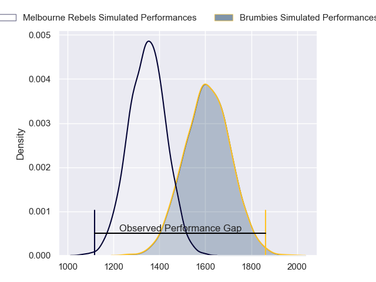
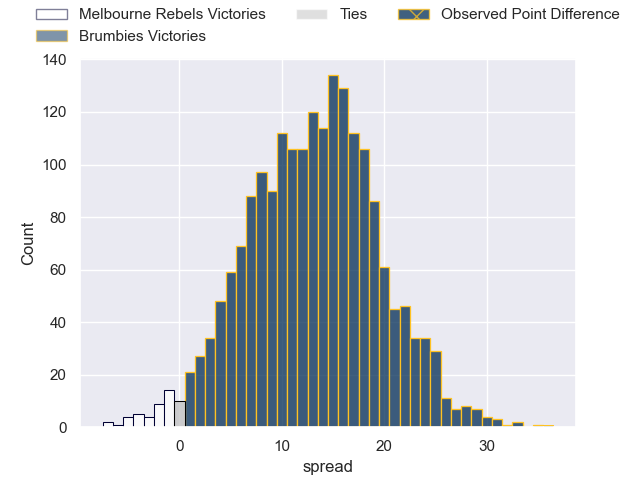
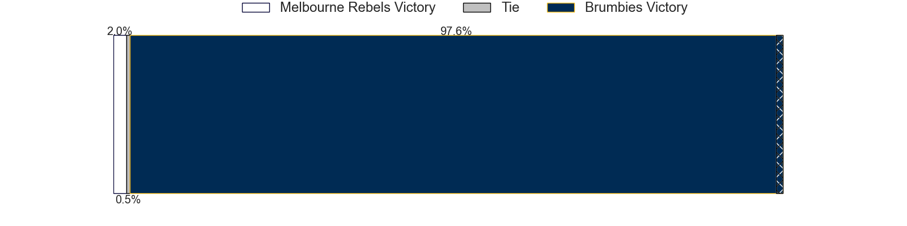
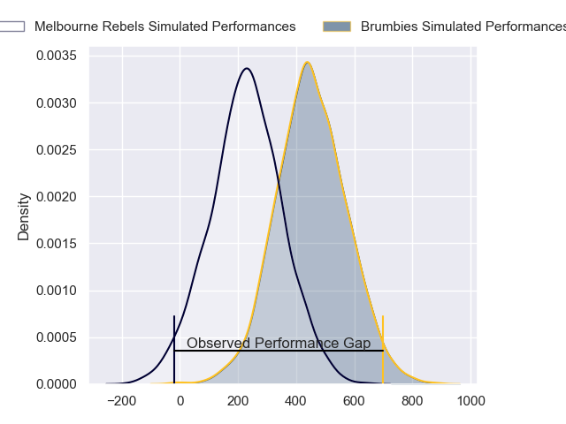
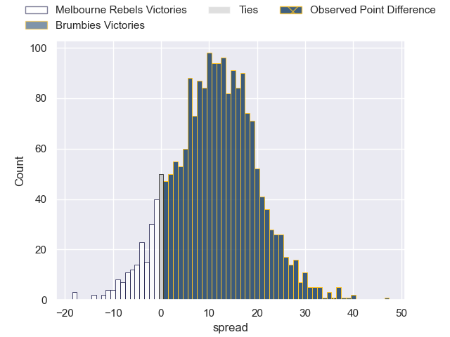
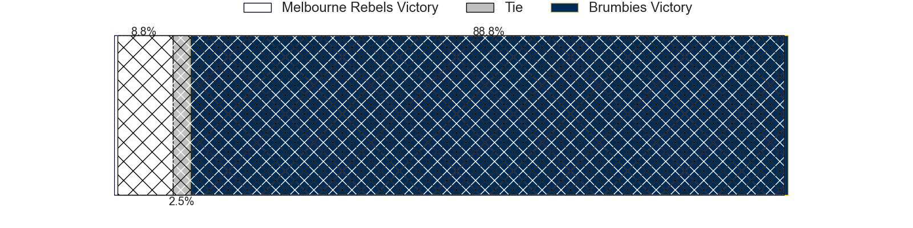

---  
layout: page  
title: Melbourne Rebels at Brumbies; 17-53  
date: 2024-05-24 18:00:00 -0500  
categories: "Super Rugby Pacific 2024" match review  
---
# Melbourne Rebels at Brumbies; 17-53

# Club Level Predictions

The first set of predictions treats a club as the smallest object, as the club develops its members, organizes a gameplan, and deploys its players as needed for each match. This club model has a prediction of 0.815, which translates to predicting Brumbies to win by 13.3.

Our Over/Under is 49.5 - and combined with the spread above, we have a predicted scoreline of 18 to 31

Each club has a rating and a rating deviation (similar to a Glicko rating), and expected performances can be generated. This allows for simulated matches and spreads like the ones below.
## Projected Performances - Club Model

## Projected Spreads - Club Model

## Projected Results - Club Model

# Player Level Predictions

Treating teams instead as an entity made up of the currently active players, I have ratings for each player in an altogether different system. These can be combined to form team ratings once teamsheets are announced, weighting starters a bit higher than the reserves. After the match is played, players can be weighted by their minutes on the field, allowing for an accurate measure of the team's composition. With these compiled team ratings, we can make predictions, measure inaccuracy, and update the individual player ratings.
## Prediction without Player Minutes: Brumbies by 14.8

Brumbies by 10.1 on a neutral pitch

## Projected Performances - Player Model

## Projected Spreads - Player Model

## Projected Results - Player Model

|   Away Minutes | Away Player         |   Away Percentile |   Number |   Home Percentile | Home Player      |   Home Minutes |
|---------------:|:--------------------|------------------:|---------:|------------------:|:-----------------|---------------:|
|             40 | Isaac Aedo Kailea   |             41.3  |        1 |             95.06 | James Slipper    |             38 |
|             48 | Jordan Uelese       |             45.26 |        2 |             80.1  | Billy Pollard    |             52 |
|             40 | Sam Talakai         |             54.74 |        3 |             97    | Allan Alaalatoa  |             59 |
|             80 | Angelo Smith        |             43.1  |        4 |             78.85 | Darcy Swain      |             67 |
|             65 | Josh Canham         |             60.97 |        5 |             76.66 | Tom Hooper       |             80 |
|             80 | Rob Leota           |              3.68 |        6 |             51.02 | Nick Frost       |             80 |
|             74 | Brad Wilkin         |             36.59 |        7 |             87.12 | Jahrome Brown    |             80 |
|             40 | Vaiolini Ekuasi     |             23.81 |        8 |             95.45 | Rob Valetini     |             64 |
|             62 | Ryan Louwrens       |             96.21 |        9 |             90    | Ryan Lonergan    |             64 |
|             80 | Jake Strachan       |             18.97 |       10 |             87.42 | Noah Lolesio     |             80 |
|             80 | Glen Vaihu          |             17.28 |       11 |             64.39 | Corey Toole      |             80 |
|             40 | Nick Jooste         |             64.28 |       12 |             65.92 | Tamati Tua       |             68 |
|             80 | Filipo Daugunu      |             95.6  |       13 |             72.88 | Len Ikitau       |             76 |
|             80 | Darby Lancaster     |             60.02 |       14 |             94.4  | Andy Muirhead    |             80 |
|             80 | Andrew Kellaway     |             68.97 |       15 |             83.65 | Tom Wright       |             80 |
|             32 | Ethan Dobbins       |            nan    |       16 |            nan    | Liam Bowron      |             28 |
|             40 | Matt Gibbon         |             88.99 |       17 |             73.52 | Rhys Van Nek     |             42 |
|             40 | Taniela Tupou       |             96.36 |       18 |             30.61 | Sefo Kautai      |             21 |
|             15 | Luke Callan         |            nan    |       19 |             99.01 | Cadeyrn Neville  |             13 |
|              6 | Maciu Nabolakasi    |             54.89 |       20 |             56.82 | Luke Reimer      |             16 |
|             40 | Tuaina Taii Tualima |             80.24 |       21 |             23.62 | Harrison Goddard |             16 |
|             18 | James Tuttle        |             66.38 |       22 |             75.46 | Jack Debreczeni  |              4 |
|             40 | Mason Gordon        |            nan    |       23 |             90.79 | Ollie Sapsford   |             12 |

