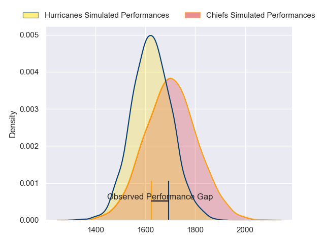
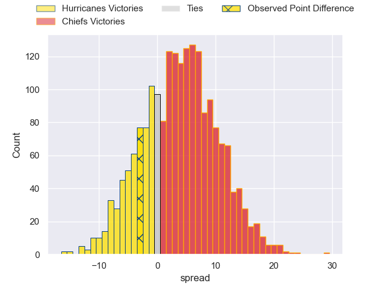
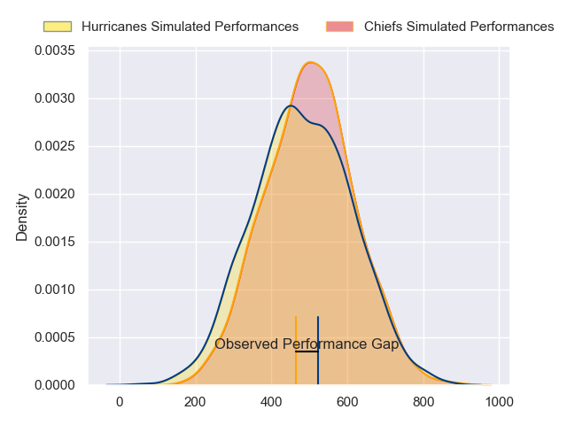
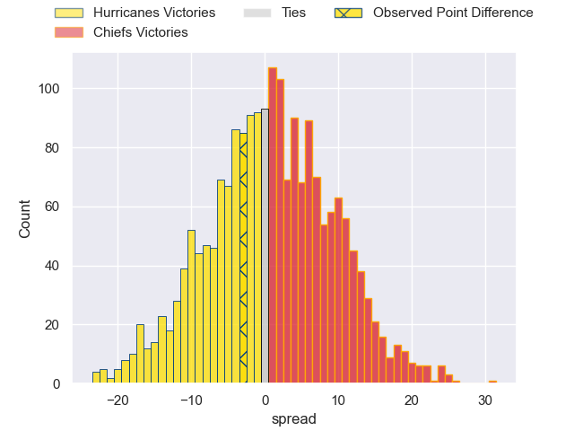

---  
layout: page  
title: Hurricanes at Chiefs; 20-17  
date: 2024-05-24 18:00:00 -0500  
categories: "Super Rugby Pacific 2024" match review  
---
# Hurricanes at Chiefs; 20-17

# Club Level Predictions

The first set of predictions treats a club as the smallest object, as the club develops its members, organizes a gameplan, and deploys its players as needed for each match. This club model has a prediction of 0.606, which translates to predicting Chiefs to win by 3.9.

Our Over/Under is 55.5 - and combined with the spread above, we have a predicted scoreline of 26 to 30

Each club has a rating and a rating deviation (similar to a Glicko rating), and expected performances can be generated. This allows for simulated matches and spreads like the ones below.
## Projected Performances - Club Model

## Projected Spreads - Club Model

## Projected Results - Club Model

# Player Level Predictions

Treating teams instead as an entity made up of the currently active players, I have ratings for each player in an altogether different system. These can be combined to form team ratings once teamsheets are announced, weighting starters a bit higher than the reserves. After the match is played, players can be weighted by their minutes on the field, allowing for an accurate measure of the team's composition. With these compiled team ratings, we can make predictions, measure inaccuracy, and update the individual player ratings.
## Prediction without Player Minutes: Chiefs by 2.3

Hurricanes by 2.4 on a neutral pitch

## Projected Performances - Player Model

## Projected Spreads - Player Model

## Projected Results - Player Model

|   Away Minutes | Away Player          |   Away Percentile |   Number |   Home Percentile | Home Player            |   Home Minutes |
|---------------:|:---------------------|------------------:|---------:|------------------:|:-----------------------|---------------:|
|             64 | Xavier Numia         |             97.81 |        1 |             98.62 | Aidan Ross             |             52 |
|             80 | Raymond Tuputupu     |             37.72 |        2 |             94.38 | Samisoni Taukei'aho    |             80 |
|             58 | Pasilio Tosi         |             45.91 |        3 |             85.26 | George Dyer            |             69 |
|             56 | Justin Sangster      |             83.12 |        4 |             20.46 | Manaaki Selby-Rickit   |             52 |
|             80 | Isaia Walker-Leawere |             97.91 |        5 |             92.75 | Tupou Vaa'i            |             80 |
|             80 | Devan Flanders       |             90.71 |        6 |             56.05 | Simon Parker           |             80 |
|             80 | Peter Lakai          |             96.52 |        7 |             56.53 | Kaylum Boshier         |             49 |
|             62 | Brayden Iose         |              1.45 |        8 |             90.27 | Luke Jacobson          |             80 |
|             64 | TJ Perenara          |             97.93 |        9 |             73.79 | Cortez Ratima          |             60 |
|             80 | Brett Cameron        |             29.69 |       10 |             97.94 | Damian McKenzie        |             80 |
|             80 | Kini Naholo          |             97.63 |       11 |             73.88 | Etene Nanai-Seturo     |             80 |
|             80 | Jordie Barrett       |             97.34 |       12 |             92.63 | Quinn Tupaea           |             52 |
|             69 | Billy Proctor        |             96.32 |       13 |             94.06 | Anton Lienert-Brown    |             80 |
|             80 | Joshua Moorby        |             92.12 |       14 |             92.5  | Emoni Narawa           |             65 |
|             74 | Ruben Love           |             96.44 |       15 |             84.28 | Shaun Stevenson        |             80 |
|              0 | James O'Reilly       |             35.47 |       16 |            nan    | Tyrone Thompson        |             20 |
|             16 | Pouri Rakete-Stones  |             90.36 |       17 |             27.77 | Jared Proffit          |             28 |
|             22 | Tevita Mafileo       |             89.88 |       18 |            nan    | Sione Ahio             |             11 |
|              4 | Caleb Delany         |             85.5  |       19 |             96.13 | Naitoa Ah Kuoi         |             41 |
|             20 | TK Howden            |              1.26 |       20 |             54.66 | Wallace Sititi         |             31 |
|             16 | Richard Judd         |             95.69 |       21 |             70.86 | Te Toiroa Tahuriorangi |             20 |
|             11 | Peter Umaga-Jensen   |             28.76 |       22 |             49.9  | Josh Ioane             |             15 |
|              6 | Salesi Rayasi        |             87.75 |       23 |             76.66 | Rameka Poihipi         |             28 |

