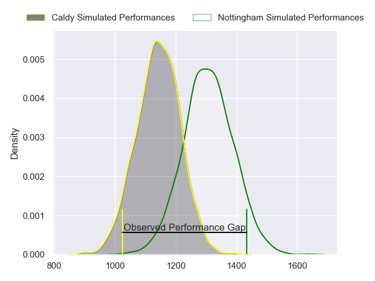
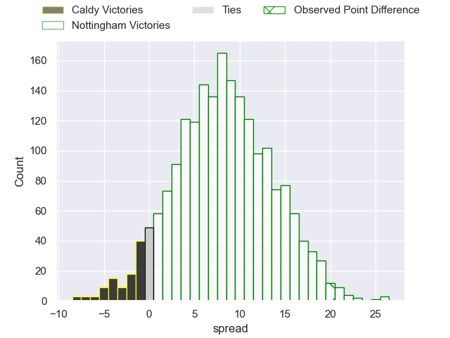
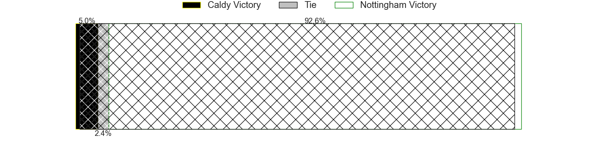
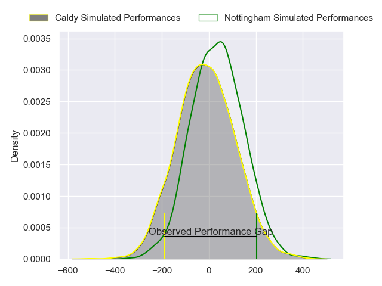
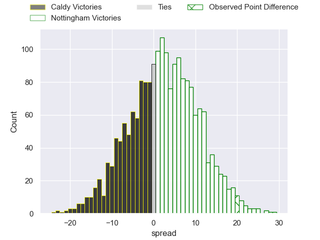
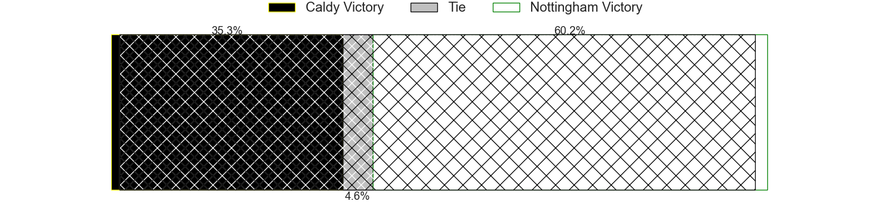

---  
layout: page  
title: Caldy at Nottingham; 8-28  
date: 2024-05-24 18:00:00 -0500  
categories: "RFU Championship 2023" match review  
---
# Caldy at Nottingham; 8-28

# Club Level Predictions

The first set of predictions treats a club as the smallest object, as the club develops its members, organizes a gameplan, and deploys its players as needed for each match. This club model has a prediction of 0.715, which translates to predicting Nottingham to win by 8.2.

Our Over/Under is 57.5 - and combined with the spread above, we have a predicted scoreline of 25 to 33

Each club has a rating and a rating deviation (similar to a Glicko rating), and expected performances can be generated. This allows for simulated matches and spreads like the ones below.
## Projected Performances - Club Model

## Projected Spreads - Club Model

## Projected Results - Club Model

# Player Level Predictions

Treating teams instead as an entity made up of the currently active players, I have ratings for each player in an altogether different system. These can be combined to form team ratings once teamsheets are announced, weighting starters a bit higher than the reserves. After the match is played, players can be weighted by their minutes on the field, allowing for an accurate measure of the team's composition. With these compiled team ratings, we can make predictions, measure inaccuracy, and update the individual player ratings.
## Prediction without Player Minutes: Nottingham by 2.1

Caldy by 1.4 on a neutral pitch

## Projected Performances - Player Model

## Projected Spreads - Player Model

## Projected Results - Player Model

|   Away Minutes | Away Player      |   Away Percentile |   Number |   Home Percentile | Home Player               |   Home Minutes |
|---------------:|:-----------------|------------------:|---------:|------------------:|:--------------------------|---------------:|
|             57 | Monty Weatherby  |             55.55 |        1 |             66.56 | Archie Van der Flier      |             55 |
|             80 | Matt Gallagher   |             38.04 |        2 |             39.49 | Jack Dickinson            |             55 |
|              8 | Joe Sproston     |             10.53 |        3 |             82.67 | Dan Richardson            |             55 |
|             57 | Callum Atkinson  |             32.97 |        4 |              1.29 | Sebastien Ferreira        |             80 |
|             80 | Thomas Sanders   |             12.31 |        5 |             55.41 | Jack Shine                |             60 |
|             80 | Martin Gerrard   |             13.26 |        6 |              6.49 | Michael Green             |             44 |
|             62 | Ciaran Booth     |             60.99 |        7 |             50.63 | James Cherry              |             80 |
|             62 | Sam Dickinson    |             51.97 |        8 |             10.14 | Scott Hall                |             80 |
|             53 | Chris Pilgrim    |              5.52 |        9 |             19.83 | Micheal Stronge           |             65 |
|             80 | Lewis Barker     |              3.71 |       10 |             68.66 | Matthew Arden             |             80 |
|             62 | William Robinson |             11.68 |       11 |             67.9  | Harry Graham              |             51 |
|             80 | Michael Barlow   |             26.51 |       12 |             36.64 | Dafydd-Rhys Tiueti        |             60 |
|             80 | Connor Wilkinson |             19.65 |       13 |              3.07 | Jack Stapley              |             80 |
|             80 | Michael Cartmill |              2.09 |       14 |             24.41 | David Williams            |             80 |
|             80 | Matt Kilcourse   |             38.57 |       15 |             63.94 | Ellis Mee                 |             80 |
|             72 | Adam Aigbokhae   |             16.11 |       16 |             15.2  | Jay Ecclesfield           |             36 |
|             27 | Callum Ridgway   |              3.93 |       17 |             62.39 | Ryan Olowofela            |             29 |
|             23 | Nathan Rushton   |              9.39 |       18 |             69.8  | Xavier Valentine          |             25 |
|             23 | Sam Olyott       |              9.2  |       19 |             79.13 | Harry Clayton             |             25 |
|             18 | Ollie Wynn       |            nan    |       20 |             35.79 | Kai Owen                  |             25 |
|             18 | Luke Cox         |            nan    |       21 |              6.24 | Marcus Alexander Ramage   |             20 |
|             18 | Jacob Mitchell   |             42.74 |       22 |             70.9  | Iosefa Danny Wayne Fiaola |             20 |
|            nan | nan              |            nan    |       23 |             27.07 | Josh Goodwin              |             15 |

