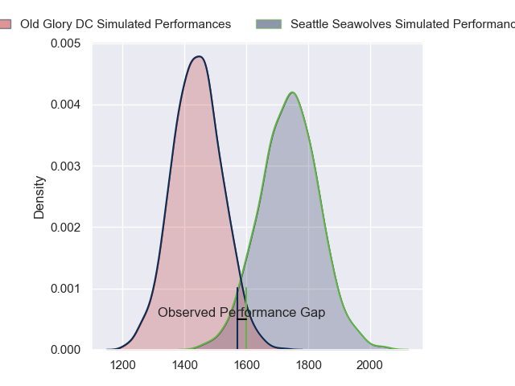
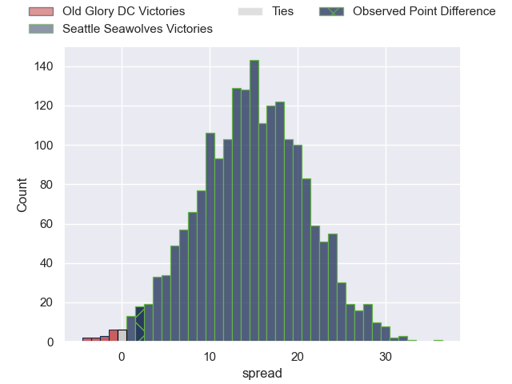
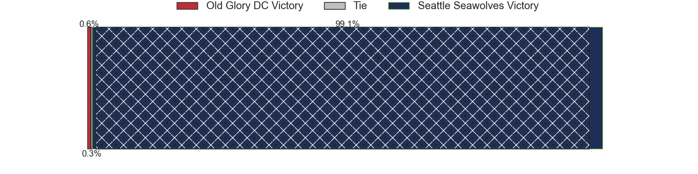
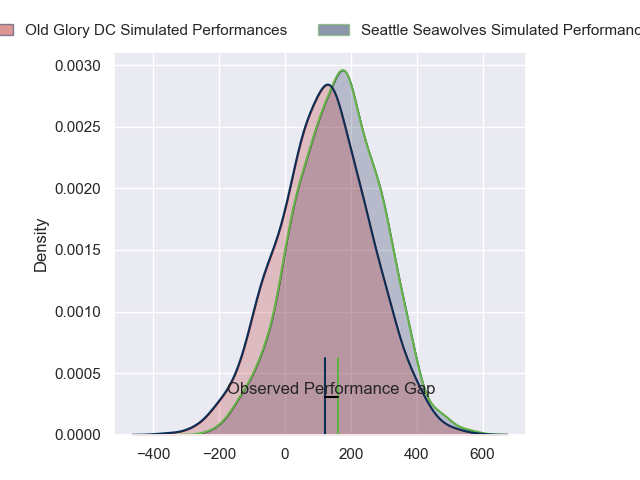
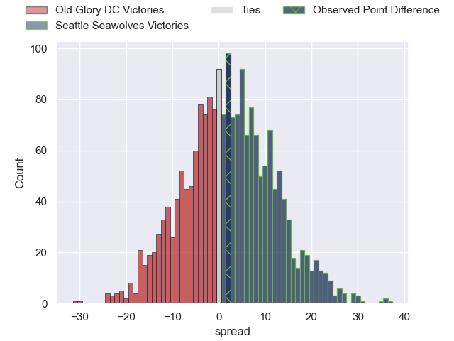

---  
layout: page  
title: Old Glory DC at Seattle Seawolves; 24-26  
date: 2024-05-24 18:00:00 -0500  
categories: "Major League Rugby 2024" match review  
---
# Old Glory DC at Seattle Seawolves; 24-26

# Club Level Predictions

The first set of predictions treats a club as the smallest object, as the club develops its members, organizes a gameplan, and deploys its players as needed for each match. This club model has a prediction of 0.84, which translates to predicting Seattle Seawolves to win by 14.8.

Our Over/Under is 68.5 - and combined with the spread above, we have a predicted scoreline of 27 to 42

Each club has a rating and a rating deviation (similar to a Glicko rating), and expected performances can be generated. This allows for simulated matches and spreads like the ones below.
## Projected Performances - Club Model

## Projected Spreads - Club Model

## Projected Results - Club Model

# Player Level Predictions

Treating teams instead as an entity made up of the currently active players, I have ratings for each player in an altogether different system. These can be combined to form team ratings once teamsheets are announced, weighting starters a bit higher than the reserves. After the match is played, players can be weighted by their minutes on the field, allowing for an accurate measure of the team's composition. With these compiled team ratings, we can make predictions, measure inaccuracy, and update the individual player ratings.
## Prediction without Player Minutes: Seattle Seawolves by 2.3

Old Glory DC by 0.4 on a neutral pitch

## Projected Performances - Player Model

## Projected Spreads - Player Model

## Projected Results - Player Model

|   Away Minutes | Away Player              |   Away Percentile |   Number |   Home Percentile | Home Player       |   Home Minutes |
|---------------:|:-------------------------|------------------:|---------:|------------------:|:------------------|---------------:|
|             80 | Quentin Newcomer         |             46.56 |        1 |             56.52 | Cameron Orr       |             80 |
|             80 | Martín Vaca              |             48.31 |        2 |             56.5  | Daquan Perry      |             80 |
|             80 | Stevie Longwell          |             77.25 |        3 |             59.03 | Oli Kilifi        |             80 |
|             80 | Tevita Naqali            |             61.87 |        4 |             51.44 | Rhyno Herbst      |             80 |
|             80 | Bill Whiteside           |             46.38 |        5 |             56.21 | Mahonri Ngakuru   |             80 |
|             80 | Collin Grosse            |             43.51 |        6 |             53.63 | Huw Taylor        |             80 |
|             80 | Brady Daniel             |             43.51 |        7 |             42.88 | Monate Akuei      |             80 |
|             80 | Jamason Fa'Anana-Schultz |             54.24 |        8 |             43.06 | Pago Haini        |             80 |
|             80 | Connor Buckley           |             47.24 |        9 |             53.45 | Jp Smith          |             80 |
|             80 | Jason Robertson          |             42.06 |       10 |             50.72 | Mack Mason        |             80 |
|             80 | Axel Muller              |             59.35 |       11 |             51.38 | Toni Pulu         |             80 |
|             80 | Willie Talataina-Mu      |             41.45 |       12 |             44.73 | Dan Kriel         |             80 |
|             80 | John Powers              |             53.02 |       13 |             54.45 | Tevita Kuridrani  |             80 |
|             80 | John Rizzo               |             47.77 |       14 |             55.18 | Lauina Futi       |             80 |
|             80 | Perry Humphreys          |             54.3  |       15 |             30.61 | Divan Rossouw     |             80 |
|              0 | Facundo Gattas           |             61.64 |       16 |             58.43 | Dewald Donald     |              0 |
|              0 | Joe Wrafter              |            nan    |       17 |            nan    | Kellen Gordon     |              0 |
|              0 | Cali Martinez            |            nan    |       18 |            nan    | Chance Wenglewski |              0 |
|              0 | Charlie Overton          |            nan    |       19 |             52.04 | Taylor Krumrei    |              0 |
|              0 | Dacoda Worth             |            nan    |       20 |            nan    | Isaia Lotawa      |              0 |
|              0 | Ethan Mcveigh            |             58.45 |       21 |             48.21 | Reid Davis        |              0 |
|              0 | Gradyn Bowd              |             56.49 |       22 |             51.03 | Ryan Rees         |              0 |
|              0 | Palema Roberts           |            nan    |       23 |             50.52 | Sam Windsor       |              0 |

