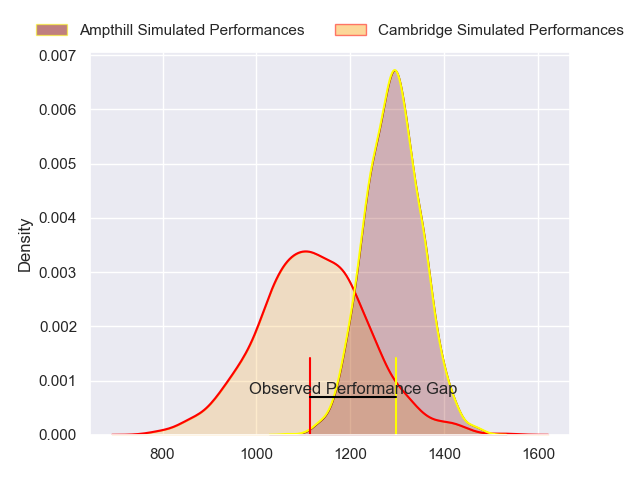
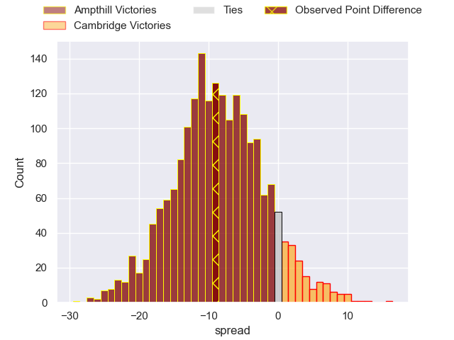
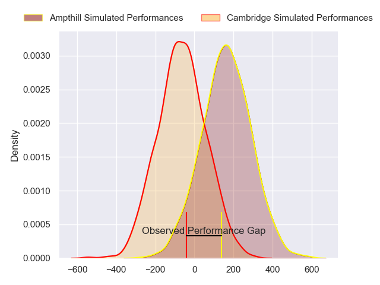
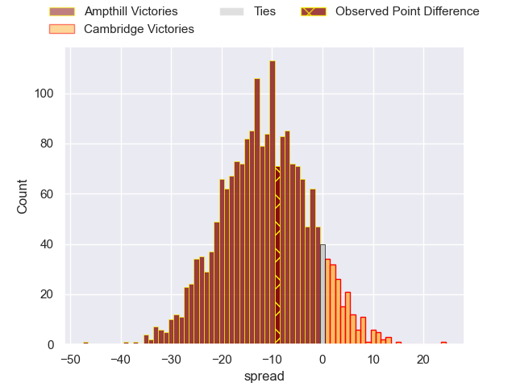

---  
layout: page  
title: Ampthill at Cambridge; 37-28  
date: 2024-05-25 18:00:00 -0500  
categories: "RFU Championship 2023" match review  
---
# Ampthill at Cambridge; 37-28

# Club Level Predictions

The first set of predictions treats a club as the smallest object, as the club develops its members, organizes a gameplan, and deploys its players as needed for each match. This club model has a prediction of 0.283, which translates to predicting Ampthill to win by 8.2.

Our Over/Under is 51.5 - and combined with the spread above, we have a predicted scoreline of 30 to 21

Each club has a rating and a rating deviation (similar to a Glicko rating), and expected performances can be generated. This allows for simulated matches and spreads like the ones below.
## Projected Performances - Club Model

## Projected Spreads - Club Model

## Projected Results - Club Model

# Player Level Predictions

Treating teams instead as an entity made up of the currently active players, I have ratings for each player in an altogether different system. These can be combined to form team ratings once teamsheets are announced, weighting starters a bit higher than the reserves. After the match is played, players can be weighted by their minutes on the field, allowing for an accurate measure of the team's composition. With these compiled team ratings, we can make predictions, measure inaccuracy, and update the individual player ratings.
## Prediction without Player Minutes: Ampthill by 12.3

Ampthill by 14.6 on a neutral pitch

## Projected Performances - Player Model

## Projected Spreads - Player Model

## Projected Results - Player Model

|   Away Minutes | Away Player                 |   Away Percentile |   Number |   Home Percentile | Home Player          |   Home Minutes |
|---------------:|:----------------------------|------------------:|---------:|------------------:|:---------------------|---------------:|
|             66 | James Flynn                 |             11.17 |        1 |              9.8  | Jake Elwood          |             80 |
|             70 | Benjamin Chapman            |             21.19 |        2 |             28.41 | Benjamin Brownlie    |             62 |
|             59 | James Johnston              |             74.74 |        3 |              5.75 | Billy Walker         |             70 |
|             80 | Iwan Shenton                |             77.66 |        4 |             16.78 | George Bretag-Norris |             63 |
|             80 | Griff Evans                 |             33.07 |        5 |             15.79 | Gareth Baxter        |             80 |
|             80 | Josh Smart                  |              5.71 |        6 |             25.36 | Anthony Maka         |             54 |
|             41 | Samson Adejimi              |             47.63 |        7 |              3.97 | Jared Cardew         |             80 |
|             72 | Morgan Strong               |             78.88 |        8 |             30.64 | Nahum Merigan        |             80 |
|             64 | Charlie Bracken             |             77.24 |        9 |             14.31 | Kieran Duffin        |             63 |
|             80 | Gwyn Parks                  |             26.19 |       10 |             12.58 | Steffan James        |             80 |
|             80 | Brandon Jackson-Richards    |             77.87 |       11 |             25.93 | Josef Green          |             80 |
|             72 | Fraser James Kevin Strachan |             91.81 |       12 |             13.82 | Benjamin Hoppe       |             80 |
|             80 | Oli Morris                  |             57.22 |       13 |              2.25 | Sam Hanks            |             80 |
|             64 | Francis Moore               |             34    |       14 |             18.8  | Kwaku Asiedu         |             80 |
|             80 | Tomas Bacon                 |             83.23 |       15 |              4.82 | Elias Caven          |             80 |
|             39 | Sam Asotasi                 |            nan    |       16 |            nan    | Noah Sloot           |             26 |
|             21 | Dominic Hardman             |              9.55 |       17 |             20.52 | Toby Dabell          |             17 |
|             16 | Peter White                 |             91.38 |       18 |             16.48 | Kieran Frost         |             17 |
|             16 | Josh Skelcey                |             15.19 |       19 |              8.67 | Morgan Veness        |             18 |
|             14 | Zac Nearchou                |             39.76 |       20 |             62.19 | Huw Owen             |             10 |
|             10 | Beck Cutting                |             19.42 |       21 |            nan    | nan                  |            nan |
|              8 | Harrison Legg               |            nan    |       22 |            nan    | nan                  |            nan |
|              8 | Harvey Beaton               |             51.82 |       23 |            nan    | nan                  |            nan |

