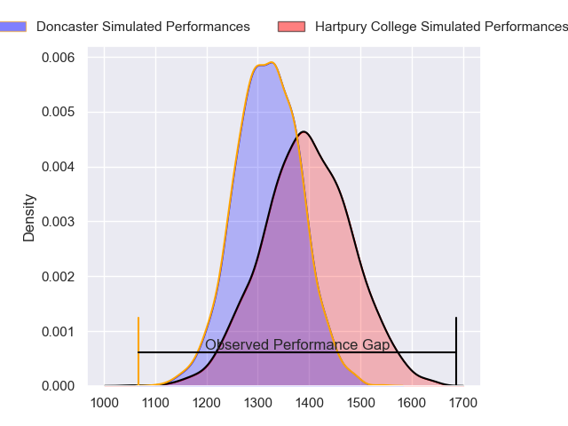
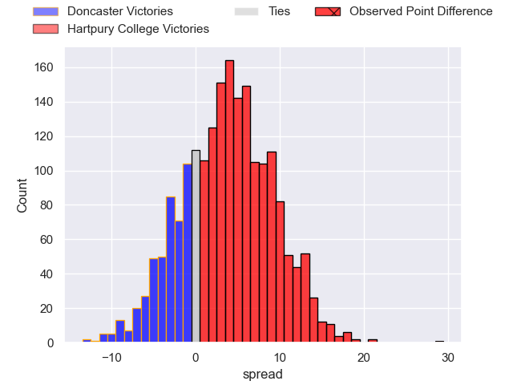
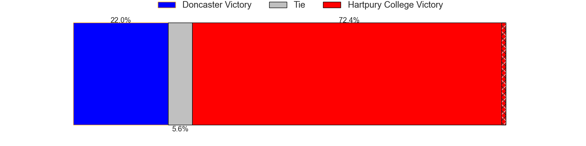
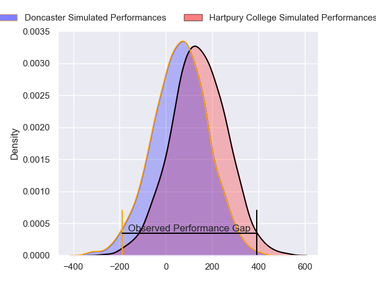
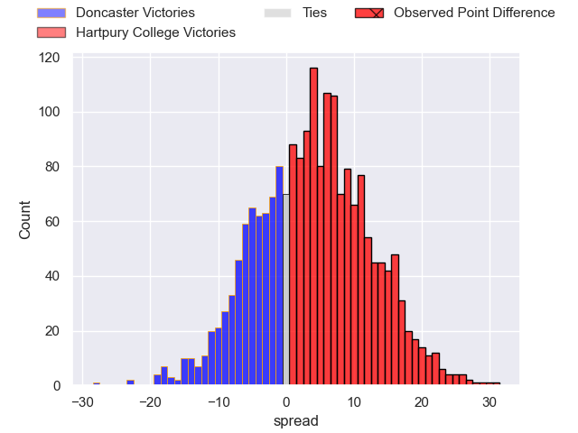
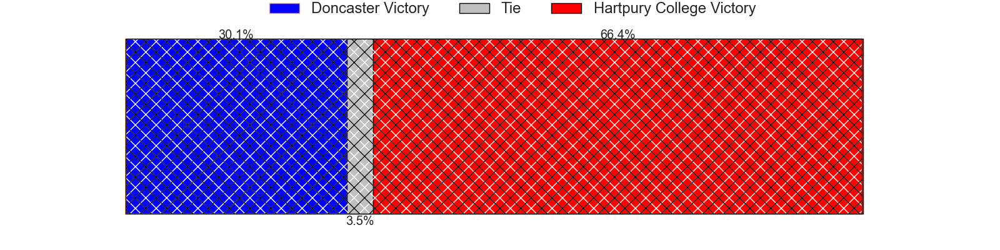

---  
layout: page  
title: Doncaster at Hartpury College; 14-43  
date: 2024-05-25 18:00:00 -0500  
categories: "RFU Championship 2023" match review  
---
# Doncaster at Hartpury College; 14-43

# Club Level Predictions

The first set of predictions treats a club as the smallest object, as the club develops its members, organizes a gameplan, and deploys its players as needed for each match. This club model has a prediction of 0.615, which translates to predicting Hartpury College to win by 4.1.

Our Over/Under is 63.5 - and combined with the spread above, we have a predicted scoreline of 30 to 34

Each club has a rating and a rating deviation (similar to a Glicko rating), and expected performances can be generated. This allows for simulated matches and spreads like the ones below.
## Projected Performances - Club Model

## Projected Spreads - Club Model

## Projected Results - Club Model

# Player Level Predictions

Treating teams instead as an entity made up of the currently active players, I have ratings for each player in an altogether different system. These can be combined to form team ratings once teamsheets are announced, weighting starters a bit higher than the reserves. After the match is played, players can be weighted by their minutes on the field, allowing for an accurate measure of the team's composition. With these compiled team ratings, we can make predictions, measure inaccuracy, and update the individual player ratings.
## Prediction without Player Minutes: Hartpury College by 3.6

Hartpury College by 0.4 on a neutral pitch

## Projected Performances - Player Model

## Projected Spreads - Player Model

## Projected Results - Player Model

|   Away Minutes | Away Player              |   Away Percentile |   Number |   Home Percentile | Home Player           |   Home Minutes |
|---------------:|:-------------------------|------------------:|---------:|------------------:|:----------------------|---------------:|
|             80 | Conor Davidson           |             39.51 |        1 |             77.98 | Aristot Benz-Salomon  |             57 |
|             57 | George Roberts           |             16.37 |        2 |             66.13 | William Crane         |             57 |
|             43 | Andrew Foster            |             84.29 |        3 |             68.99 | Jonathan Benz-Salomon |             73 |
|             43 | Charlie Beckett          |             66.53 |        4 |             60.08 | Dale Lemon            |             78 |
|             80 | Ben Murphy               |             29.99 |        5 |             82.52 | Jack Davies           |             80 |
|             40 | Fyn Brown                |             14.33 |        6 |             39.88 | Samuel Lewis          |             80 |
|             65 | Archie Smeaton           |             31.36 |        7 |             77.93 | Harry Short           |             60 |
|             43 | Harry Wilson             |             11.18 |        8 |             41.41 | Jarrad Hayler         |             78 |
|             80 | Ollie Fox                |              2.24 |        9 |             65    | Michael Austin        |             80 |
|             80 | Sam Olver                |             13.81 |       10 |             81.03 | Harry Bazalgette      |             80 |
|             80 | Westleigh Alleyne Holden |             24.6  |       11 |             52.8  | Oliver Holliday       |             45 |
|             57 | Sam Bedlow               |             80.96 |       12 |             52.3  | Tommy Mathews         |             80 |
|             71 | Joe Margetts             |             42.27 |       13 |              9.83 | Robbie Smith          |             80 |
|             80 | George Simpson           |             12.82 |       14 |             23.65 | Alex Forrester        |             80 |
|             80 | Billy McBryde            |             77.15 |       15 |             43.4  | Alex Morgan           |             80 |
|             40 | Ehize Ehizode            |              6.85 |       16 |             71.24 | Sam Smith             |             33 |
|             37 | Corrie Barrett           |             22.59 |       17 |             75.6  | Ethan Hunt            |             23 |
|             37 | Jack Digby               |             58.59 |       18 |             66.72 | James Gibbons         |             23 |
|             37 | Evan Mintern             |             85.2  |       19 |             78.61 | Josh Gray             |             20 |
|             23 | Tom Doughty              |             13.48 |       20 |            nan    | Alex Gibson           |              7 |
|             23 | Jack Metcalf             |             19.37 |       21 |            nan    | Rhys Price            |              2 |
|             15 | Harrison Courtney        |             71.5  |       22 |             46.76 | Ellis Hart            |              2 |
|              9 | William Metcalf          |            nan    |       23 |            nan    | Cameron Cobbett       |              2 |

