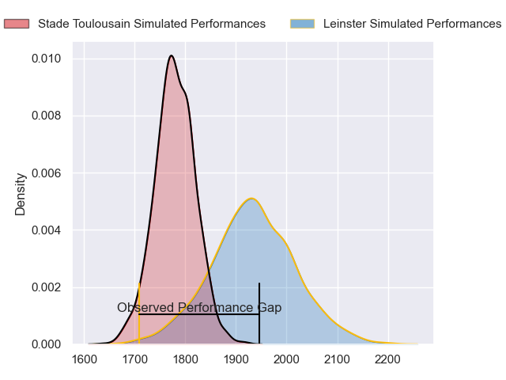
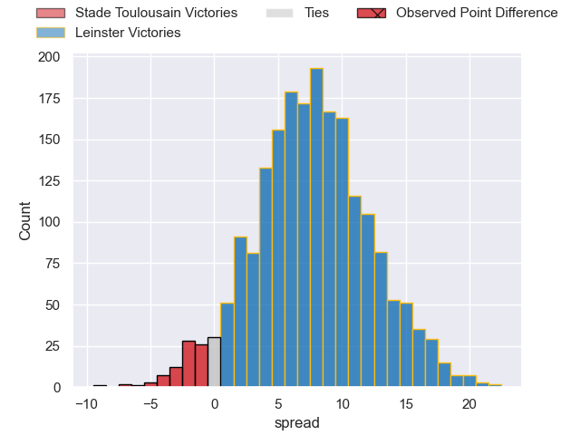
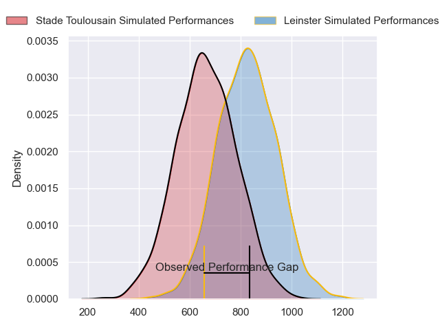
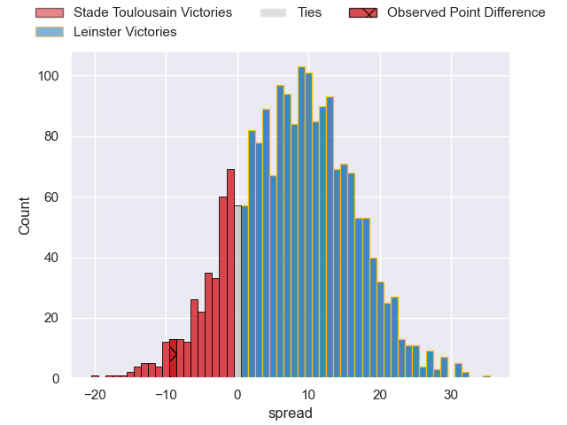
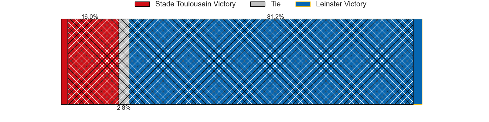

---  
layout: page  
title: Stade Toulousain at Leinster; 31-22  
date: 2024-05-25 18:00:00 -0500  
categories: "European Rugby Champions Cup 2023" match review  
---
# Stade Toulousain at Leinster; 31-22

# Club Level Predictions

The first set of predictions treats a club as the smallest object, as the club develops its members, organizes a gameplan, and deploys its players as needed for each match. This club model has a prediction of 0.706, which translates to predicting Leinster to win by 7.7.

Our Over/Under is 31.5 - and combined with the spread above, we have a predicted scoreline of 12 to 20

Each club has a rating and a rating deviation (similar to a Glicko rating), and expected performances can be generated. This allows for simulated matches and spreads like the ones below.
## Projected Performances - Club Model

## Projected Spreads - Club Model

## Projected Results - Club Model

# Player Level Predictions

Treating teams instead as an entity made up of the currently active players, I have ratings for each player in an altogether different system. These can be combined to form team ratings once teamsheets are announced, weighting starters a bit higher than the reserves. After the match is played, players can be weighted by their minutes on the field, allowing for an accurate measure of the team's composition. With these compiled team ratings, we can make predictions, measure inaccuracy, and update the individual player ratings.
## Prediction without Player Minutes: Leinster by 10.9

Leinster by 4.6 on a neutral pitch

## Projected Performances - Player Model

## Projected Spreads - Player Model

## Projected Results - Player Model

|   Away Minutes | Away Player         |   Away Percentile |   Number |   Home Percentile | Home Player         |   Home Minutes |
|---------------:|:--------------------|------------------:|---------:|------------------:|:--------------------|---------------:|
|             58 | Cyril Baille        |             96.44 |        1 |             90.53 | Andrew Porter       |             89 |
|             54 | Peato Mauvaka       |             94.86 |        2 |             70.3  | Dan Sheehan         |             69 |
|             54 | Dorian Aldegheri    |             96.68 |        3 |             96.92 | Tadhg Furlong       |             69 |
|             95 | Thibaud Flament     |             94.34 |        4 |             79.15 | Joe McCarthy        |             95 |
|             66 | Emmanuel Meafou     |             89.08 |        5 |             67.33 | Jason Jenkins       |             40 |
|             95 | Jack Willis         |             96.03 |        6 |             87.9  | Ryan Baird          |             59 |
|             71 | Francois Cros       |             98.45 |        7 |             80.54 | Will Connors        |             44 |
|             95 | Alexandre Roumat    |             96.27 |        8 |             94    | Caelan Doris        |             95 |
|             95 | Antoine Dupont      |             99.83 |        9 |             96.55 | Jamison Gibson-Park |             95 |
|             95 | Romain Ntamack      |             96.49 |       10 |             94.43 | Ross Byrne          |             69 |
|             95 | Matthis Lebel       |             98.96 |       11 |            100    | James Lowe          |             95 |
|             22 | Pita Ahki           |             66.53 |       12 |             88.64 | Jamie Osborne       |             95 |
|             58 | Paul Costes         |             69.91 |       13 |             89.46 | Robbie Henshaw      |             95 |
|             92 | Juan Cruz Mallia    |             99.24 |       14 |             90.12 | Jordan Larmour      |             95 |
|             95 | Blair Kinghorn      |            100    |       15 |             98.74 | Hugo Keenan         |             95 |
|             41 | Julien Marchand     |             99.2  |       16 |             93.9  | Ronan Kelleher      |             26 |
|             37 | Rodrigue Neti       |             60.24 |       17 |             93.28 | Cian Healy          |              6 |
|             41 | Joel Merkler        |             82.75 |       18 |             94.49 | Michael Ala'alatoa  |             26 |
|             41 | Richie Arnold       |             79.54 |       19 |             95.73 | James Ryan          |             55 |
|             12 | Joshua Brennan      |             82.77 |       20 |             97.72 | Jack Conan          |             36 |
|              3 | Paul Graou          |             50.86 |       21 |             98.79 | Luke McGrath        |              0 |
|             73 | Santiago Chocobares |             15.56 |       22 |             60.17 | Ciaran Frawley      |             26 |
|             37 | Thomas Ramos        |             96.23 |       23 |             99.13 | Josh van der Flier  |             51 |

