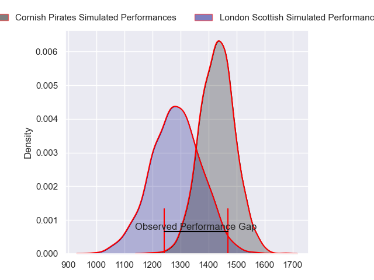
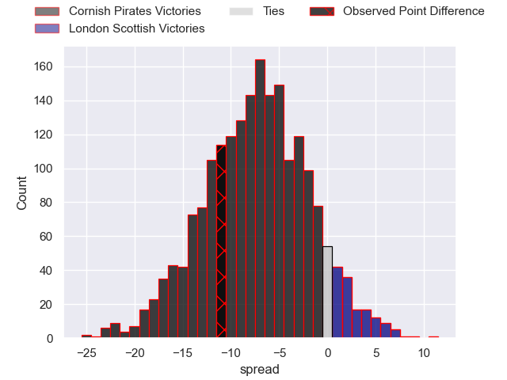
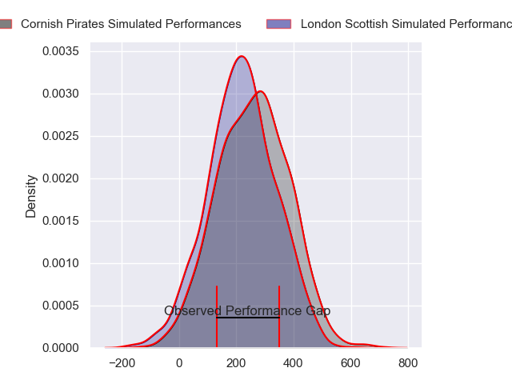
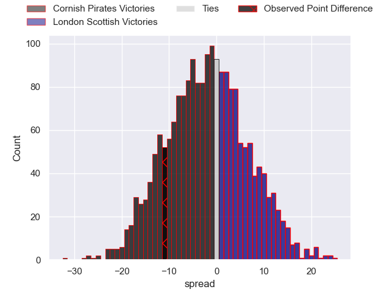

---  
layout: page  
title: Cornish Pirates at London Scottish; 38-27  
date: 2024-05-25 18:00:00 -0500  
categories: "RFU Championship 2023" match review  
---
# Cornish Pirates at London Scottish; 38-27

# Club Level Predictions

The first set of predictions treats a club as the smallest object, as the club develops its members, organizes a gameplan, and deploys its players as needed for each match. This club model has a prediction of 0.305, which translates to predicting Cornish Pirates to win by 7.3.

Our Over/Under is 47.5 - and combined with the spread above, we have a predicted scoreline of 27 to 20

Each club has a rating and a rating deviation (similar to a Glicko rating), and expected performances can be generated. This allows for simulated matches and spreads like the ones below.
## Projected Performances - Club Model

## Projected Spreads - Club Model

## Projected Results - Club Model

# Player Level Predictions

Treating teams instead as an entity made up of the currently active players, I have ratings for each player in an altogether different system. These can be combined to form team ratings once teamsheets are announced, weighting starters a bit higher than the reserves. After the match is played, players can be weighted by their minutes on the field, allowing for an accurate measure of the team's composition. With these compiled team ratings, we can make predictions, measure inaccuracy, and update the individual player ratings.
## Prediction without Player Minutes: Cornish Pirates by 1.9

Cornish Pirates by 5.3 on a neutral pitch

## Projected Performances - Player Model

## Projected Spreads - Player Model

## Projected Results - Player Model

|   Away Minutes | Away Player          |   Away Percentile |   Number |   Home Percentile | Home Player           |   Home Minutes |
|---------------:|:---------------------|------------------:|---------:|------------------:|:----------------------|---------------:|
|             64 | Jake Morris          |             63.89 |        1 |             49.64 | Tom Osborne           |             64 |
|             64 | Harry Hocking        |             65.65 |        2 |             76.24 | Jack Musk             |             69 |
|             50 | Finlay Richardson    |             81.21 |        3 |             81.46 | William Hobson        |             69 |
|             69 | Will Britton         |             28.1  |        4 |             53.23 | Matt Wilkinson        |             69 |
|             80 | Steele Robert Barker |             89.87 |        5 |             16.98 | Matas Jurevicius      |             55 |
|             80 | Peter Everett        |             81.32 |        6 |             69.8  | Bailey Ransom         |             80 |
|             50 | Will Gibson          |             89.45 |        7 |             21.97 | Jack Ingall           |             80 |
|             80 | Hugh Bokenham        |             83.02 |        8 |             53.83 | Tom Marshall          |             80 |
|             50 | Alex Schwarz         |             72.41 |        9 |             23.45 | Daniel Nutton         |             69 |
|             58 | Bruce Houston        |             78.76 |       10 |             42.47 | Alexander Lloyd-Seed  |             55 |
|             80 | Arthur Relton        |             74.83 |       11 |             23.17 | Luke Mehson           |             80 |
|             80 | Joe Elderkin         |             78.3  |       12 |             27.33 | Will Simonds          |             80 |
|             80 | Matthew McNab        |             61.21 |       13 |             30.71 | Hayden Hyde           |             60 |
|             80 | Will Trewin          |             90.88 |       14 |             90.69 | Will Brown            |             80 |
|             64 | Kyle Moyle           |             71.91 |       15 |             51.78 | Charlie Ingall        |             80 |
|             30 | Matt Johnson         |             81.94 |       16 |             66.83 | Marijn Huis           |             25 |
|             30 | Ruaridh Dawson       |             70.69 |       17 |             16.38 | Jonny Law             |             25 |
|             30 | John Stevens         |             85.51 |       18 |              6.76 | Robert David McCallum |             20 |
|             22 | Tom Pittman          |             79.59 |       19 |             81.7  | Will Prior            |             16 |
|             16 | Marlen Walker        |             80.89 |       20 |             21.03 | Stephen Kerins        |             11 |
|             16 | William Young        |            nan    |       21 |             21.88 | Ioan Rhys Davies      |             11 |
|             16 | Robin Wedlake        |             79.39 |       22 |             14.98 | Ashley Challenger     |             11 |
|             11 | Josh King            |             59.48 |       23 |             22.79 | Austin Wallis         |             11 |

