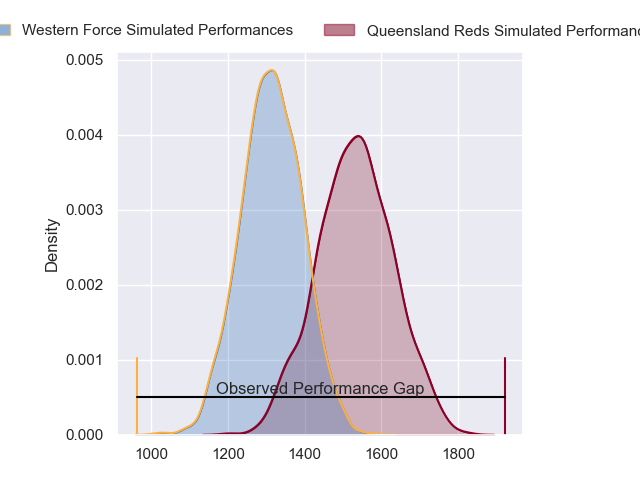
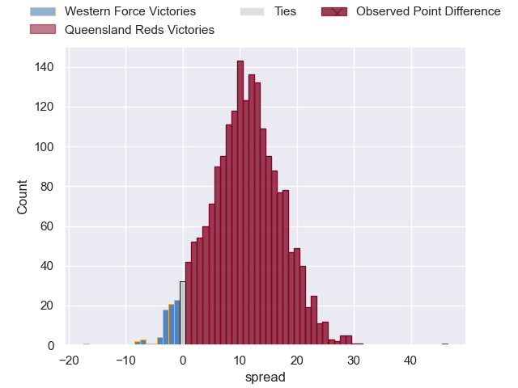
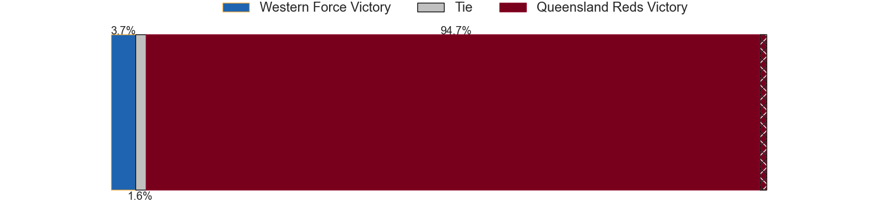
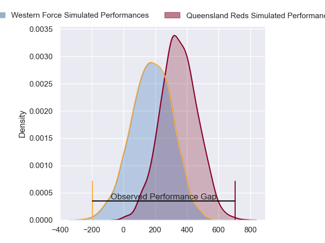
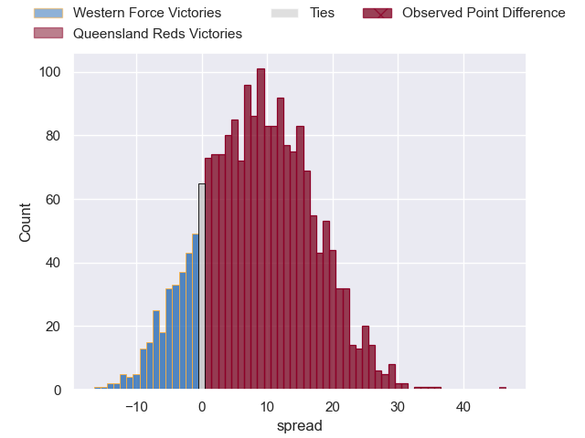
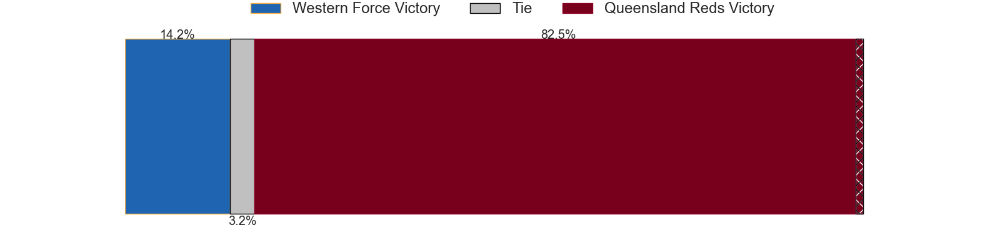

---  
layout: page  
title: Western Force at Queensland Reds; 13-59  
date: 2024-05-25 18:00:00 -0500  
categories: "Super Rugby 2024" match review  
---
# Western Force at Queensland Reds; 13-59

# Club Level Predictions

The first set of predictions treats a club as the smallest object, as the club develops its members, organizes a gameplan, and deploys its players as needed for each match. This club model has a prediction of 0.77, which translates to predicting Queensland Reds to win by 10.8.

Our Over/Under is 50.5 - and combined with the spread above, we have a predicted scoreline of 20 to 31

Each club has a rating and a rating deviation (similar to a Glicko rating), and expected performances can be generated. This allows for simulated matches and spreads like the ones below.
## Projected Performances - Club Model

## Projected Spreads - Club Model

## Projected Results - Club Model

# Player Level Predictions

Treating teams instead as an entity made up of the currently active players, I have ratings for each player in an altogether different system. These can be combined to form team ratings once teamsheets are announced, weighting starters a bit higher than the reserves. After the match is played, players can be weighted by their minutes on the field, allowing for an accurate measure of the team's composition. With these compiled team ratings, we can make predictions, measure inaccuracy, and update the individual player ratings.
## Prediction without Player Minutes: Queensland Reds by 8.8

Queensland Reds by 4.0 on a neutral pitch

## Projected Performances - Player Model

## Projected Spreads - Player Model

## Projected Results - Player Model

|   Away Minutes | Away Player           |   Away Percentile |   Number |   Home Percentile | Home Player        |   Home Minutes |
|---------------:|:----------------------|------------------:|---------:|------------------:|:-------------------|---------------:|
|             53 | Harry Hoopert         |             42.35 |        1 |             67.37 | Alex Hodgman       |             53 |
|             47 | Tom Horton            |             67.58 |        2 |             83.31 | Matt Faessler      |             69 |
|             44 | Santiago Medrano      |             17.57 |        3 |             94.74 | Jeff Toomaga-Allen |             53 |
|             80 | Jeremy Williams       |             22.94 |        4 |             73.88 | Seru Uru           |             56 |
|             68 | Izack Rodda           |             88.98 |        5 |             48.36 | Ryan Smith         |             80 |
|             49 | Will Harris           |             76.67 |        6 |             97.97 | Liam Wright        |             64 |
|             80 | Carlo Tizzano         |             17.04 |        7 |             95.16 | Fraser McReight    |             80 |
|             80 | Reed Prinsep          |             89.65 |        8 |             53.62 | John Bryant        |             80 |
|             49 | Nic White             |             99.48 |        9 |             82.07 | Tate McDermott     |             62 |
|             80 | Ben Donaldson         |             60.82 |       10 |             84.74 | Tom Lynagh         |             62 |
|             44 | Ronan Leahy           |             13.68 |       11 |             90.03 | Mac Grealy         |             80 |
|             80 | Hamish Stewart        |             85.26 |       12 |             81.17 | Hunter Paisami     |             80 |
|             80 | Bayley Kuenzle        |              7.06 |       13 |             55.58 | Josh Flook         |             76 |
|             80 | George Poolman        |             63.15 |       14 |             65.81 | Tim Ryan           |             80 |
|             72 | Kurtley Beale         |             95.81 |       15 |             72.12 | Jock Campbell      |             70 |
|              0 | Feleti Kaitu'U        |            nan    |       16 |             36.44 | Josh Nasser        |             11 |
|             27 | Marley Pearce         |             40.4  |       17 |             78.14 | Sef Fa'agase       |              0 |
|             36 | Santiago Medrano      |             17.57 |       18 |             77.09 | Zane Nonggorr      |             27 |
|             12 | Lopeti Faifua         |             17.58 |       19 |            nan    | Connor Vest        |             24 |
|             31 | Michael Wells         |              1.45 |       20 |            nan    | Joe Brial          |             16 |
|             31 | Issak Fines-Leleiwasa |             33.79 |       21 |             67.41 | Kalani Thomas      |             18 |
|              8 | Sam Spink             |             22.11 |       22 |             58.75 | James O'Connor     |              0 |
|             36 | Chase Tiatia          |             83.86 |       23 |             30.6  | Taj Annan          |             14 |

