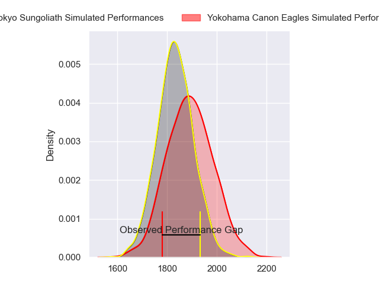
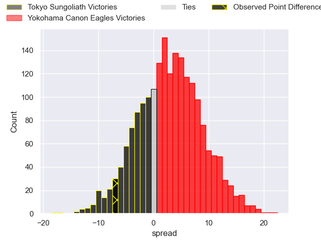
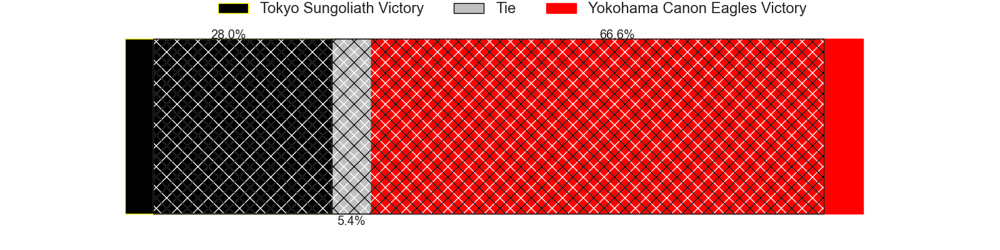
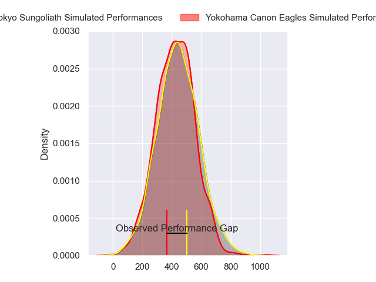
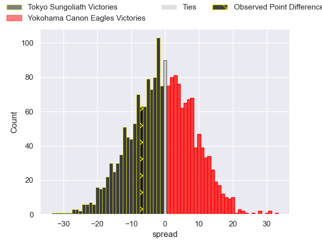

---  
layout: page  
title: Tokyo Sungoliath at Yokohama Canon Eagles; 40-33  
date: 2024-05-25 18:00:00 -0500  
categories: "Japan Rugby League One 2023" match review  
---
# Tokyo Sungoliath at Yokohama Canon Eagles; 40-33

# Club Level Predictions

The first set of predictions treats a club as the smallest object, as the club develops its members, organizes a gameplan, and deploys its players as needed for each match. This club model has a prediction of 0.582, which translates to predicting Yokohama Canon Eagles to win by 3.0.

Our Over/Under is 60.5 - and combined with the spread above, we have a predicted scoreline of 29 to 32

Each club has a rating and a rating deviation (similar to a Glicko rating), and expected performances can be generated. This allows for simulated matches and spreads like the ones below.
## Projected Performances - Club Model

## Projected Spreads - Club Model

## Projected Results - Club Model

# Player Level Predictions

Treating teams instead as an entity made up of the currently active players, I have ratings for each player in an altogether different system. These can be combined to form team ratings once teamsheets are announced, weighting starters a bit higher than the reserves. After the match is played, players can be weighted by their minutes on the field, allowing for an accurate measure of the team's composition. With these compiled team ratings, we can make predictions, measure inaccuracy, and update the individual player ratings.
## Prediction without Player Minutes: Yokohama Canon Eagles by 0.5

Tokyo Sungoliath by 2.8 on a neutral pitch

## Projected Performances - Player Model

## Projected Spreads - Player Model

## Projected Results - Player Model

|   Away Minutes | Away Player         |   Away Percentile |   Number |   Home Percentile | Home Player        |   Home Minutes |
|---------------:|:--------------------|------------------:|---------:|------------------:|:-------------------|---------------:|
|             80 | Kenta Kobayashi     |             60.73 |        1 |             96.76 | Takato Okabe       |             80 |
|             80 | Kosuke Horikoshi    |             81.54 |        2 |             88.6  | Shunta Nakamura    |             80 |
|             80 | Shinnosuke Kakinaga |             89.31 |        3 |             74.57 | Ryosuke Iwaihara   |             80 |
|             80 | Trevor Hosea        |             19.76 |        4 |              7.55 | Liaki Moli         |             80 |
|             80 | Harry Hockings      |             98.51 |        5 |             67.63 | Matt Philip        |             80 |
|             80 | Kanji Shimokawa     |             75.8  |        6 |             59.92 | Mitch Brown        |             80 |
|             80 | Sota Oketani        |             76.57 |        7 |             78.9  | Sioeli Vakalahi    |             80 |
|             80 | Hendrik Tui         |             68.53 |        8 |             93.37 | Amanaki Mafi       |             80 |
|             80 | Naoto Saito         |             12.59 |        9 |             71.72 | Kouki Arai         |             80 |
|             80 | Mikiya Takamoto     |             68.04 |       10 |             87.01 | Yu Tamura          |             80 |
|             80 | Cheslin Kolbe       |             99.91 |       11 |             41.98 | Masayoshi Takezawa |             80 |
|             80 | Ryoto Nakamura      |             95.8  |       12 |             28.97 | Ryo Tabata         |             80 |
|             80 | Isaiah Punivai      |             51.89 |       13 |             98.06 | Jesse Kriel        |             80 |
|             80 | Seiya Ozaki         |             92.69 |       14 |             68.47 | Chihito Matsui     |             80 |
|             80 | Kotaro Matsushima   |             95.18 |       15 |             98.53 | Jumpei Ogura       |             80 |

