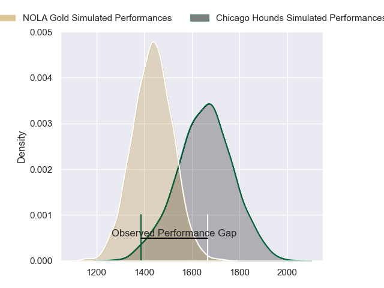
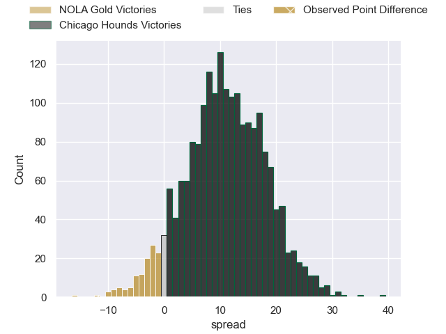
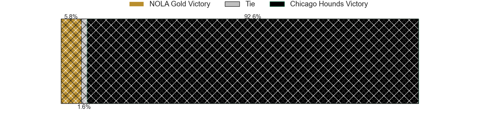
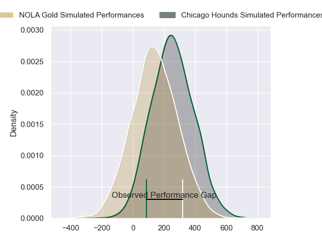
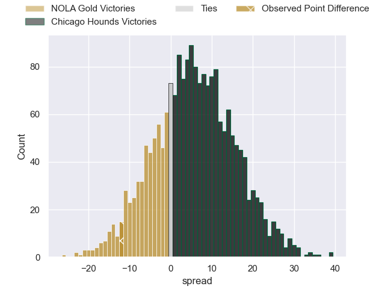
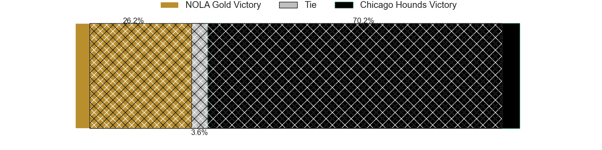

---  
layout: page  
title: NOLA Gold at Chicago Hounds; 25-13  
date: 2024-05-26 18:00:00 -0500  
categories: "Major League Rugby 2024" match review  
---
# NOLA Gold at Chicago Hounds; 25-13

# Club Level Predictions

The first set of predictions treats a club as the smallest object, as the club develops its members, organizes a gameplan, and deploys its players as needed for each match. This club model has a prediction of 0.769, which translates to predicting Chicago Hounds to win by 10.8.

Our Over/Under is 49.5 - and combined with the spread above, we have a predicted scoreline of 19 to 30

Each club has a rating and a rating deviation (similar to a Glicko rating), and expected performances can be generated. This allows for simulated matches and spreads like the ones below.
## Projected Performances - Club Model

## Projected Spreads - Club Model

## Projected Results - Club Model

# Player Level Predictions

Treating teams instead as an entity made up of the currently active players, I have ratings for each player in an altogether different system. These can be combined to form team ratings once teamsheets are announced, weighting starters a bit higher than the reserves. After the match is played, players can be weighted by their minutes on the field, allowing for an accurate measure of the team's composition. With these compiled team ratings, we can make predictions, measure inaccuracy, and update the individual player ratings.
## Prediction without Player Minutes: Chicago Hounds by 6.4

Chicago Hounds by 4.1 on a neutral pitch

## Projected Performances - Player Model

## Projected Spreads - Player Model

## Projected Results - Player Model

|   Away Minutes | Away Player         |   Away Percentile |   Number |   Home Percentile | Home Player             |   Home Minutes |
|---------------:|:--------------------|------------------:|---------:|------------------:|:------------------------|---------------:|
|             80 | Jarred Adams        |             80.4  |        1 |             18.14 | Charlie Abel            |             80 |
|             80 | Augusto Bohme       |             67.09 |        2 |             99.04 | Dylan Fawsitt           |             80 |
|             80 | Isaac Salmon        |             68.58 |        3 |             17.65 | Paddy Ryan              |             80 |
|             80 | Callum Botchar      |             72.1  |        4 |              6.45 | Mason Flesch            |             80 |
|             80 | Cam Dolan           |             64.75 |        5 |             57    | James Scott             |             80 |
|             80 | Malcolm May         |             78.27 |        6 |             24.59 | Ben Landry              |             80 |
|             80 | Moni Tonga'Uiha     |             78.27 |        7 |             19.85 | Maclean Jones           |             80 |
|             80 | Oj Noa              |             72.46 |        8 |              8.07 | Luke White              |             80 |
|             80 | Luke Campbell       |             73.28 |        9 |             54.83 | Jason Higgins           |             80 |
|             80 | Reece Botha         |             64.33 |       10 |             19.59 | Adriaan Carelse         |             80 |
|             80 | Ed Fidow            |             10.26 |       11 |             21.56 | Julián Dominguez Widmer |             80 |
|             80 | Jordan Jackson-Hope |             58.34 |       12 |             33.47 | Bill Meakes             |             80 |
|             80 | Jp Du Plessis       |             59.77 |       13 |             22.31 | Bryce Campbell          |             80 |
|             80 | Taniela Filimone    |             78.35 |       14 |             99.53 | Nate Augspurger         |             80 |
|             80 | Dougie Fife         |             76.94 |       15 |             18.66 | Luke Carty              |             80 |
|              0 | Ale Lopeti          |            nan    |       16 |             92.94 | Guillermo Pujadas       |              0 |
|              0 | Matt Harmon         |             59.76 |       17 |            nan    | Nico Revol              |              0 |
|              0 | Doc Irey            |            nan    |       18 |             90.61 | Ignacio Peculo          |              0 |
|              0 | William Waguespack  |             60.28 |       19 |             31.98 | George Merrick          |              0 |
|              0 | Fintan Coleman      |            nan    |       20 |            nan    | Brad Tucker             |              0 |
|              0 | Julian Roberts      |             53.46 |       21 |            nan    | Sidney Shoop            |              0 |
|              0 | Harley Wheeler      |            nan    |       22 |            nan    | Michael Baska           |              0 |
|              0 | Ross Depperschmidt  |             61.82 |       23 |             24.46 | Mark O'Keeffe           |              0 |

