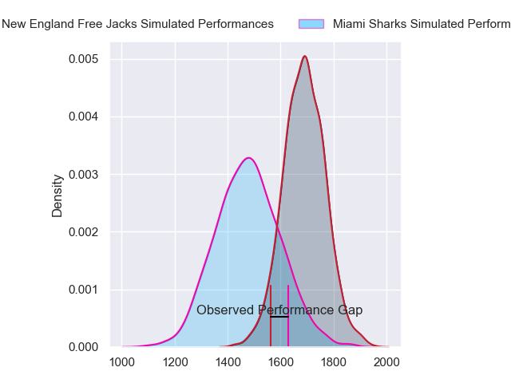
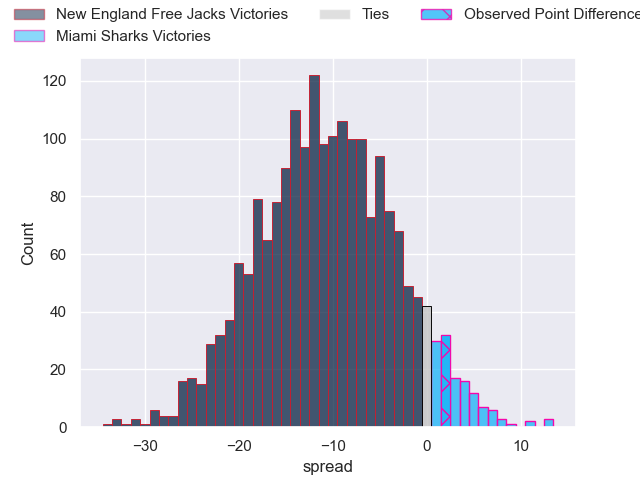
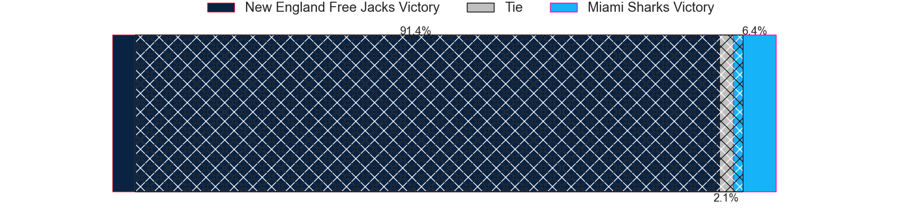
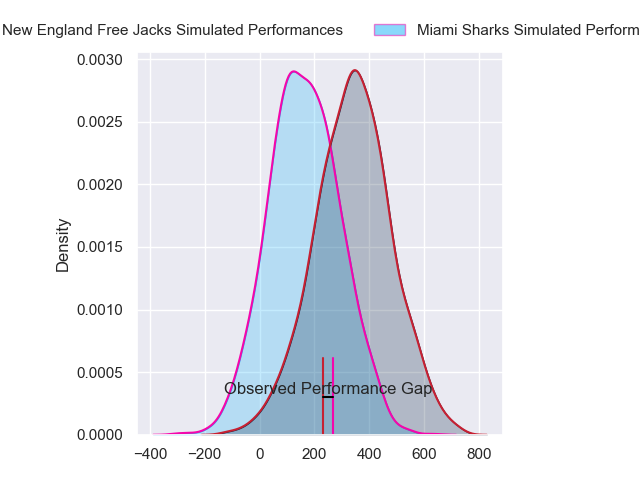
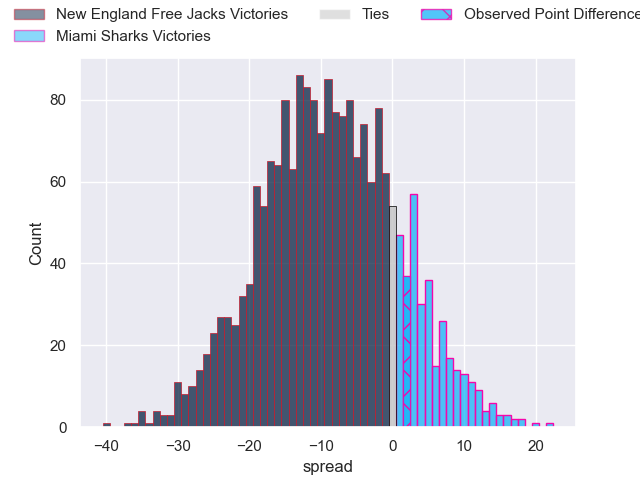
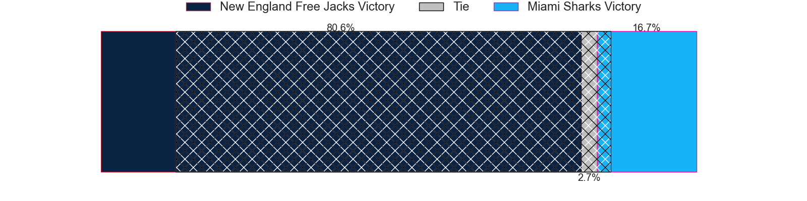

---  
layout: page  
title: New England Free Jacks at Miami Sharks; 13-15  
date: 2024-05-26 18:00:00 -0500  
categories: "Major League Rugby 2024" match review  
---
# New England Free Jacks at Miami Sharks; 13-15

# Club Level Predictions

The first set of predictions treats a club as the smallest object, as the club develops its members, organizes a gameplan, and deploys its players as needed for each match. This club model has a prediction of 0.233, which translates to predicting New England Free Jacks to win by 10.7.

Our Over/Under is 47.5 - and combined with the spread above, we have a predicted scoreline of 29 to 18

Each club has a rating and a rating deviation (similar to a Glicko rating), and expected performances can be generated. This allows for simulated matches and spreads like the ones below.
## Projected Performances - Club Model

## Projected Spreads - Club Model

## Projected Results - Club Model

# Player Level Predictions

Treating teams instead as an entity made up of the currently active players, I have ratings for each player in an altogether different system. These can be combined to form team ratings once teamsheets are announced, weighting starters a bit higher than the reserves. After the match is played, players can be weighted by their minutes on the field, allowing for an accurate measure of the team's composition. With these compiled team ratings, we can make predictions, measure inaccuracy, and update the individual player ratings.
## Prediction without Player Minutes: New England Free Jacks by 8.6

New England Free Jacks by 10.8 on a neutral pitch

## Projected Performances - Player Model

## Projected Spreads - Player Model

## Projected Results - Player Model

|   Away Minutes | Away Player             |   Away Percentile |   Number |   Home Percentile | Home Player              |   Home Minutes |
|---------------:|:------------------------|------------------:|---------:|------------------:|:-------------------------|---------------:|
|             80 | Kyle Ciquera            |             73.68 |        1 |             94.57 | Rob Evans                |             80 |
|             80 | AJ Quattrin             |             59.23 |        2 |             63.56 | Sean McNulty             |             80 |
|             80 | Cole Keith              |             86.23 |        3 |             78.7  | Alec McDonnell           |             80 |
|             80 | Kyle Baillie            |             62.76 |        4 |             55.81 | Rick Rose                |             80 |
|             80 | Conor Keys              |             76.86 |        5 |              2.38 | Stan van den Hoven       |             80 |
|             80 | Ethan Fryer             |             36.21 |        6 |             88.77 | Benjam�n Bonasso         |             80 |
|             80 | Seta Baker              |             37.95 |        7 |             25.65 | Roelof Smit              |             80 |
|             80 | Cam Davidowicz          |             33.75 |        8 |             81.57 | Manuel Ardao             |             80 |
|             80 | Cameron Nordli-Kelemeti |             18.45 |        9 |             37.76 | Tomas Cubelli            |             80 |
|             80 | Jayson Potroz           |             92.78 |       10 |             53.61 | Santiago Videla Cambiaso |             80 |
|             80 | Isaac Olson             |             19.66 |       11 |             62.68 | Avery Oitomen            |             80 |
|             80 | Le Roux Malan           |             87.72 |       12 |             13.92 | Nick Grigg               |             80 |
|             80 | Ben LeSage              |             72.98 |       13 |             90.07 | Tomas Inciarte Rachetti  |             80 |
|             80 | Mitch Wilson            |             95.73 |       14 |             64.96 | Michael Hand             |             80 |
|             80 | Danyon Morgan-Puterangi |             62.47 |       15 |             74.63 | Felipe Etcheverry        |             80 |

