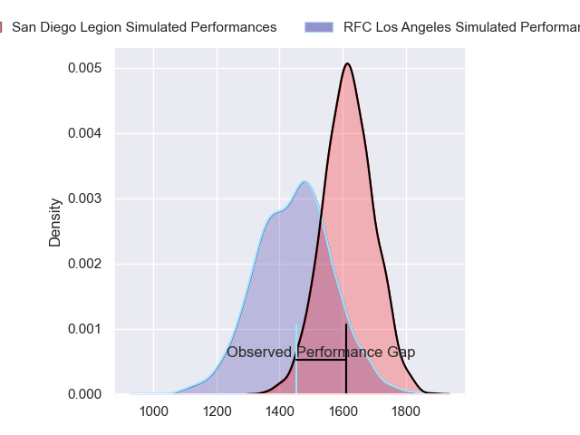
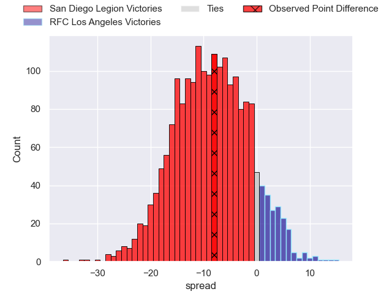
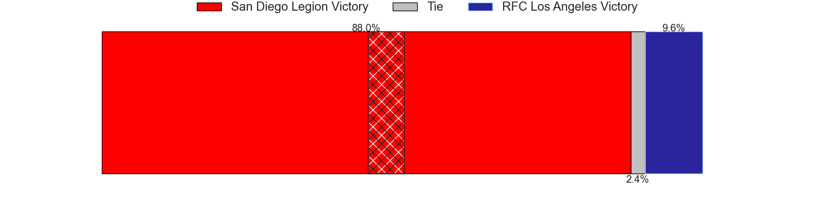
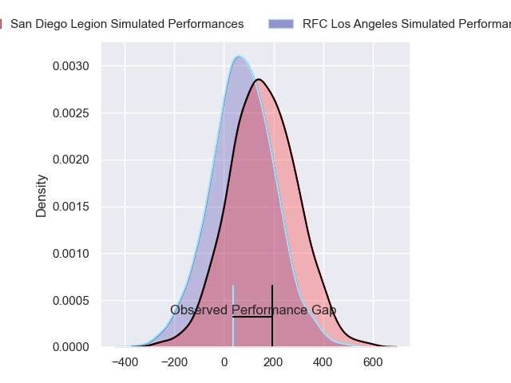
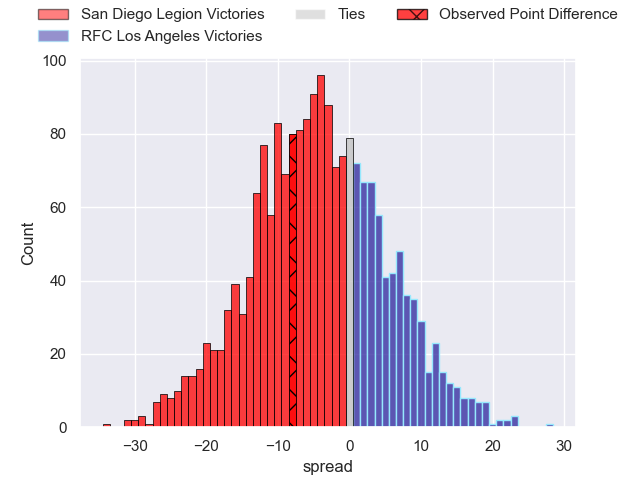
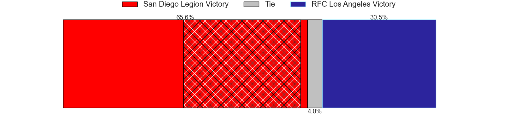

---  
layout: page  
title: San Diego Legion at RFC Los Angeles; 27-19  
date: 2024-05-27 18:00:00 -0500  
categories: "Major League Rugby 2024" match review  
---
# San Diego Legion at RFC Los Angeles; 27-19

# Club Level Predictions

The first set of predictions treats a club as the smallest object, as the club develops its members, organizes a gameplan, and deploys its players as needed for each match. This club model has a prediction of 0.271, which translates to predicting San Diego Legion to win by 8.9.

Our Over/Under is 50.5 - and combined with the spread above, we have a predicted scoreline of 30 to 21

Each club has a rating and a rating deviation (similar to a Glicko rating), and expected performances can be generated. This allows for simulated matches and spreads like the ones below.
## Projected Performances - Club Model

## Projected Spreads - Club Model

## Projected Results - Club Model

# Player Level Predictions

Treating teams instead as an entity made up of the currently active players, I have ratings for each player in an altogether different system. These can be combined to form team ratings once teamsheets are announced, weighting starters a bit higher than the reserves. After the match is played, players can be weighted by their minutes on the field, allowing for an accurate measure of the team's composition. With these compiled team ratings, we can make predictions, measure inaccuracy, and update the individual player ratings.
## Prediction without Player Minutes: San Diego Legion by 3.8

San Diego Legion by 6.0 on a neutral pitch

## Projected Performances - Player Model

## Projected Spreads - Player Model

## Projected Results - Player Model

|   Away Minutes | Away Player          |   Away Percentile |   Number |   Home Percentile | Home Player       |   Home Minutes |
|---------------:|:---------------------|------------------:|---------:|------------------:|:------------------|---------------:|
|             80 | Payton Telea-Ilalio  |             13.44 |        1 |             19.92 | Dane Zander       |             80 |
|             80 | Hugh Roach           |             66.77 |        2 |             25.04 | Ben Strang        |             80 |
|             80 | Darcy Breen          |             31.09 |        3 |              1.54 | Alex Maughan      |             80 |
|             80 | Jay Tuivaiti         |             39.92 |        4 |             22.05 | Theo Vukasinovic  |             80 |
|             80 | Greg Peterson        |              9.33 |        5 |             90.96 | Reegan O'Gorman   |             80 |
|             80 | Christian Poidevin   |             71.73 |        6 |             26.82 | Michael Amiras    |             80 |
|             80 | Blair Cowan          |             80.93 |        7 |             35.53 | Max Katjijeko     |             80 |
|             80 | Tupou Ma'afu-Afungia |             36.65 |        8 |              2.69 | Jason Damm        |             80 |
|             80 | Connor Tupai         |             17.41 |        9 |             43.28 | Niall Saunders    |             80 |
|             80 | Matt Giteau          |             99.38 |       10 |             27.63 | Tas Smith         |             80 |
|             80 | James Vaifale        |             16.05 |       11 |              6.17 | Jack Shaw         |             80 |
|             80 | Tiaan Loots          |             73.08 |       12 |             40.33 | James Stokes      |             80 |
|             80 | Ethan Grayson        |             67.45 |       13 |             41.66 | Will Leonard      |             80 |
|             80 | Tomas Aoake          |             38.94 |       14 |             30.67 | Brooklyn Hardaker |             80 |
|             80 | Alex Horan           |             34.59 |       15 |             61.64 | Andrew Coe        |             80 |

