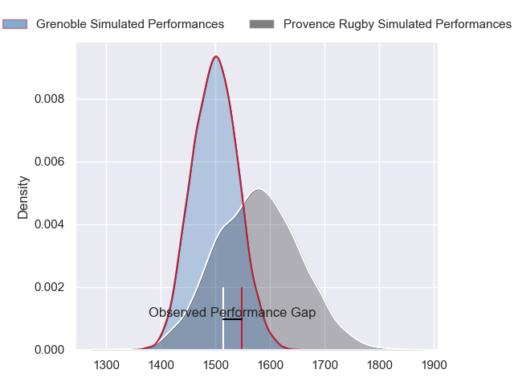
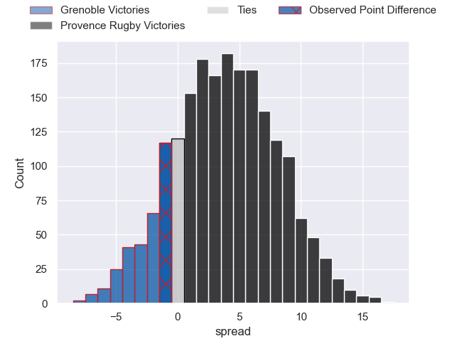
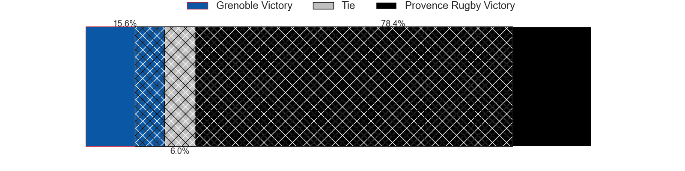
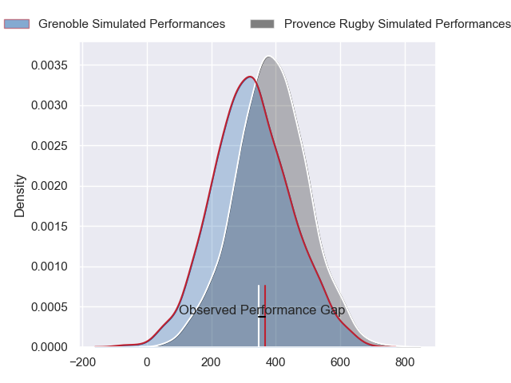
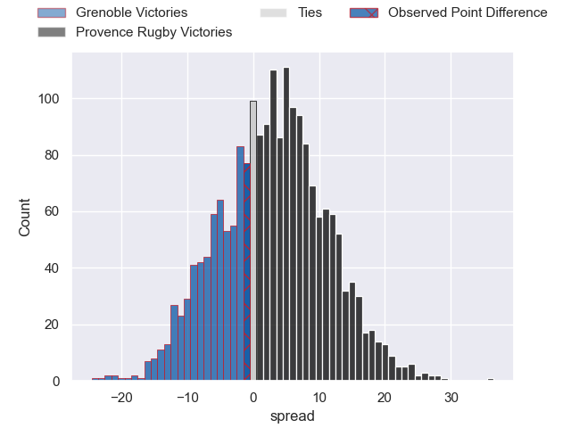
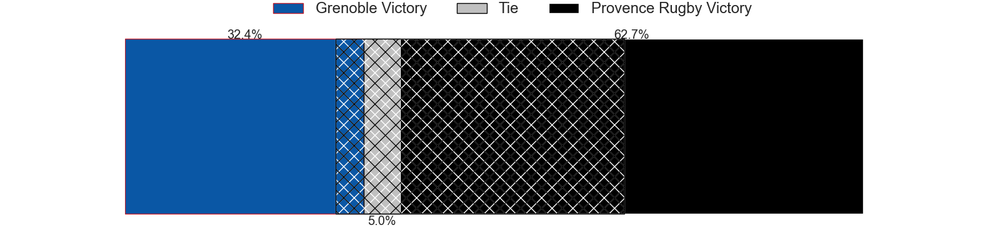

---  
layout: page  
title: Grenoble at Provence Rugby; 23-22  
date: 2024-05-30 18:00:00 -0500  
categories: "Pro D2 2023" match review  
---
# Grenoble at Provence Rugby; 23-22

# Club Level Predictions

The first set of predictions treats a club as the smallest object, as the club develops its members, organizes a gameplan, and deploys its players as needed for each match. This club model has a prediction of 0.608, which translates to predicting Provence Rugby to win by 3.8.

Our Over/Under is 47.5 - and combined with the spread above, we have a predicted scoreline of 22 to 26

Each club has a rating and a rating deviation (similar to a Glicko rating), and expected performances can be generated. This allows for simulated matches and spreads like the ones below.
## Projected Performances - Club Model

## Projected Spreads - Club Model

## Projected Results - Club Model

# Player Level Predictions

Treating teams instead as an entity made up of the currently active players, I have ratings for each player in an altogether different system. These can be combined to form team ratings once teamsheets are announced, weighting starters a bit higher than the reserves. After the match is played, players can be weighted by their minutes on the field, allowing for an accurate measure of the team's composition. With these compiled team ratings, we can make predictions, measure inaccuracy, and update the individual player ratings.
## Prediction without Player Minutes: Provence Rugby by 6.1

Provence Rugby by 0.3 on a neutral pitch

## Projected Performances - Player Model

## Projected Spreads - Player Model

## Projected Results - Player Model

|   Away Minutes | Away Player         |   Away Percentile |   Number |   Home Percentile | Home Player           |   Home Minutes |
|---------------:|:--------------------|------------------:|---------:|------------------:|:----------------------|---------------:|
|             58 | Luka Goginava       |             76.84 |        1 |             69.39 | Federico Wegrzyn      |             31 |
|             58 | Barnabé Massa       |             87.14 |        2 |             93.25 | Lucas Martin          |             41 |
|             58 | Regis Montagne      |             88.83 |        3 |             99.68 | Tomas Francis         |             58 |
|             51 | Thomas Lainault     |             71.5  |        4 |             88.7  | Jérôme Dufour         |             47 |
|             80 | Georgi Javakhia     |             89.6  |        5 |             78.6  | Josh Tyrell           |             47 |
|             80 | Jose Madeira        |             93.64 |        6 |             83.33 | Guillaume Piazzoli    |             55 |
|             80 | Steeve Blanc-Mappaz |             86.71 |        7 |             88.34 | Bilel Taieb           |             80 |
|             51 | Pio Muarua          |             78.93 |        8 |             83.06 | Teimana Harrison      |             80 |
|             62 | Eric Escande        |             94.16 |        9 |             70.96 | Arthur Coville        |             56 |
|             80 | Sam Davies          |             90.45 |       10 |             90.24 | Jimmy Gopperth        |             80 |
|             80 | Nathan Farissier    |             28.44 |       11 |             72.32 | Léo Drouet            |             80 |
|             55 | Romain Trouilloud   |             82.52 |       12 |             91.31 | Kaveinga Finau        |              9 |
|             80 | Romain Fusier       |             60.81 |       13 |             63.7  | Atila Septar          |             80 |
|             80 | Geoffrey Cros       |             81.33 |       14 |             31.37 | Adrien Lapegue-Lafaye |             80 |
|             80 | Julien Farnoux      |             98.12 |       15 |             61.17 | Mathias Colombet      |             80 |
|             29 | Thibaut Martel      |             70.52 |       16 |             91.46 | Enzo Selponi          |             71 |
|             29 | Pierce Phillips     |             83    |       17 |             85.26 | Julius Nostadt        |             49 |
|             25 | Bautista Ezcurra    |             97.1  |       18 |              3.38 | Loick Jammes          |             39 |
|             22 | Irakli Aptsiauri    |             83.72 |       19 |             50.8  | Malohi Suta           |             33 |
|             22 | Eli Eglaine         |             31.74 |       20 |             77.46 | Charly Gambini        |             33 |
|             22 | Mathis Sarragallet  |             51.93 |       21 |             58.88 | Carl Axtens           |             25 |
|             18 | Barnabe Couilloud   |             11    |       22 |             77.84 | Joris Cazenave        |             24 |
|            nan | nan                 |            nan    |       23 |             80.97 | Paul Mallez           |             22 |

