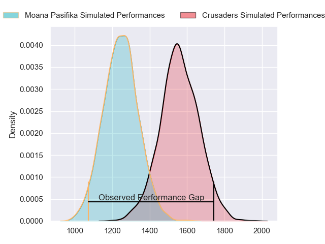
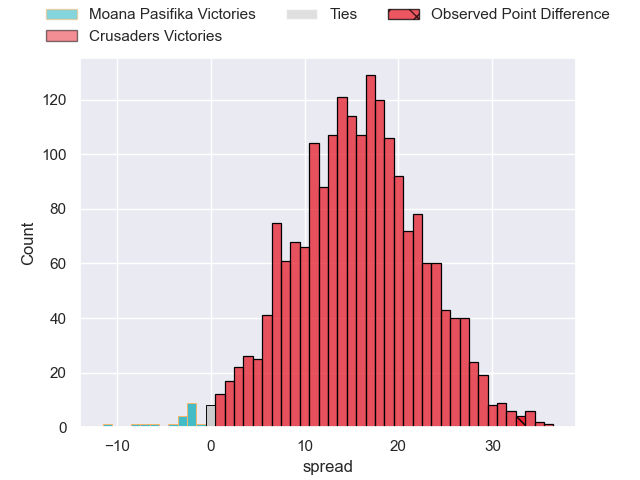
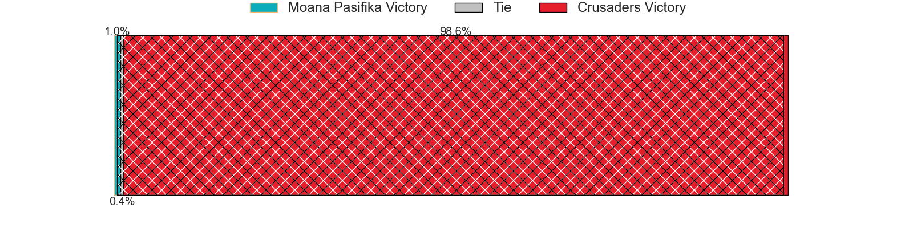
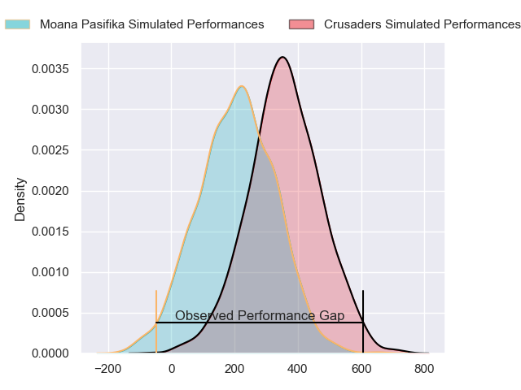
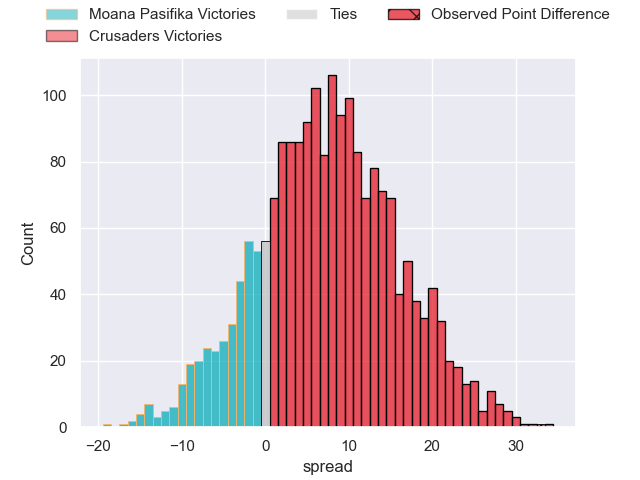
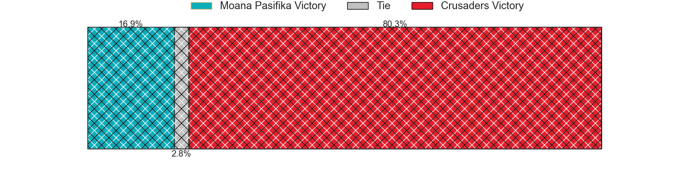

---  
layout: page  
title: Moana Pasifika at Crusaders; 10-43  
date: 2024-05-31 18:00:00 -0500  
categories: "Super Rugby Pacific 2024" match review  
---
# Moana Pasifika at Crusaders; 10-43

# Club Level Predictions

The first set of predictions treats a club as the smallest object, as the club develops its members, organizes a gameplan, and deploys its players as needed for each match. This club model has a prediction of 0.854, which translates to predicting Crusaders to win by 15.9.

Our Over/Under is 57.5 - and combined with the spread above, we have a predicted scoreline of 21 to 37

Each club has a rating and a rating deviation (similar to a Glicko rating), and expected performances can be generated. This allows for simulated matches and spreads like the ones below.
## Projected Performances - Club Model

## Projected Spreads - Club Model

## Projected Results - Club Model

# Player Level Predictions

Treating teams instead as an entity made up of the currently active players, I have ratings for each player in an altogether different system. These can be combined to form team ratings once teamsheets are announced, weighting starters a bit higher than the reserves. After the match is played, players can be weighted by their minutes on the field, allowing for an accurate measure of the team's composition. With these compiled team ratings, we can make predictions, measure inaccuracy, and update the individual player ratings.
## Prediction without Player Minutes: Crusaders by 10.1

Crusaders by 5.7 on a neutral pitch

## Projected Performances - Player Model

## Projected Spreads - Player Model

## Projected Results - Player Model

|   Away Minutes | Away Player           |   Away Percentile |   Number |   Home Percentile | Home Player          |   Home Minutes |
|---------------:|:----------------------|------------------:|---------:|------------------:|:---------------------|---------------:|
|             56 | Abraham Pole          |             14.01 |        1 |             73.36 | Joe Moody            |             57 |
|             52 | Samiuela Moli         |              4.82 |        2 |             99.52 | Codie Taylor         |             59 |
|             44 | Sekope Kepu           |             85.59 |        3 |             86.32 | Tamaiti Williams     |             59 |
|             80 | Tom Savage            |             91.6  |        4 |             12.4  | Antonio Shalfoon     |             13 |
|             44 | Allan Craig           |             13.7  |        5 |             93.9  | Quinten Strange      |             80 |
|             80 | Jacob Norris          |             87.96 |        6 |             87.67 | Cullen Grace         |             63 |
|             80 | Sione Havili Talitui  |             83.62 |        7 |             98.75 | Ethan Blackadder     |             80 |
|             56 | Lotu Inisi            |             11.16 |        8 |             59.5  | Christian Lio-Willie |             80 |
|             50 | Jonathan Taumateine   |             34.71 |        9 |             76.12 | Noah Hotham          |             65 |
|             80 | William Havili        |             30.28 |       10 |             43.5  | Fergus Burke         |             80 |
|             66 | Pepesana Patafilo     |             75.55 |       11 |             28.91 | Macca Springer       |             80 |
|             80 | Julian Savea          |             98.04 |       12 |             97.62 | Ryan Crotty          |             54 |
|             80 | Henry Taefu           |             22.96 |       13 |             72.49 | Dallas McLeod        |             66 |
|             80 | Fine Inisi            |              5.88 |       14 |             27.96 | Chay Fihaki          |             80 |
|             52 | Kyren Taumoefolau     |             34.86 |       15 |             87.89 | Johnny McNicholl     |             80 |
|             28 | Thomas Maka           |            nan    |       16 |             10.77 | George Bell          |             21 |
|             24 | Ivan Fepuleai         |            nan    |       17 |              7.29 | George Bower         |             23 |
|             36 | Suetena Asomua        |             20.4  |       18 |             75.63 | Owen Franks          |             21 |
|             36 | Ola Tauelangi         |             33.7  |       19 |             26.88 | Dom Gardiner         |             67 |
|             24 | Alamanda Motuga       |             31.6  |       20 |             69.56 | Tom Christie         |             17 |
|             30 | Aisea Halo            |             38.32 |       21 |             88.49 | Mitchell Drummond    |             15 |
|             28 | Christian Leali'ifano |             77.85 |       22 |             33.61 | Taine Robinson       |             26 |
|             14 | Nigel Ah Wong         |             74.98 |       23 |             23.03 | Heremaia Murray      |             14 |

