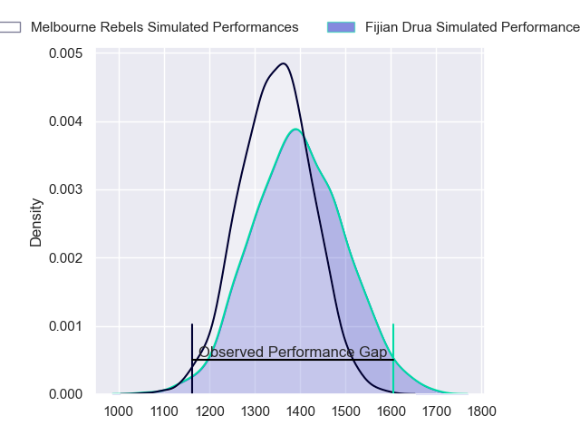
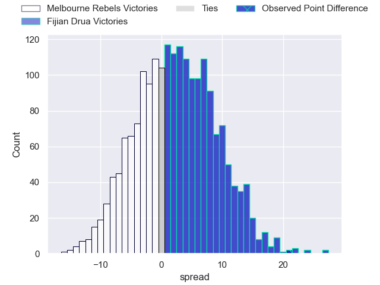
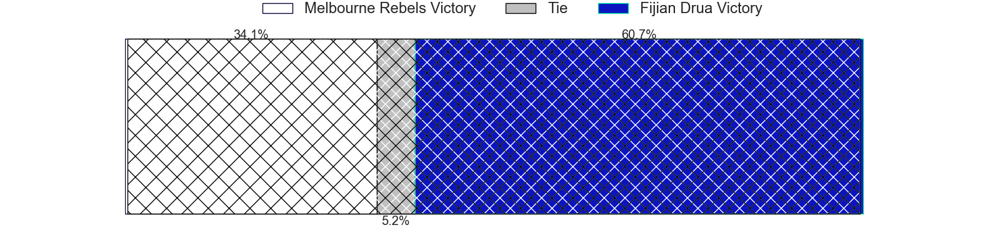
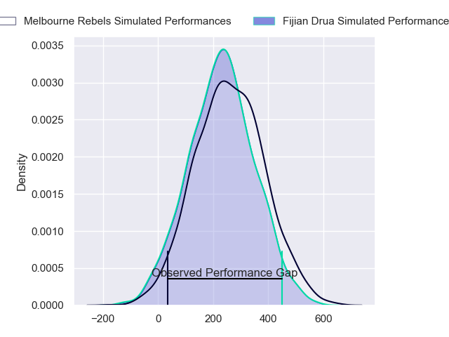
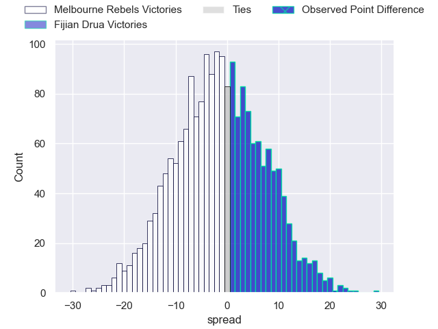
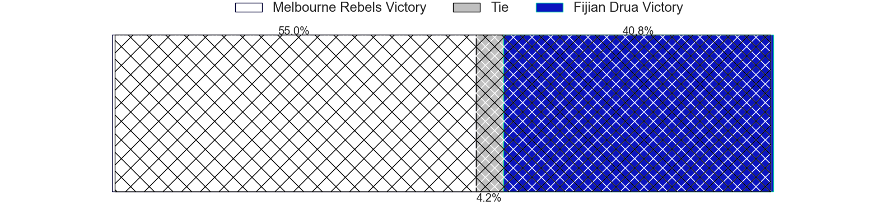

---  
layout: page  
title: Melbourne Rebels at Fijian Drua; 19-40  
date: 2024-05-31 18:00:00 -0500  
categories: "Super Rugby Pacific 2024" match review  
---
# Melbourne Rebels at Fijian Drua; 19-40

# Club Level Predictions

The first set of predictions treats a club as the smallest object, as the club develops its members, organizes a gameplan, and deploys its players as needed for each match. This club model has a prediction of 0.573, which translates to predicting Fijian Drua to win by 2.6.

Our Over/Under is 54.5 - and combined with the spread above, we have a predicted scoreline of 26 to 28

Each club has a rating and a rating deviation (similar to a Glicko rating), and expected performances can be generated. This allows for simulated matches and spreads like the ones below.
## Projected Performances - Club Model

## Projected Spreads - Club Model

## Projected Results - Club Model

# Player Level Predictions

Treating teams instead as an entity made up of the currently active players, I have ratings for each player in an altogether different system. These can be combined to form team ratings once teamsheets are announced, weighting starters a bit higher than the reserves. After the match is played, players can be weighted by their minutes on the field, allowing for an accurate measure of the team's composition. With these compiled team ratings, we can make predictions, measure inaccuracy, and update the individual player ratings.
## Prediction without Player Minutes: Melbourne Rebels by 1.4

Melbourne Rebels by 3.8 on a neutral pitch

## Projected Performances - Player Model

## Projected Spreads - Player Model

## Projected Results - Player Model

|   Away Minutes | Away Player         |   Away Percentile |   Number |   Home Percentile | Home Player             |   Home Minutes |
|---------------:|:--------------------|------------------:|---------:|------------------:|:------------------------|---------------:|
|             49 | Isaac Aedo Kailea   |             26.32 |        1 |             54.41 | Livai Natave            |             59 |
|             54 | Jordan Uelese       |             30.23 |        2 |             90.51 | Tevita Ikanivere        |             69 |
|             49 | Taniela Tupou       |             95.38 |        3 |             43.24 | Mesake Doge             |             59 |
|             80 | Angelo Smith        |             25.2  |        4 |             76.6  | Mesake Vocevoce         |             80 |
|             80 | Josh Canham         |             42.4  |        5 |             53.8  | Ratu Rotuisolia         |             51 |
|             80 | Josh Kemeny         |             10.02 |        6 |             83.24 | Etonia Waqa             |             61 |
|             63 | Brad Wilkin         |             21.87 |        7 |             11.08 | Kitione Salawa          |             80 |
|             42 | Rob Leota           |              2.48 |        8 |             44.01 | Meli Derenalagi         |             51 |
|             80 | Ryan Louwrens       |             95.36 |        9 |             79.04 | Frank Lomani            |             80 |
|             80 | Carter Gordon       |             60.77 |       10 |             33.33 | Isaiah Armstrong-Ravula |             45 |
|             80 | Darby Lancaster     |             43.13 |       11 |             63.32 | Waqa Nalaga             |             80 |
|             69 | David Feliuai       |             43.74 |       12 |             47.98 | Kemu Valetini           |             80 |
|             52 | Filipo Daugunu      |             94.83 |       13 |             82.94 | Iosefo Masi             |             80 |
|             80 | Andrew Kellaway     |             63.6  |       14 |             84.93 | Selestino Ravutaumada   |             80 |
|             80 | Mason Gordon        |             19.62 |       15 |             67.43 | Ilaisa Droasese         |             75 |
|             26 | Ethan Dobbins       |            nan    |       16 |             38.1  | Zuriel Togiatama        |             11 |
|             31 | Matt Gibbon         |             88.74 |       17 |            nan    | Emosi Tuqiri            |             21 |
|             31 | Sam Talakai         |             54.25 |       18 |            nan    | Meli Tuni               |             21 |
|             25 | Tuaina Taii Tualima |             80.1  |       19 |             66.7  | Isoa Nasilasila         |             29 |
|             30 | Maciu Nabolakasi    |             54.91 |       20 |             39.88 | Motikiai Murray         |             19 |
|             11 | James Tuttle        |             66.84 |       21 |             64.67 | Elia Canakaivata        |             29 |
|             37 | David Vaihu         |            nan    |       22 |             13.06 | Simione Kuruvoli        |              0 |
|             28 | Lukas Ripley        |             54.08 |       23 |             68.5  | Caleb Muntz             |             35 |

