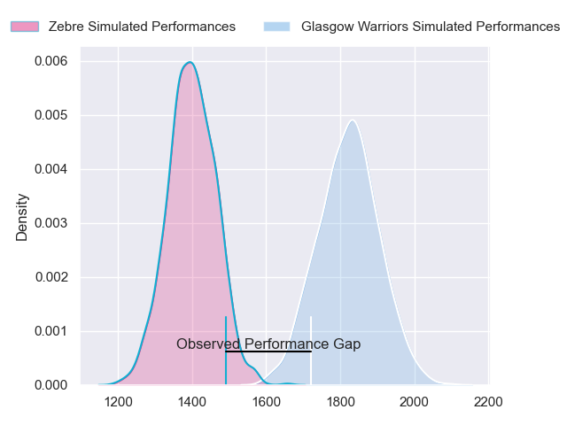
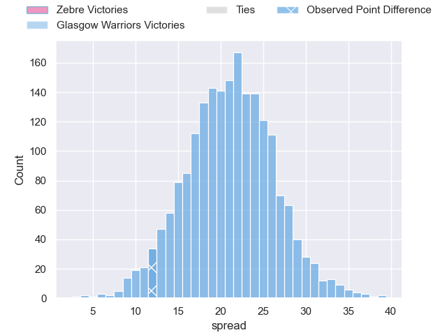
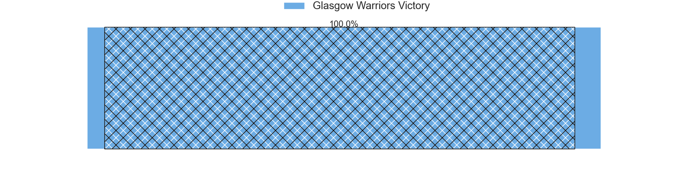
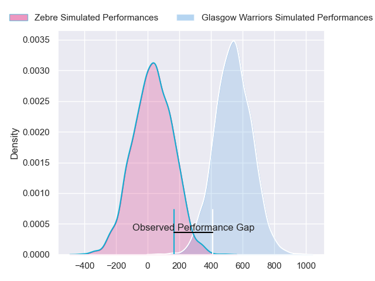
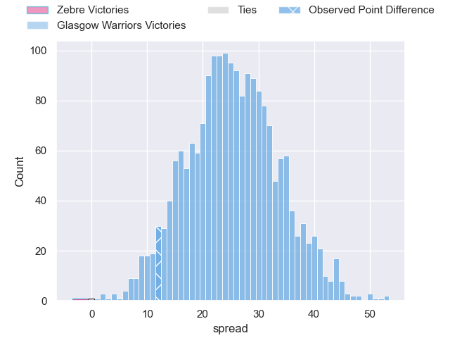
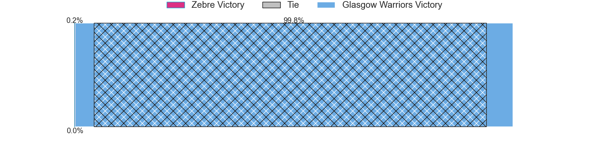

---  
layout: page  
title: Zebre at Glasgow Warriors; 26-38  
date: 2024-05-31 18:00:00 -0500  
categories: "United Rugby Championship 2023" match review  
---
# Zebre at Glasgow Warriors; 26-38

# Club Level Predictions

The first set of predictions treats a club as the smallest object, as the club develops its members, organizes a gameplan, and deploys its players as needed for each match. This club model has a prediction of 0.918, which translates to predicting Glasgow Warriors to win by 21.4.

Our Over/Under is 50.5 - and combined with the spread above, we have a predicted scoreline of 15 to 36

Each club has a rating and a rating deviation (similar to a Glicko rating), and expected performances can be generated. This allows for simulated matches and spreads like the ones below.
## Projected Performances - Club Model

## Projected Spreads - Club Model

## Projected Results - Club Model

# Player Level Predictions

Treating teams instead as an entity made up of the currently active players, I have ratings for each player in an altogether different system. These can be combined to form team ratings once teamsheets are announced, weighting starters a bit higher than the reserves. After the match is played, players can be weighted by their minutes on the field, allowing for an accurate measure of the team's composition. With these compiled team ratings, we can make predictions, measure inaccuracy, and update the individual player ratings.
## Prediction without Player Minutes: Glasgow Warriors by 25.9

Glasgow Warriors by 19.5 on a neutral pitch

## Projected Performances - Player Model

## Projected Spreads - Player Model

## Projected Results - Player Model

|   Away Minutes | Away Player           |   Away Percentile |   Number |   Home Percentile | Home Player           |   Home Minutes |
|---------------:|:----------------------|------------------:|---------:|------------------:|:----------------------|---------------:|
|             40 | Danilo Fischetti      |             52.79 |        1 |             93.44 | Jamie Bhatti          |             51 |
|             56 | Giampietro Ribaldi    |              8.04 |        2 |             13.83 | Johnny Matthews       |             71 |
|             67 | Muhamed Hasa          |             19.19 |        3 |             99.19 | Zander Fagerson       |             71 |
|             53 | Matteo Canali         |             89    |        4 |             37.2  | Max Williamson        |             18 |
|             81 | Leonard Krumov        |              2.4  |        5 |             73.9  | Richie Gray           |             63 |
|             81 | Giacomo Ferrari       |             35.65 |        6 |             94.99 | Matt Fagerson         |             81 |
|             81 | Bautista Stavile      |             21.29 |        7 |             76.88 | Rory Darge            |             81 |
|             52 | Davide Ruggeri        |             34.92 |        8 |             23.14 | Jack Dempsey          |             81 |
|             31 | Alessandro Fusco      |              7.04 |        9 |             72.85 | Jamie Dobie           |             81 |
|             67 | Giovanni Montemauri   |              2.64 |       10 |             78.66 | Duncan Weir           |             49 |
|             81 | Simone Gesi           |              6.16 |       11 |             99.15 | Sebastian Cancelliere |             81 |
|             57 | Damiano Mazza         |             73.11 |       12 |             45.4  | Sione Tuipulotu       |             81 |
|             81 | Luca Morisi           |             90.9  |       13 |             30.2  | Huw Jones             |             63 |
|             81 | Pierre Bruno          |             39.05 |       14 |             90.62 | Facundo Cordero       |             49 |
|             81 | Jacopo Trulla         |              2.09 |       15 |             70.98 | Kyle Rowe             |             81 |
|             25 | Tommaso Di Bartolomeo |            nan    |       16 |             69.13 | Gregor Hiddleston     |             10 |
|             41 | Alessio Sanavia       |            nan    |       17 |             48.91 | Nathan McBeth         |             30 |
|             14 | Riccardo Genovese     |            nan    |       18 |             96.6  | Oli Kebble            |             10 |
|             28 | Dave Sisi             |              4.8  |       19 |             97.6  | Scott Cummings        |             63 |
|             29 | Taina Fox-Matamua     |             71.39 |       20 |             44.22 | Euan Ferrie           |             18 |
|             50 | Ratko Jelic           |            nan    |       21 |             99.14 | George Horne          |             32 |
|             14 | Tiff Eden             |              9.15 |       22 |             67.89 | Ross Thompson         |             32 |
|             24 | Fetuli Paea           |             69.39 |       23 |             35.98 | Tom Jordan            |             18 |

