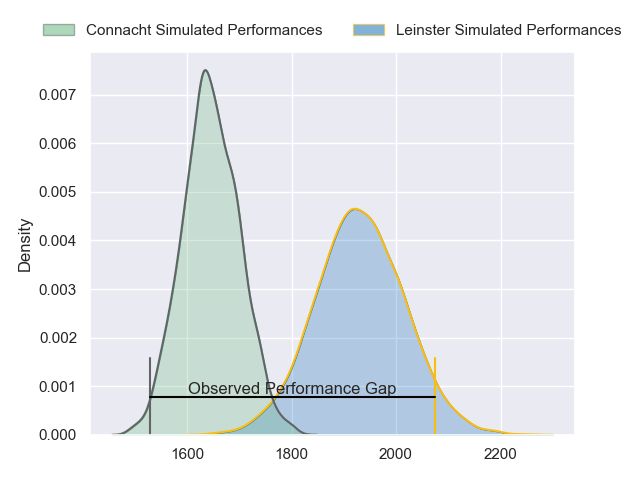
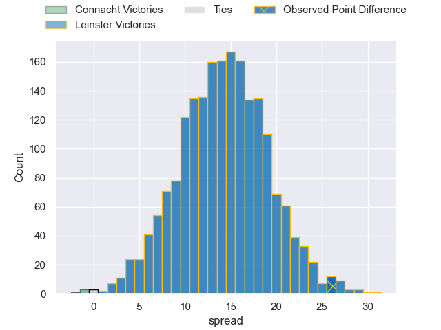
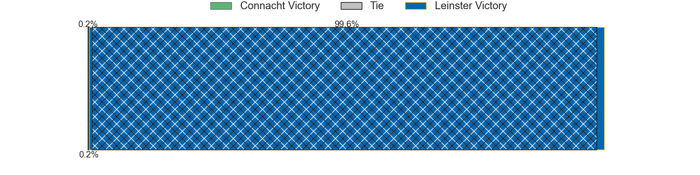
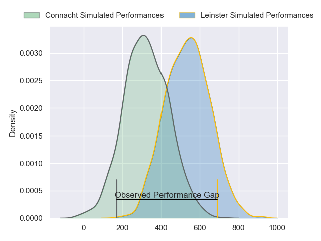
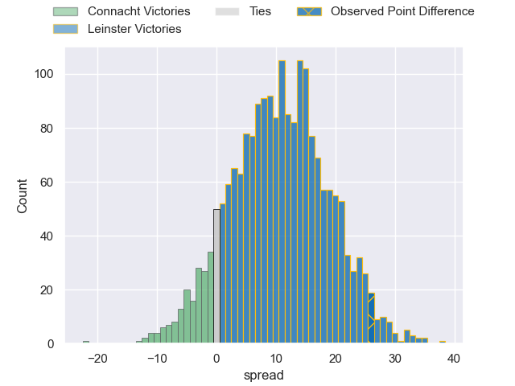
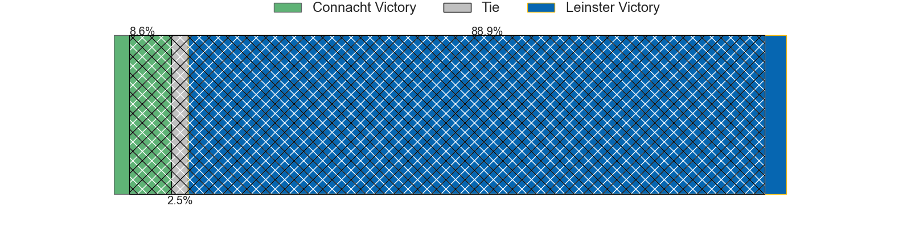

---  
layout: page  
title: Connacht at Leinster; 7-33  
date: 2024-05-31 18:00:00 -0500  
categories: "United Rugby Championship 2023" match review  
---
# Connacht at Leinster; 7-33

# Club Level Predictions

The first set of predictions treats a club as the smallest object, as the club develops its members, organizes a gameplan, and deploys its players as needed for each match. This club model has a prediction of 0.836, which translates to predicting Leinster to win by 14.4.

Our Over/Under is 61.5 - and combined with the spread above, we have a predicted scoreline of 24 to 38

Each club has a rating and a rating deviation (similar to a Glicko rating), and expected performances can be generated. This allows for simulated matches and spreads like the ones below.
## Projected Performances - Club Model

## Projected Spreads - Club Model

## Projected Results - Club Model

# Player Level Predictions

Treating teams instead as an entity made up of the currently active players, I have ratings for each player in an altogether different system. These can be combined to form team ratings once teamsheets are announced, weighting starters a bit higher than the reserves. After the match is played, players can be weighted by their minutes on the field, allowing for an accurate measure of the team's composition. With these compiled team ratings, we can make predictions, measure inaccuracy, and update the individual player ratings.
## Prediction without Player Minutes: Leinster by 11.9

Leinster by 5.6 on a neutral pitch

## Projected Performances - Player Model

## Projected Spreads - Player Model

## Projected Results - Player Model

|   Away Minutes | Away Player          |   Away Percentile |   Number |   Home Percentile | Home Player        |   Home Minutes |
|---------------:|:---------------------|------------------:|---------:|------------------:|:-------------------|---------------:|
|             41 | Peter Dooley         |             97.17 |        1 |             92.47 | Ed Byrne           |             53 |
|             61 | Dave Heffernan       |             56.27 |        2 |             93.57 | Ronan Kelleher     |             53 |
|             41 | Finlay Bealham       |             96.03 |        3 |             80.65 | Thomas Clarkson    |             62 |
|             51 | Joe Joyce            |             95.6  |        4 |             95.3  | Ross Molony        |             80 |
|             80 | Niall Murray         |             89.5  |        5 |             49    | Brian Deeny        |             71 |
|             80 | Cian Prendergast     |             52.5  |        6 |             99.71 | Rhys Ruddock       |             49 |
|             80 | Conor Oliver         |             85.07 |        7 |             85.55 | Scott Penny        |             80 |
|             25 | Sean Jansen          |             14.46 |        8 |             97.11 | Jack Conan         |             41 |
|             47 | Caolin Blade         |             76.8  |        9 |             53.61 | Cormac Foley       |             80 |
|             51 | Jack Carty           |             92.48 |       10 |             15.85 | Sam Prendergast    |             80 |
|             43 | Shane Mallon         |             41.04 |       11 |             69.95 | Rob Russell        |             57 |
|             80 | Cathal Forde         |             17.58 |       12 |             58.95 | Ciaran Frawley     |             62 |
|             80 | David Hawkshaw       |             66.6  |       13 |             90.07 | Jamie Osborne      |             80 |
|             80 | Shane Jennings       |             55.55 |       14 |             51.37 | Tommy O'Brien      |             50 |
|             80 | Santiago Cordero     |             94.99 |       15 |             92.28 | Jimmy O'Brien      |             80 |
|             19 | Dylan Tierney-Martin |             69.45 |       16 |             69.94 | Dan Sheehan        |             27 |
|             39 | Denis Buckley        |             89.47 |       17 |             68.02 | Michael Milne      |             27 |
|             39 | Jack Aungier         |             75.79 |       18 |             94.74 | Michael Ala'alatoa |             27 |
|             29 | Darragh Murray       |             38    |       19 |             88.25 | Ryan Baird         |             31 |
|             55 | Sean O'Brien         |             31.61 |       20 |             91.14 | Max Deegan         |             39 |
|             33 | Colm Reilly          |             42.96 |       21 |             98.97 | Luke McGrath       |             23 |
|             37 | Byron Ralston        |              6.92 |       22 |             86.99 | Harry Byrne        |             18 |
|             29 | Tom Daly             |             23.06 |       23 |             89.04 | Charlie Ngatai     |             30 |

