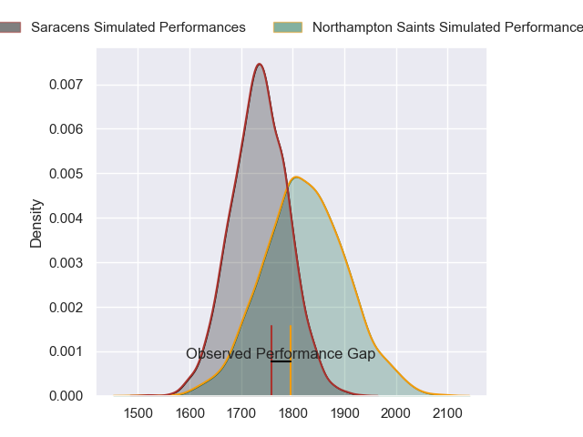
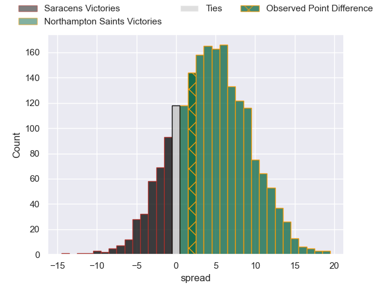
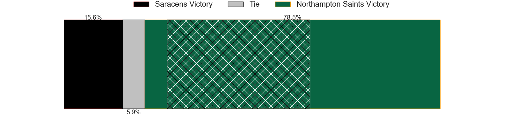
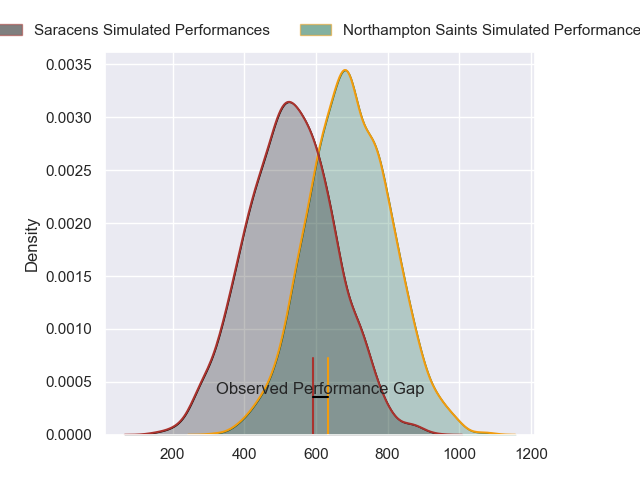
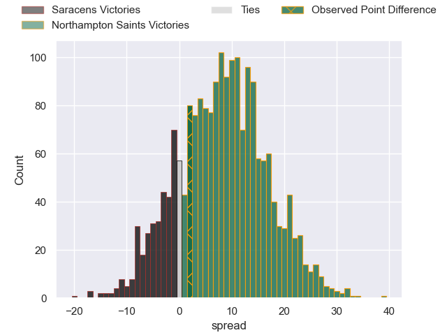
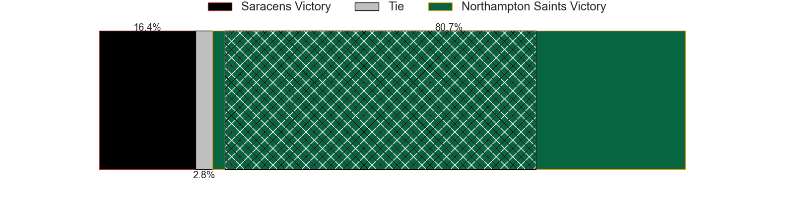

---  
layout: page  
title: Saracens at Northampton Saints; 20-22  
date: 2024-05-31 18:00:00 -0500  
categories: "Gallagher Premiership 2023" match review  
---
# Saracens at Northampton Saints; 20-22

# Club Level Predictions

The first set of predictions treats a club as the smallest object, as the club develops its members, organizes a gameplan, and deploys its players as needed for each match. This club model has a prediction of 0.62, which translates to predicting Northampton Saints to win by 4.3.

Our Over/Under is 41.5 - and combined with the spread above, we have a predicted scoreline of 18 to 23

Each club has a rating and a rating deviation (similar to a Glicko rating), and expected performances can be generated. This allows for simulated matches and spreads like the ones below.
## Projected Performances - Club Model

## Projected Spreads - Club Model

## Projected Results - Club Model

# Player Level Predictions

Treating teams instead as an entity made up of the currently active players, I have ratings for each player in an altogether different system. These can be combined to form team ratings once teamsheets are announced, weighting starters a bit higher than the reserves. After the match is played, players can be weighted by their minutes on the field, allowing for an accurate measure of the team's composition. With these compiled team ratings, we can make predictions, measure inaccuracy, and update the individual player ratings.
## Prediction without Player Minutes: Northampton Saints by 8.2

Saracens by 0.1 on a neutral pitch

## Projected Performances - Player Model

## Projected Spreads - Player Model

## Projected Results - Player Model

|   Away Minutes | Away Player          |   Away Percentile |   Number |   Home Percentile | Home Player         |   Home Minutes |
|---------------:|:---------------------|------------------:|---------:|------------------:|:--------------------|---------------:|
|             51 | Mako Vunipola        |             99.84 |        1 |             98.22 | Alex Waller         |             60 |
|             51 | Jamie George         |             98.87 |        2 |             94.69 | Curtis Langdon      |             64 |
|             63 | Marco Riccioni       |             56.92 |        3 |              4.29 | Trevor Davison      |             60 |
|             68 | Maro Itoje           |             95.4  |        4 |             98    | Alex Moon           |             77 |
|             51 | Nick Isiekwe         |             91    |        5 |             32.4  | Alex Coles          |             80 |
|             80 | Juan Martin Gonzalez |             95.76 |        6 |             98.65 | Courtney Lawes      |             80 |
|             80 | Ben Earl             |             97.98 |        7 |             97.01 | Tom Pearson         |             53 |
|             51 | Billy Vunipola       |             96.69 |        8 |             75.83 | Juarno Augustus     |             70 |
|             72 | Ivan van Zyl         |             79.38 |        9 |             96.39 | Alex Mitchell       |             80 |
|             80 | Owen Farrell         |             98.98 |       10 |             86.59 | Fin Smith           |             80 |
|             25 | Tom Parton           |             93.46 |       11 |             96.68 | Ollie Sleightholme  |             72 |
|             80 | Nick Tompkins        |             98.45 |       12 |             93.28 | Fraser Dingwall     |             80 |
|             80 | Lucio Cinti          |             63.29 |       13 |             84.07 | Burger Odendaal     |             80 |
|             80 | Alex Lewington       |             58.77 |       14 |             98.39 | Tommy Freeman       |             80 |
|             80 | Elliot Daly          |             84.97 |       15 |             97.49 | George Furbank      |             80 |
|             29 | Theo Dan             |             50.64 |       16 |             84.73 | Sam Matavesi        |             16 |
|             29 | Eroni Mawi           |             79.19 |       17 |             52.06 | Emmanuel Iyogun     |             20 |
|             17 | Oli Hoskins          |            nan    |       18 |             89.07 | Elliot Millar-Mills |             20 |
|             12 | Hugh Tizard          |             61.7  |       19 |             90.8  | Temo Mayanavanua    |              3 |
|             29 | Theo McFarland       |             30.2  |       20 |             97.31 | Sam Graham          |             10 |
|             29 | Tom Willis           |             25.62 |       21 |             68.11 | Lewis Ludlam        |             27 |
|              8 | Aled Davies          |             79.73 |       22 |             24.23 | Tom James           |              0 |
|             55 | Alex Lozowski        |            nan    |       23 |             90.9  | George Hendy        |              8 |

