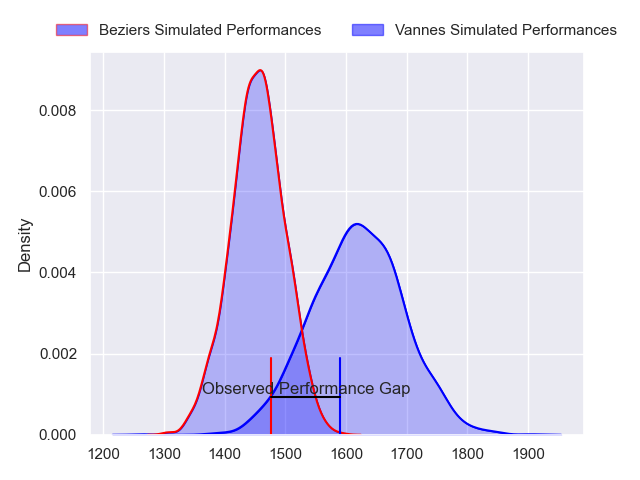
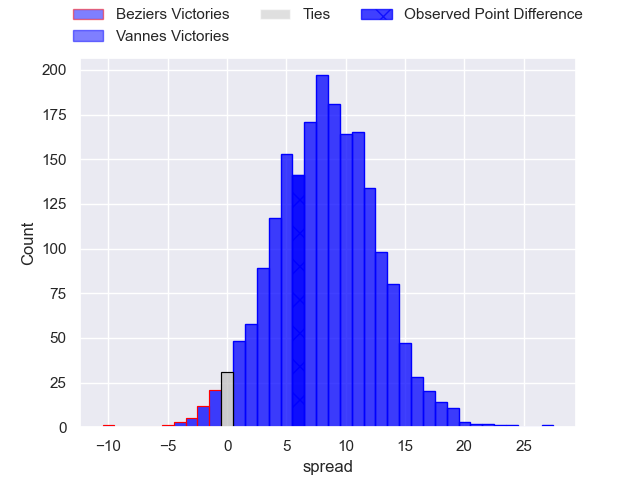
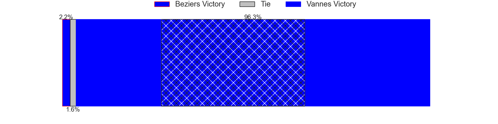
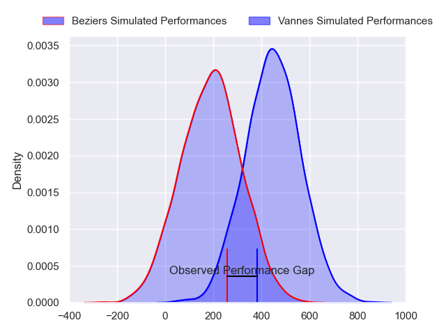
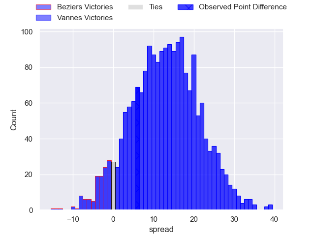
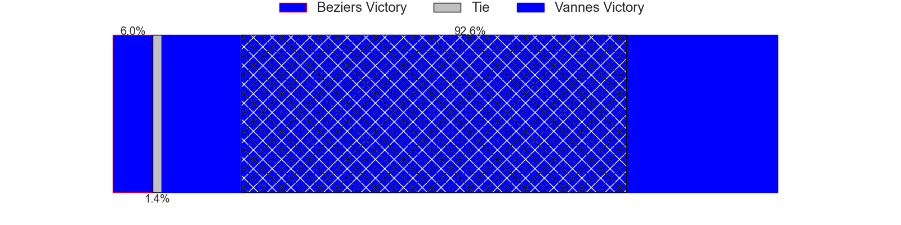

---  
layout: page  
title: Beziers at Vannes; 21-27  
date: 2024-05-31 18:00:00 -0500  
categories: "Pro D2 2023" match review  
---
# Beziers at Vannes; 21-27

# Club Level Predictions

The first set of predictions treats a club as the smallest object, as the club develops its members, organizes a gameplan, and deploys its players as needed for each match. This club model has a prediction of 0.716, which translates to predicting Vannes to win by 8.1.

Our Over/Under is 62.5 - and combined with the spread above, we have a predicted scoreline of 27 to 35

Each club has a rating and a rating deviation (similar to a Glicko rating), and expected performances can be generated. This allows for simulated matches and spreads like the ones below.
## Projected Performances - Club Model

## Projected Spreads - Club Model

## Projected Results - Club Model

# Player Level Predictions

Treating teams instead as an entity made up of the currently active players, I have ratings for each player in an altogether different system. These can be combined to form team ratings once teamsheets are announced, weighting starters a bit higher than the reserves. After the match is played, players can be weighted by their minutes on the field, allowing for an accurate measure of the team's composition. With these compiled team ratings, we can make predictions, measure inaccuracy, and update the individual player ratings.
## Prediction without Player Minutes: Vannes by 13.9

Vannes by 9.9 on a neutral pitch

## Projected Performances - Player Model

## Projected Spreads - Player Model

## Projected Results - Player Model

|   Away Minutes | Away Player         |   Away Percentile |   Number |   Home Percentile | Home Player             |   Home Minutes |
|---------------:|:--------------------|------------------:|---------:|------------------:|:------------------------|---------------:|
|             48 | Francisco Fernandes |             11.82 |        1 |             89.15 | Andy Bordelai           |             59 |
|             59 | Wilmar Arnoldi      |             80.39 |        2 |             43.09 | Cyril Blanchard         |             51 |
|             70 | Jon Zabala Arrieta  |             76.36 |        3 |             94.09 | Paga Tafili             |             59 |
|             80 | Hans N'kinsi        |              5.7  |        4 |             74.6  | Anton Bresler           |              6 |
|             48 | Pierre Gayraud      |             13.4  |        5 |             83.4  | Darren O'Shea           |             54 |
|             70 | William van Bost    |             29.87 |        6 |             23.41 | Juan Bautista Pedemonte |             80 |
|             80 | Clement Ancely      |             79.19 |        7 |             98.84 | Francisco Gorrissen     |             80 |
|             80 | Otonuku Jr Pauta    |             74.17 |        8 |             52.69 | Sione Kalamafoni        |             70 |
|             80 | Samuel Marques      |             89.52 |        9 |             93.13 | Michael Ruru            |             80 |
|             80 | Charly Malie        |             68.29 |       10 |             93.9  | Maxime Lafage           |             80 |
|             80 | Nicolas Plazy       |             80.66 |       11 |             76.49 | Romaric Camou           |             80 |
|             80 | Taleta Tupuola      |             68.05 |       12 |              7.65 | Alex Arrate             |             70 |
|             66 | Tim Nanai-Williams  |             89.45 |       13 |              9.1  | Andres Vilaseca         |             80 |
|             74 | Paul Reau           |             65.78 |       14 |             62.84 | Paul Surano             |             80 |
|             80 | Gabin Lorre         |             90.81 |       15 |             98.96 | Gwenaël Duplenne        |             80 |
|             32 | Youssef Amrouni     |             37.41 |       16 |             90.91 | Joe Edwards             |             74 |
|             32 | John Madigan        |             21    |       17 |             66.88 | Théo Beziat             |             29 |
|             21 | Jose Luis Gonzalez  |             80.71 |       18 |             15.2  | Mattéo Desjeux          |             26 |
|             14 | Paul Recor          |             58.53 |       19 |             29.31 | Charles-Henri Berguet   |             21 |
|             10 | Luka Tchelidze      |             64.94 |       20 |             82.51 | Phil Kite               |             21 |
|             10 | Thomas Hoarau       |             16.53 |       21 |             24.47 | Léon Boulier            |             10 |
|              6 | Victor Dreuille     |             12.4  |       22 |             38.49 | Jules Le Bail           |             10 |

