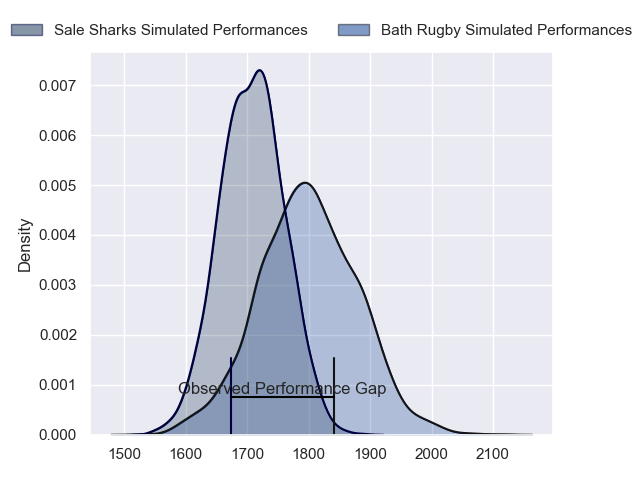
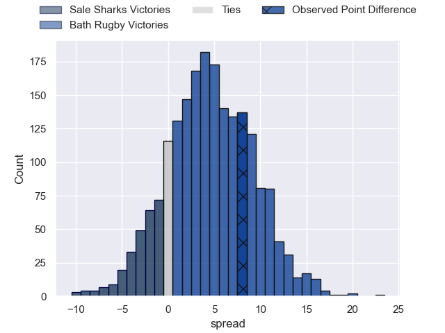
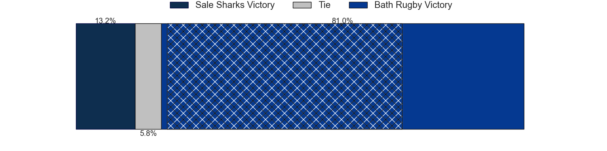
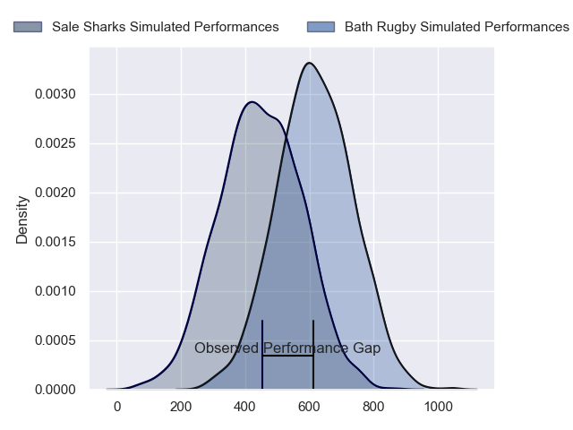
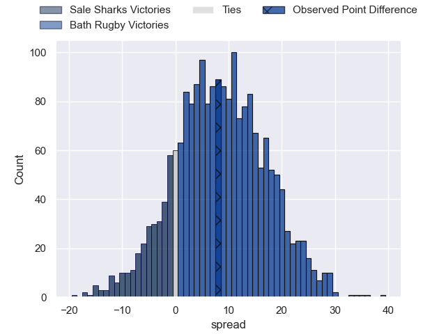

---  
layout: page  
title: Sale Sharks at Bath Rugby; 23-31  
date: 2024-06-01 18:00:00 -0500  
categories: "Gallagher Premiership 2023" match review  
---
# Sale Sharks at Bath Rugby; 23-31

# Club Level Predictions

The first set of predictions treats a club as the smallest object, as the club develops its members, organizes a gameplan, and deploys its players as needed for each match. This club model has a prediction of 0.623, which translates to predicting Bath Rugby to win by 4.4.

Our Over/Under is 52.5 - and combined with the spread above, we have a predicted scoreline of 24 to 29

Each club has a rating and a rating deviation (similar to a Glicko rating), and expected performances can be generated. This allows for simulated matches and spreads like the ones below.
## Projected Performances - Club Model

## Projected Spreads - Club Model

## Projected Results - Club Model

# Player Level Predictions

Treating teams instead as an entity made up of the currently active players, I have ratings for each player in an altogether different system. These can be combined to form team ratings once teamsheets are announced, weighting starters a bit higher than the reserves. After the match is played, players can be weighted by their minutes on the field, allowing for an accurate measure of the team's composition. With these compiled team ratings, we can make predictions, measure inaccuracy, and update the individual player ratings.
## Prediction without Player Minutes: Bath Rugby by 13.0

Bath Rugby by 5.0 on a neutral pitch

## Projected Performances - Player Model

## Projected Spreads - Player Model

## Projected Results - Player Model

|   Away Minutes | Away Player       |   Away Percentile |   Number |   Home Percentile | Home Player     |   Home Minutes |
|---------------:|:------------------|------------------:|---------:|------------------:|:----------------|---------------:|
|             61 | Bevan Rodd        |             95.3  |        1 |             90.61 | Beno Obano      |             76 |
|             61 | Tommy Taylor      |             20.9  |        2 |             97.91 | Tom Dunn        |             68 |
|             47 | James Harper      |             20.57 |        3 |             95.71 | Thomas du Toit  |             61 |
|             76 | Cobus Wiese       |             93.7  |        4 |             94.9  | Quinn Roux      |             66 |
|             79 | Ernst van Rhyn    |             90.7  |        5 |             72.5  | Charlie Ewels   |             80 |
|             80 | Ben Curry         |             68.21 |        6 |             89.11 | Ted Hill        |             80 |
|             47 | Sam Dugdale       |             31.12 |        7 |             93.16 | Sam Underhill   |             58 |
|             80 | Jean-Luc du Preez |             99.79 |        8 |             76.86 | Alfie Barbeary  |             51 |
|             55 | Gus Warr          |             42.61 |        9 |             83.68 | Ben Spencer     |             79 |
|             80 | George Ford       |             97.15 |       10 |             99.39 | Finn Russell    |             79 |
|             80 | Tom O'Flaherty    |             97.54 |       11 |             17.82 | Will Muir       |             80 |
|             80 | Robert du Preez   |             80.56 |       12 |             53.88 | Cameron Redpath |             80 |
|             80 | Sam James         |             90.28 |       13 |             86.25 | Ollie Lawrence  |             80 |
|             80 | Tom Roebuck       |             86.73 |       14 |             94.79 | Joe Cokanasiga  |             80 |
|             79 | Joe Carpenter     |             13.57 |       15 |             97.08 | Matt Gallagher  |             80 |
|             19 | Agustin Creevy    |             94.21 |       16 |             58.36 | Niall Annett    |             12 |
|             19 | Simon McIntyre    |             93.04 |       17 |             54.9  | Juan Schoeman   |              4 |
|             33 | WillGriff John    |            nan    |       18 |             34.17 | Will Stuart     |             19 |
|              4 | Ben Bamber        |             15.4  |       19 |             87.7  | Elliott Stooke  |             14 |
|              1 | Tom Ellis         |            nan    |       20 |             18.18 | Josh Bayliss    |             29 |
|             25 | Raffi Quirke      |             71.82 |       21 |             78.01 | Louis Schreuder |              1 |
|              1 | Luke James        |            nan    |       22 |             40.04 | Orlando Bailey  |              1 |
|             33 | Tom Curry         |             84.1  |       23 |             97.4  | Miles Reid      |             22 |

