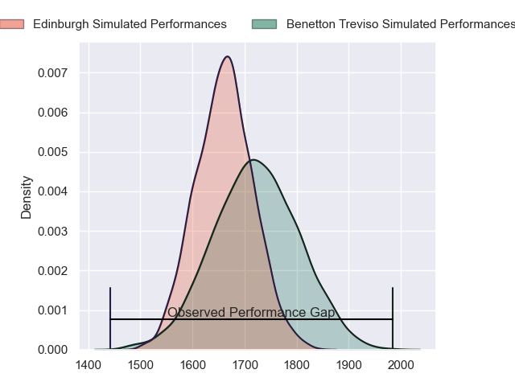
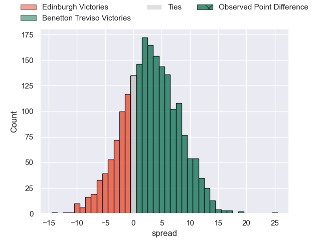
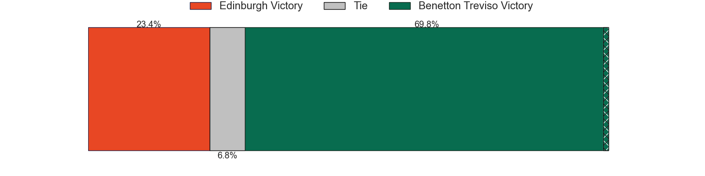
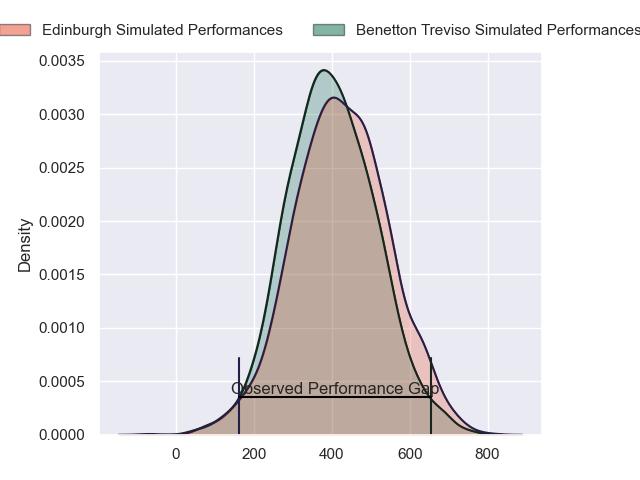
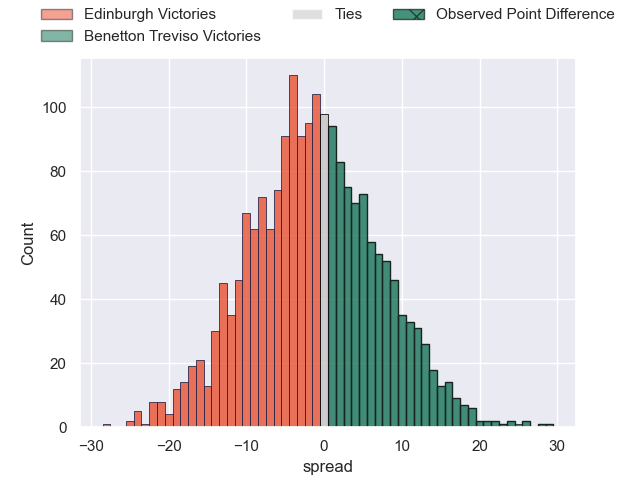
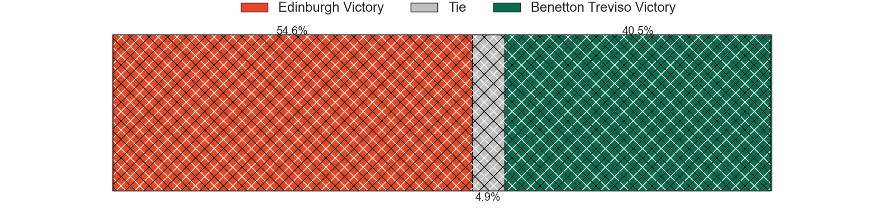

---  
layout: page  
title: Edinburgh at Benetton Treviso; 6-31  
date: 2024-06-01 18:00:00 -0500  
categories: "United Rugby Championship 2023" match review  
---
# Edinburgh at Benetton Treviso; 6-31

# Club Level Predictions

The first set of predictions treats a club as the smallest object, as the club develops its members, organizes a gameplan, and deploys its players as needed for each match. This club model has a prediction of 0.584, which translates to predicting Benetton Treviso to win by 3.0.

Our Over/Under is 44.5 - and combined with the spread above, we have a predicted scoreline of 21 to 24

Each club has a rating and a rating deviation (similar to a Glicko rating), and expected performances can be generated. This allows for simulated matches and spreads like the ones below.
## Projected Performances - Club Model

## Projected Spreads - Club Model

## Projected Results - Club Model

# Player Level Predictions

Treating teams instead as an entity made up of the currently active players, I have ratings for each player in an altogether different system. These can be combined to form team ratings once teamsheets are announced, weighting starters a bit higher than the reserves. After the match is played, players can be weighted by their minutes on the field, allowing for an accurate measure of the team's composition. With these compiled team ratings, we can make predictions, measure inaccuracy, and update the individual player ratings.
## Prediction without Player Minutes: Benetton Treviso by 0.1

Edinburgh by 5.1 on a neutral pitch

## Projected Performances - Player Model

## Projected Spreads - Player Model

## Projected Results - Player Model

|   Away Minutes | Away Player         |   Away Percentile |   Number |   Home Percentile | Home Player        |   Home Minutes |
|---------------:|:--------------------|------------------:|---------:|------------------:|:-------------------|---------------:|
|             59 | Pierre Schoeman     |             90.2  |        1 |             91.58 | Thomas Gallo       |             56 |
|             59 | Ewan Ashman         |             79.9  |        2 |             98.55 | Giacomo Nicotera   |             37 |
|             59 | WP Nel              |             99.03 |        3 |             96.76 | Simone Ferrari     |             56 |
|             59 | Sam Skinner         |             75.4  |        4 |             75.5  | Niccolo Cannone    |             55 |
|             80 | Grant Gilchrist     |             94.7  |        5 |             88    | Eli Snyman         |             80 |
|             73 | Jamie Ritchie       |             99.9  |        6 |             71    | Alessandro Izekor  |             80 |
|             68 | Luke Crosbie        |             93.93 |        7 |             97.88 | Michele Lamaro     |             80 |
|             80 | Viliame Mata        |             70.25 |        8 |             74.59 | Toa Halafihi       |             53 |
|             61 | Ali Price           |             85.22 |        9 |             25.77 | Andy Uren          |             65 |
|             65 | Ben Healy           |             78.46 |       10 |             84.15 | Tomas Albornoz     |             80 |
|             80 | Duhan van der Merwe |             81.8  |       11 |             53.18 | Onisi Ratave       |             74 |
|             65 | Chris Dean          |              4.24 |       12 |             96.07 | Juan Ignacio Brex  |             71 |
|             80 | Matt Currie         |             77.15 |       13 |             91.52 | Tommaso Menoncello |             80 |
|             80 | Jacob Henry         |             12.32 |       14 |             29.67 | Ignacio Mendy      |             80 |
|             80 | James Lang          |             89.14 |       15 |             92.48 | Rhyno Smith        |             80 |
|             21 | Dave Cherry         |             56.75 |       16 |             87.46 | Gianmarco Lucchesi |             43 |
|             21 | Boan Venter         |             13.77 |       17 |             77.17 | Mirco Spagnolo     |             24 |
|             21 | Javan Sebastian     |             61.78 |       18 |             72.23 | Giosue Zilocchi    |             24 |
|             21 | Marshall Sykes      |             88.5  |       19 |             73.4  | Edoardo Iachizzi   |             25 |
|             19 | Hamish Watson       |             60.21 |       20 |             91.74 | Lorenzo Cannone    |             27 |
|             19 | Ben Vellacott       |             79.9  |       21 |             71.31 | Alessandro Garbisi |             15 |
|             15 | Cameron Scott       |            nan    |       22 |             73.07 | Jacob Umaga        |              6 |
|             15 | Mark Bennett        |             67.63 |       23 |             60.5  | Marco Zanon        |              9 |

