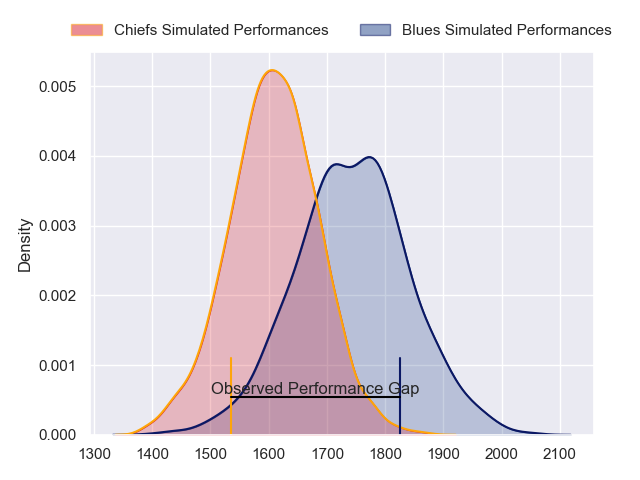
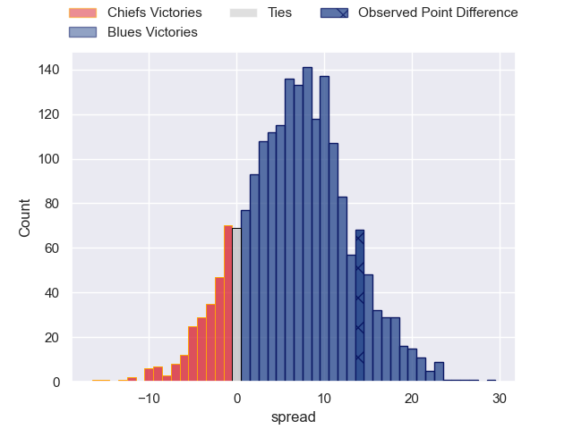
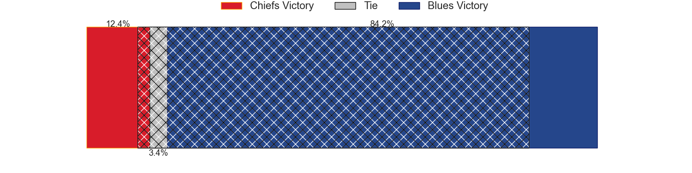
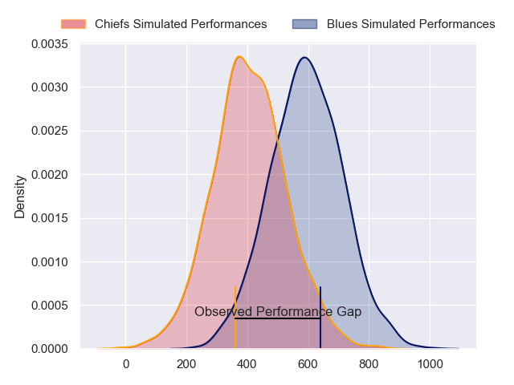
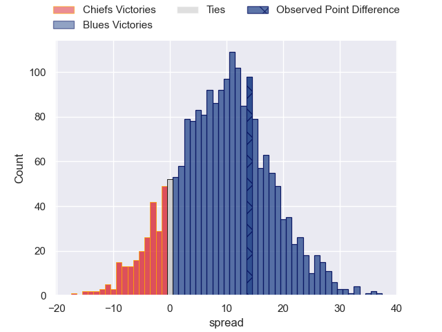
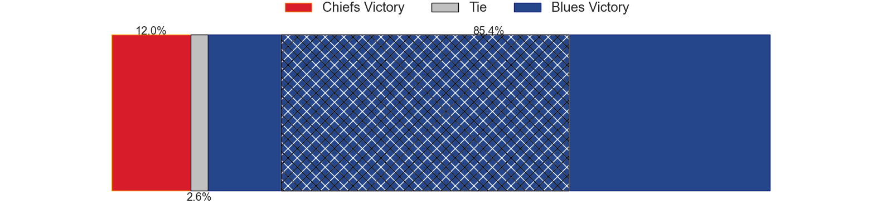

---  
layout: page  
title: Chiefs at Blues; 17-31  
date: 2024-06-01 18:00:00 -0500  
categories: "Super Rugby Pacific 2024" match review  
---
# Chiefs at Blues; 17-31

# Club Level Predictions

The first set of predictions treats a club as the smallest object, as the club develops its members, organizes a gameplan, and deploys its players as needed for each match. This club model has a prediction of 0.676, which translates to predicting Blues to win by 6.6.

Our Over/Under is 49.5 - and combined with the spread above, we have a predicted scoreline of 21 to 28

Each club has a rating and a rating deviation (similar to a Glicko rating), and expected performances can be generated. This allows for simulated matches and spreads like the ones below.
## Projected Performances - Club Model

## Projected Spreads - Club Model

## Projected Results - Club Model

# Player Level Predictions

Treating teams instead as an entity made up of the currently active players, I have ratings for each player in an altogether different system. These can be combined to form team ratings once teamsheets are announced, weighting starters a bit higher than the reserves. After the match is played, players can be weighted by their minutes on the field, allowing for an accurate measure of the team's composition. With these compiled team ratings, we can make predictions, measure inaccuracy, and update the individual player ratings.
## Prediction without Player Minutes: Blues by 10.1

Blues by 5.5 on a neutral pitch

## Projected Performances - Player Model

## Projected Spreads - Player Model

## Projected Results - Player Model

|   Away Minutes | Away Player          |   Away Percentile |   Number |   Home Percentile | Home Player       |   Home Minutes |
|---------------:|:---------------------|------------------:|---------:|------------------:|:------------------|---------------:|
|             52 | Aidan Ross           |             98.54 |        1 |             99.27 | Ofa Tu'ungafasi   |             61 |
|             52 | Bradley Slater       |             84.24 |        2 |             88.75 | Ricky Riccitelli  |             72 |
|             55 | George Dyer          |             84.45 |        3 |             81.78 | Marcel Renata     |             48 |
|             80 | Naitoa Ah Kuoi       |             96    |        4 |             96.1  | Patrick Tuipulotu |             80 |
|             80 | Jimmy Tupou          |             34.6  |        5 |             43.5  | Sam Darry         |             65 |
|             65 | Samipeni Finau       |             95.38 |        6 |             98.55 | Akira Ioane       |             67 |
|             65 | Luke Jacobson        |             94.03 |        7 |             99.52 | Dalton Papalii    |             80 |
|             72 | Wallace Sititi       |             50.83 |        8 |             95.04 | Hoskins Sotutu    |             80 |
|             55 | Cortez Ratima        |             73.2  |        9 |             71.99 | Finlay Christie   |             61 |
|             61 | Damian McKenzie      |             97.76 |       10 |             96.95 | Stephen Perofeta  |             80 |
|             80 | Peniasi Malimali     |             14.22 |       11 |             70.52 | Caleb Clarke      |             80 |
|             80 | Rameka Poihipi       |             75.18 |       12 |             94.73 | Harry Plummer     |             80 |
|             80 | Daniel Rona          |             80.77 |       13 |             79.32 | AJ Lam            |             80 |
|             80 | Liam Coombes-Fabling |             88.72 |       14 |             80.38 | Mark Tele'a       |             80 |
|             61 | Etene Nanai-Seturo   |             66.6  |       15 |             77.04 | Cole Forbes       |             80 |
|             28 | Samisoni Taukei'aho  |             94.37 |       16 |             91.96 | Kurt Eklund       |              8 |
|             36 | Ollie Norris         |             88.1  |       17 |             48.66 | Josh Fusitu'a     |             19 |
|             25 | Sione Ahio           |            nan    |       18 |             96.84 | Angus Ta'avao     |             32 |
|             15 | Simon Parker         |             56.26 |       19 |             68.4  | Cameron Suafoa    |             15 |
|             15 | Kaylum Boshier       |             56.84 |       20 |             66.28 | Adrian Choat      |             13 |
|             25 | Xavier Roe           |             55.67 |       21 |             75.77 | Sam Nock          |             19 |
|             19 | Josh Ioane           |             50.31 |       22 |             77.87 | Corey Evans       |              0 |
|             19 | Quinn Tupaea         |             92.76 |       23 |            nan    | Caleb Tangitau    |              0 |

