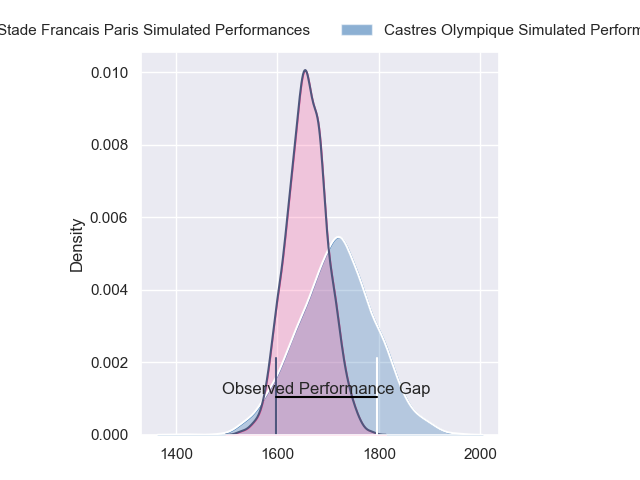
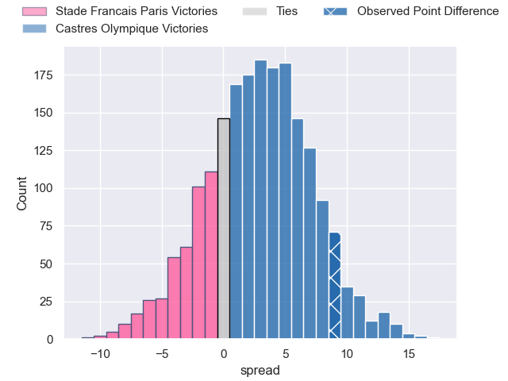
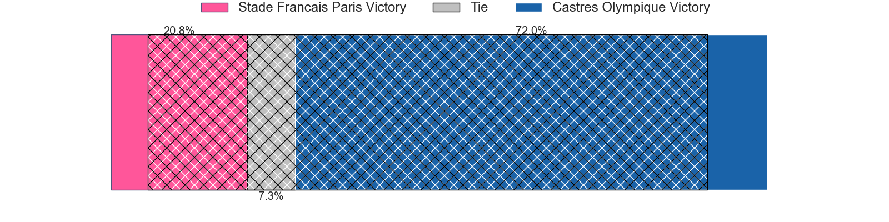
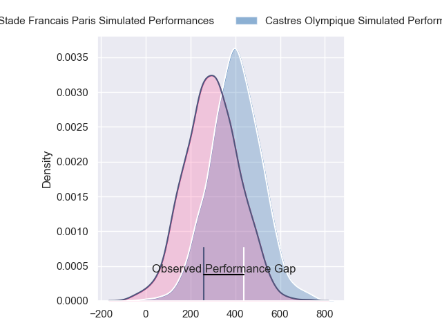
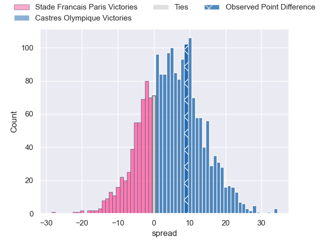
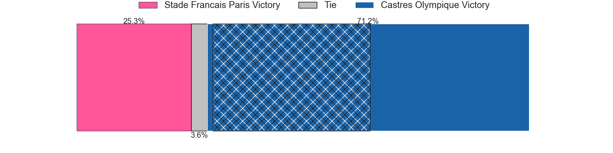

---  
layout: page  
title: Stade Francais Paris at Castres Olympique; 18-27  
date: 2024-06-01 18:00:00 -0500  
categories: "Top 14 Orange 2023" match review  
---
# Stade Francais Paris at Castres Olympique; 18-27

# Club Level Predictions

The first set of predictions treats a club as the smallest object, as the club develops its members, organizes a gameplan, and deploys its players as needed for each match. This club model has a prediction of 0.58, which translates to predicting Castres Olympique to win by 2.8.

Our Over/Under is 48.5 - and combined with the spread above, we have a predicted scoreline of 23 to 26

Each club has a rating and a rating deviation (similar to a Glicko rating), and expected performances can be generated. This allows for simulated matches and spreads like the ones below.
## Projected Performances - Club Model

## Projected Spreads - Club Model

## Projected Results - Club Model

# Player Level Predictions

Treating teams instead as an entity made up of the currently active players, I have ratings for each player in an altogether different system. These can be combined to form team ratings once teamsheets are announced, weighting starters a bit higher than the reserves. After the match is played, players can be weighted by their minutes on the field, allowing for an accurate measure of the team's composition. With these compiled team ratings, we can make predictions, measure inaccuracy, and update the individual player ratings.
## Prediction without Player Minutes: Castres Olympique by 5.7

Stade Francais Paris by 2.4 on a neutral pitch

## Projected Performances - Player Model

## Projected Spreads - Player Model

## Projected Results - Player Model

|   Away Minutes | Away Player             |   Away Percentile |   Number |   Home Percentile | Home Player                |   Home Minutes |
|---------------:|:------------------------|------------------:|---------:|------------------:|:---------------------------|---------------:|
|             54 | Moses Alo-Emile         |             72.47 |        1 |             88.02 | Antoine Tichit             |             57 |
|             63 | Lucas Peyresblanques    |             19.61 |        2 |             81.67 | Gaetan Barlot              |             57 |
|             54 | Francisco Gomez Kodela  |             93.6  |        3 |             80.4  | Levan Chilachava           |             58 |
|             80 | Paul Gabrillagues       |             36.1  |        4 |             95.1  | Leone Nakarawa             |             80 |
|             48 | JJ van der Mescht       |             84.5  |        5 |             57.8  | Tom Staniforth             |             57 |
|             63 | Tanginoa Halaifonua     |             13.1  |        6 |             36.99 | Nick Champion de Crespigny |             79 |
|             70 | Romain Briatte          |             58.19 |        7 |             79.58 | Baptiste Delaporte         |             80 |
|             80 | Sekou Macalou           |             93.18 |        8 |             39.05 | Abraham Papali'i           |             62 |
|             57 | Rory Kockott            |             98.8  |        9 |             17.7  | Jeremy Fernandez           |             76 |
|             80 | Joris Segonds           |             80.28 |       10 |             54.47 | Pierre Popelin             |             80 |
|             80 | Kylan Hamdaoui          |             60.66 |       11 |             82.65 | Filipo Nakosi              |             76 |
|             70 | Julien Delbouis         |             85.42 |       12 |             87.18 | Adrea Cocagi               |             80 |
|             80 | Jeremy Ward             |             83.25 |       13 |             39.3  | Vilimoni Botitu            |             80 |
|             80 | Peniasi Dakuwaqa        |             50.24 |       14 |             96.59 | Geoffrey Palis             |             80 |
|             80 | Leo Barre               |             67.01 |       15 |             78.5  | Julien Dumora              |             70 |
|             17 | Mickael Ivaldi          |             95.66 |       16 |             32.8  | Loris Zarantonello         |             23 |
|             26 | Clement Castets         |             47.04 |       17 |             45.67 | Lois Guerois-Galisson      |             23 |
|             26 | Baptiste Pesenti        |             80    |       18 |             65.1  | Florent Vanverberghe       |             23 |
|             10 | Ryan Chapuis            |              8.09 |       19 |             73.35 | Yann Peysson               |             19 |
|             23 | Jules Gimbert           |             11.17 |       20 |             47.25 | Gauthier Doubrere          |              4 |
|             17 | Giovanni Habel-Kueffner |             89.88 |       21 |             76.83 | Louis Le Brun              |             10 |
|             10 | Pierre Boudehent        |             51.5  |       22 |             80.57 | Josaia Raisuqe             |              4 |
|             32 | Paul Alo-Emile          |             90.85 |       23 |             34.57 | Henry Thomas               |             22 |

