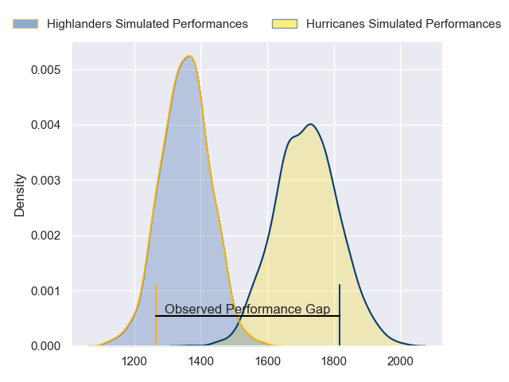
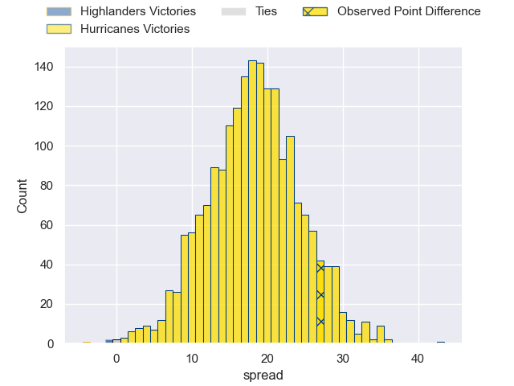
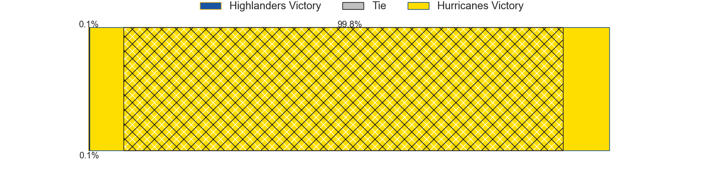
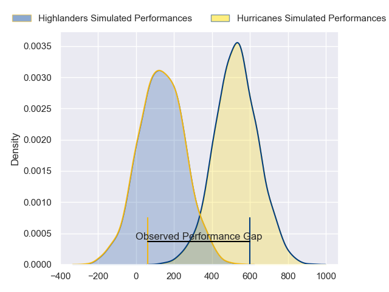
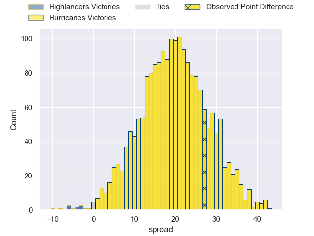
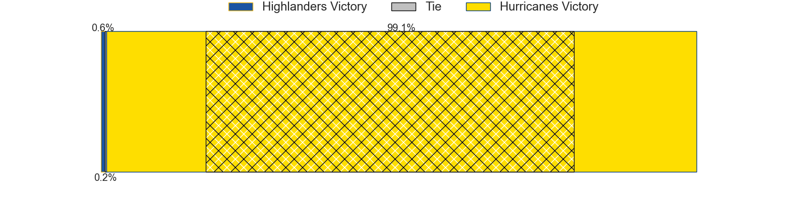

---  
layout: page  
title: Highlanders at Hurricanes; 14-41  
date: 2024-06-01 18:00:00 -0500  
categories: "Super Rugby Pacific 2024" match review  
---
# Highlanders at Hurricanes; 14-41

# Club Level Predictions

The first set of predictions treats a club as the smallest object, as the club develops its members, organizes a gameplan, and deploys its players as needed for each match. This club model has a prediction of 0.885, which translates to predicting Hurricanes to win by 18.2.

Our Over/Under is 53.5 - and combined with the spread above, we have a predicted scoreline of 18 to 36

Each club has a rating and a rating deviation (similar to a Glicko rating), and expected performances can be generated. This allows for simulated matches and spreads like the ones below.
## Projected Performances - Club Model

## Projected Spreads - Club Model

## Projected Results - Club Model

# Player Level Predictions

Treating teams instead as an entity made up of the currently active players, I have ratings for each player in an altogether different system. These can be combined to form team ratings once teamsheets are announced, weighting starters a bit higher than the reserves. After the match is played, players can be weighted by their minutes on the field, allowing for an accurate measure of the team's composition. With these compiled team ratings, we can make predictions, measure inaccuracy, and update the individual player ratings.
## Prediction without Player Minutes: Hurricanes by 24.4

Hurricanes by 19.9 on a neutral pitch

## Projected Performances - Player Model

## Projected Spreads - Player Model

## Projected Results - Player Model

|   Away Minutes | Away Player                   |   Away Percentile |   Number |   Home Percentile | Home Player          |   Home Minutes |
|---------------:|:------------------------------|------------------:|---------:|------------------:|:---------------------|---------------:|
|             41 | Ethan de Groot                |             74.98 |        1 |             97.89 | Xavier Numia         |             58 |
|             41 | Henry Bell                    |             45.34 |        2 |             96.62 | Asafo Aumua          |             41 |
|             41 | Jermaine Ainsley              |             81.7  |        3 |             48.02 | Pasilio Tosi         |             56 |
|             37 | Will Tucker                   |             10.9  |        4 |             90.9  | James Tucker         |             80 |
|             80 | Fabian Holland                |             85.2  |        5 |             98.1  | Isaia Walker-Leawere |             56 |
|             80 | Max Hicks                     |             23.03 |        6 |             91.23 | Devan Flanders       |             80 |
|             80 | Billy Harmon                  |             83.43 |        7 |             94.61 | Du'Plessis Kirifi    |             56 |
|             68 | Nikora Broughton              |             28.93 |        8 |              1.86 | Brayden Iose         |             80 |
|             67 | James Arscott                 |              6.87 |        9 |             98.11 | TJ Perenara          |             43 |
|             80 | Ajay Faleafaga                |             43.7  |       10 |             30.89 | Brett Cameron        |             80 |
|             68 | Jona Nareki                   |             87.11 |       11 |             88.63 | Salesi Rayasi        |             80 |
|             80 | Sam Gilbert                   |             29.99 |       12 |             97.52 | Jordie Barrett       |             80 |
|             80 | Matt Whaanga                  |             11.79 |       13 |             96.48 | Billy Proctor        |             67 |
|             48 | Connor Garden-Bachop          |             53.55 |       14 |             92.23 | Joshua Moorby        |             80 |
|             80 | Finn Hurley                   |             35.28 |       15 |             97.29 | Ruben Love           |             58 |
|             39 | Jack Taylor                   |             50.16 |       16 |             35.37 | James O'Reilly       |             39 |
|             39 | Dan Lienert-Brown             |             16.76 |       17 |             90.36 | Pouri Rakete-Stones  |             22 |
|             39 | Saula Ma'u                    |             15.06 |       18 |             89.88 | Tevita Mafileo       |             24 |
|             43 | Tom Sanders                   |             81.2  |       19 |             82.6  | Justin Sangster      |             24 |
|             12 | Hayden Michaels               |            nan    |       20 |             96.63 | Peter Lakai          |             24 |
|             13 | Folau Fakatava                |             77.15 |       21 |             32.3  | Jordi Viljoen        |             37 |
|             32 | Timoci Tavatavanawai          |             39.15 |       22 |             87.9  | Riley Higgins        |             22 |
|             12 | Jacob Ratumaitavuki-Kneepkens |             97.91 |       23 |             34.33 | Bailyn Sullivan      |             13 |

