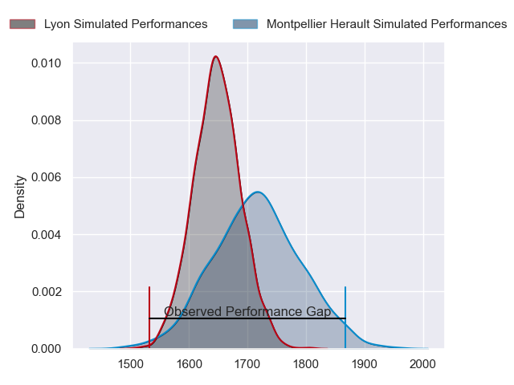
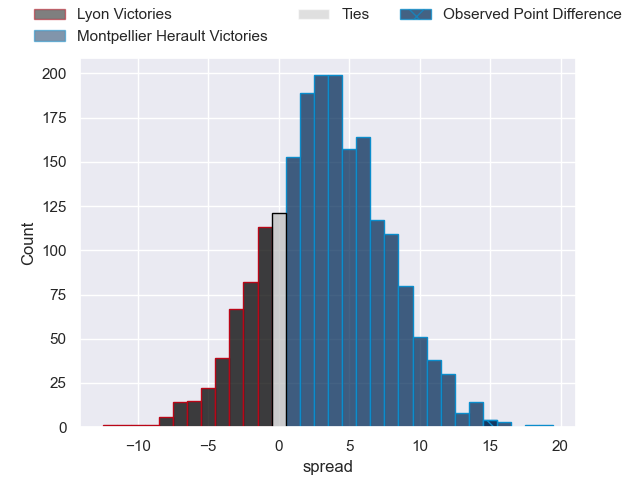
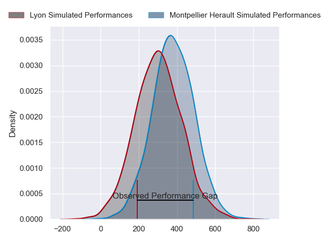
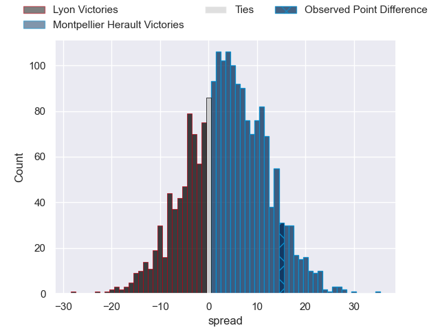
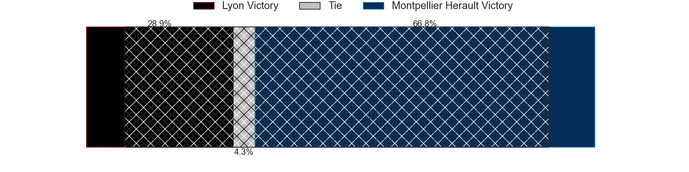

---  
layout: page  
title: Lyon at Montpellier Herault; 26-41  
date: 2024-06-01 18:00:00 -0500  
categories: "Top 14 Orange 2023" match review  
---
# Lyon at Montpellier Herault; 26-41

# Club Level Predictions

The first set of predictions treats a club as the smallest object, as the club develops its members, organizes a gameplan, and deploys its players as needed for each match. This club model has a prediction of 0.596, which translates to predicting Montpellier Herault to win by 3.4.

Our Over/Under is 43.5 - and combined with the spread above, we have a predicted scoreline of 20 to 23

Each club has a rating and a rating deviation (similar to a Glicko rating), and expected performances can be generated. This allows for simulated matches and spreads like the ones below.
## Projected Performances - Club Model

## Projected Spreads - Club Model

## Projected Results - Club Model

# Player Level Predictions

Treating teams instead as an entity made up of the currently active players, I have ratings for each player in an altogether different system. These can be combined to form team ratings once teamsheets are announced, weighting starters a bit higher than the reserves. After the match is played, players can be weighted by their minutes on the field, allowing for an accurate measure of the team's composition. With these compiled team ratings, we can make predictions, measure inaccuracy, and update the individual player ratings.
## Prediction without Player Minutes: Montpellier Herault by 4.2

Lyon by 3.3 on a neutral pitch

## Projected Performances - Player Model

## Projected Spreads - Player Model

## Projected Results - Player Model

|   Away Minutes | Away Player        |   Away Percentile |   Number |   Home Percentile | Home Player                 |   Home Minutes |
|---------------:|:-------------------|------------------:|---------:|------------------:|:----------------------------|---------------:|
|             67 | Jerome Rey         |             23.72 |        1 |              3    | Baptiste Erdocio            |             56 |
|             49 | Guillaume Marchand |             19.94 |        2 |             80.06 | Vano Karkadze               |             56 |
|             52 | Demba Bamba        |             92.06 |        3 |             77.49 | Luka Japaridze              |             56 |
|             59 | Felix Lambey       |             84    |        4 |             58.9  | Tyler Duguid                |             77 |
|             52 | Alban Roussel      |             62.1  |        5 |             82.7  | Bastien Chalureau           |             56 |
|             72 | Theo William       |             21.1  |        6 |             82.08 | Nicolaas Janse van Rensburg |             50 |
|             76 | Beka Saghinadze    |             84.2  |        7 |             31.21 | Alexandre Becognee          |             82 |
|             42 | Jordan Taufua      |             92.56 |        8 |             55.37 | Lenni Nouchi                |             82 |
|             69 | Martin Page-Relo   |             78.69 |        9 |             91.92 | Cobus Reinach               |             52 |
|             49 | Paddy Jackson      |             82.93 |       10 |             61.38 | Louis Carbonel              |             59 |
|             82 | Ethan Dumortier    |             63.41 |       11 |             62.18 | Arthur Vincent              |             82 |
|             82 | Josiah Maraku      |             11.17 |       12 |             81.59 | Jan Serfontein              |             82 |
|             82 | Semi Radradra      |             99.59 |       13 |             98.14 | Geoffrey Doumayrou          |             49 |
|             82 | Vincent Rattez     |             96.21 |       14 |             96.78 | Ben Lam                     |             82 |
|             82 | Thaakir Abrahams   |              8.98 |       15 |             61.38 | Julien Tisseron             |             82 |
|             33 | Yanis Charcosset   |             53.05 |       16 |             91.48 | Christopher Tolofua         |             26 |
|             21 | Vivien Devisme     |             73.12 |       17 |             79.11 | Enzo Forletta               |             26 |
|             30 | Loann Goujon       |             50.6  |       18 |             90.5  | Marco Tauleigne             |             32 |
|             33 | Mickael Guillard   |             69.42 |       19 |            nan    | Mael Perrin                 |             31 |
|             13 | Baptiste Couilloud |             93.47 |       20 |             20.79 | Aubin Eymeri                |             30 |
|             33 | Fletcher Smith     |             20.93 |       21 |             17.48 | Thomas Darmon               |             33 |
|             40 | Maxime Gouzou      |             36.57 |       22 |             93.08 | George Bridge               |             23 |
|             30 | Hamza Kaabeche     |              6.88 |       23 |             56.11 | Titi Lamositele             |             26 |

