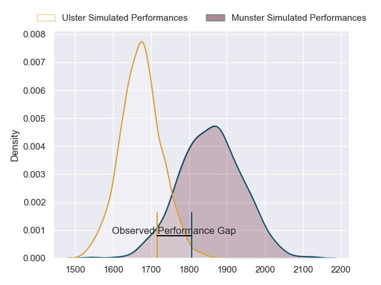
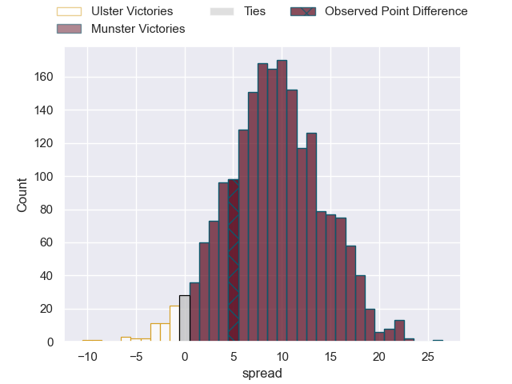
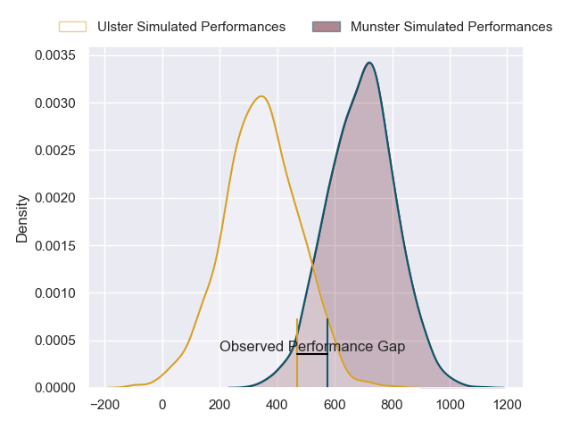
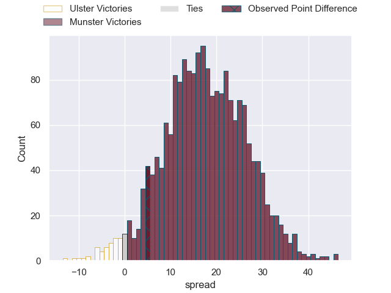
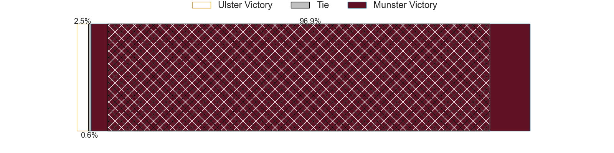

---  
layout: page  
title: Ulster at Munster; 24-29  
date: 2024-06-01 18:00:00 -0500  
categories: "United Rugby Championship 2023" match review  
---
# Ulster at Munster; 24-29

# Club Level Predictions

The first set of predictions treats a club as the smallest object, as the club develops its members, organizes a gameplan, and deploys its players as needed for each match. This club model has a prediction of 0.738, which translates to predicting Munster to win by 9.1.

Our Over/Under is 44.5 - and combined with the spread above, we have a predicted scoreline of 18 to 27

Each club has a rating and a rating deviation (similar to a Glicko rating), and expected performances can be generated. This allows for simulated matches and spreads like the ones below.
## Projected Performances - Club Model

## Projected Spreads - Club Model

## Projected Results - Club Model

# Player Level Predictions

Treating teams instead as an entity made up of the currently active players, I have ratings for each player in an altogether different system. These can be combined to form team ratings once teamsheets are announced, weighting starters a bit higher than the reserves. After the match is played, players can be weighted by their minutes on the field, allowing for an accurate measure of the team's composition. With these compiled team ratings, we can make predictions, measure inaccuracy, and update the individual player ratings.
## Prediction without Player Minutes: Munster by 23.1

Munster by 16.8 on a neutral pitch

## Projected Performances - Player Model

## Projected Spreads - Player Model

## Projected Results - Player Model

|   Away Minutes | Away Player        |   Away Percentile |   Number |   Home Percentile | Home Player     |   Home Minutes |
|---------------:|:-------------------|------------------:|---------:|------------------:|:----------------|---------------:|
|             54 | Eric O'Sullivan    |             88.91 |        1 |             97.09 | Jeremy Loughman |             60 |
|             60 | Rob Herring        |             96.78 |        2 |             95.02 | Niall Scannell  |             60 |
|             67 | Tom O'Toole        |             80.16 |        3 |             98.87 | Stephen Archer  |             50 |
|              5 | Kieran Treadwell   |             74    |        4 |             99.4  | RG Snyman       |             50 |
|             19 | Alan O'Connor      |             80.8  |        5 |             99.1  | Tadhg Beirne    |             80 |
|             80 | Cormac Izuchukwu   |             73.41 |        6 |             98.46 | Peter O'Mahony  |             51 |
|             80 | David McCann       |             84.59 |        7 |             85.74 | Alex Kendellen  |             51 |
|             80 | Nick Timoney       |             90.29 |        8 |             85.33 | Jack O'Donoghue |             80 |
|             80 | John Cooney        |             94.67 |        9 |             85.57 | Craig Casey     |             69 |
|             80 | Billy Burns        |             74.8  |       10 |             62.8  | Jack Crowley    |             80 |
|             80 | Jacob Stockdale    |             72.04 |       11 |             97.73 | Shane Daly      |             80 |
|             80 | Jude Postlethwaite |             68.87 |       12 |             94.62 | Rory Scannell   |             36 |
|             60 | Will Addison       |             92.86 |       13 |             20.17 | Sean O'Brien    |             80 |
|             80 | Mike Lowry         |             72.61 |       14 |             95.17 | Calvin Nash     |             80 |
|             80 | Stewart Moore      |             92.9  |       15 |             95.82 | Simon Zebo      |             80 |
|             20 | Tom Stewart        |              3.86 |       16 |            nan    | Eoghan Clarke   |             20 |
|             26 | Andrew Warwick     |             10.85 |       17 |             94.17 | John Ryan       |             20 |
|             13 | Scott Wilson       |             49.15 |       18 |             93.12 | Oli Jager       |             30 |
|             75 | Harry Sheridan     |             85.6  |       19 |             55.4  | Thomas Ahern    |             30 |
|             46 | Matty Rea          |             68.98 |       20 |             86.78 | Gavin Coombes   |             29 |
|              0 | Nathan Doak        |             26.8  |       21 |             98.63 | Conor Murray    |             11 |
|             20 | Aaron Sexton       |            nan    |       22 |             79.47 | Joey Carbery    |             44 |
|             15 | Dave Ewers         |             94.22 |       23 |             66.86 | John Hodnett    |             29 |

