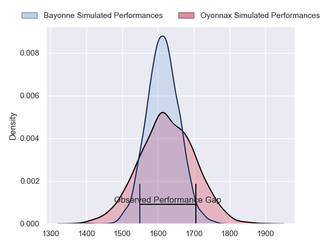
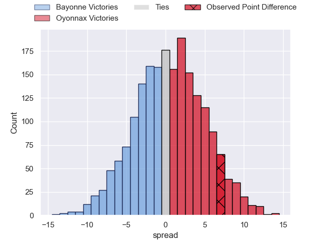
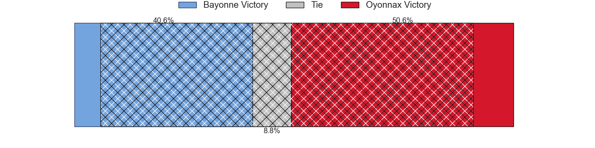
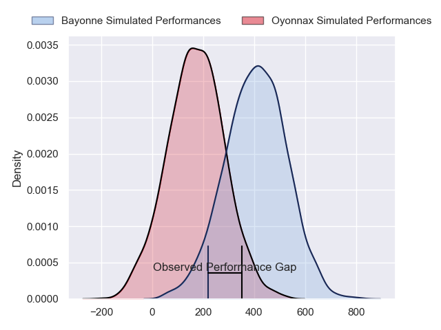
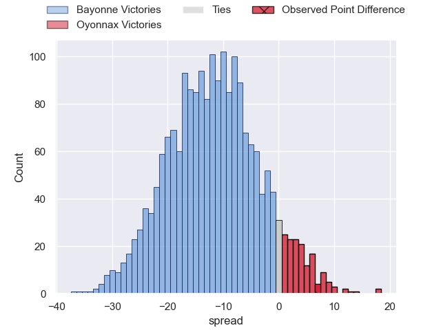
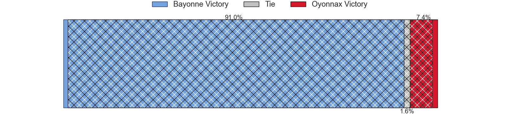

---  
layout: page  
title: Bayonne at Oyonnax; 20-27  
date: 2024-06-01 18:00:00 -0500  
categories: "Top 14 Orange 2023" match review  
---
# Bayonne at Oyonnax; 20-27

# Club Level Predictions

The first set of predictions treats a club as the smallest object, as the club develops its members, organizes a gameplan, and deploys its players as needed for each match. This club model has a prediction of 0.516, which translates to predicting Oyonnax to win by 0.6.

Our Over/Under is 52.5 - and combined with the spread above, we have a predicted scoreline of 26 to 27

Each club has a rating and a rating deviation (similar to a Glicko rating), and expected performances can be generated. This allows for simulated matches and spreads like the ones below.
## Projected Performances - Club Model

## Projected Spreads - Club Model

## Projected Results - Club Model

# Player Level Predictions

Treating teams instead as an entity made up of the currently active players, I have ratings for each player in an altogether different system. These can be combined to form team ratings once teamsheets are announced, weighting starters a bit higher than the reserves. After the match is played, players can be weighted by their minutes on the field, allowing for an accurate measure of the team's composition. With these compiled team ratings, we can make predictions, measure inaccuracy, and update the individual player ratings.
## Prediction without Player Minutes: Bayonne by 13.4

Bayonne by 21.2 on a neutral pitch

## Projected Performances - Player Model

## Projected Spreads - Player Model

## Projected Results - Player Model

|   Away Minutes | Away Player           |   Away Percentile |   Number |   Home Percentile | Home Player         |   Home Minutes |
|---------------:|:----------------------|------------------:|---------:|------------------:|:--------------------|---------------:|
|             37 | Swan Cormenier        |             44.7  |        1 |             60.16 | Antoine Abraham     |             51 |
|             51 | Facundo Bosch         |             95.5  |        2 |             11.9  | Teddy Durand        |             73 |
|             72 | Luke Tagi             |             76.19 |        3 |             16.36 | Christopher Vaotoa  |             60 |
|             37 | Denis Marchois        |             96.7  |        4 |             67.6  | Ewan Johnson        |             68 |
|             81 | Lucas Paulos          |             48    |        5 |             72.9  | Hugo Fabregue       |             51 |
|             69 | Arthur Iturria        |             79.38 |        6 |             56.45 | Kevin Lebreton      |             73 |
|             63 | Baptiste Heguy        |             87.38 |        7 |             45.47 | Loic Credoz         |             81 |
|             81 | Rodrigo Bruni         |             98.55 |        8 |              4.96 | Loic Godener        |             55 |
|             51 | Maxime Machenaud      |             93.64 |        9 |             18.04 | Vasil Lobzhanidze   |             60 |
|             81 | Camille Lopez         |             93.5  |       10 |             10.98 | Justin Bouraux      |             81 |
|             81 | Aurelien Callandret   |             82.37 |       11 |             52.32 | Enzo Reybier        |             81 |
|             73 | Reece Hodge           |             85.94 |       12 |             70.63 | Lucas Mensa         |             70 |
|             34 | Guillaume Martocq     |             15.82 |       13 |             79.52 | Theo Millet         |             81 |
|             81 | Arnaud Erbinartegaray |             44.93 |       14 |             11.37 | Gavin Stark         |             71 |
|             45 | Cheikh Tiberghien     |             10.86 |       15 |             70.15 | Daniel Ikpefan      |             55 |
|             30 | Thomas Acquier        |             87.78 |       16 |              1.45 | Manu Leiataua       |             18 |
|             44 | Matis Perchaud        |             62.43 |       17 |             83.89 | Tommy Raynaud       |             30 |
|             44 | Manuel Leindekar      |              7.8  |       18 |             18.7  | Steve Mafi          |             30 |
|             30 | Remi Bourdeau         |             94.01 |       19 |             16.09 | Kevin Kornath       |             21 |
|             30 | Gela Aprasidze        |             57.9  |       20 |             93.99 | Jonathan Ruru       |             21 |
|             44 | Tom Spring            |             16.7  |       21 |             87.6  | Domingo Miotti      |             37 |
|             47 | Sireli Maqala         |             79.73 |       22 |             63.87 | Rory Grice          |             26 |
|              9 | Tevita Tatafu         |             25.67 |       23 |             84.94 | Irakli Mirtskhulava |             21 |

