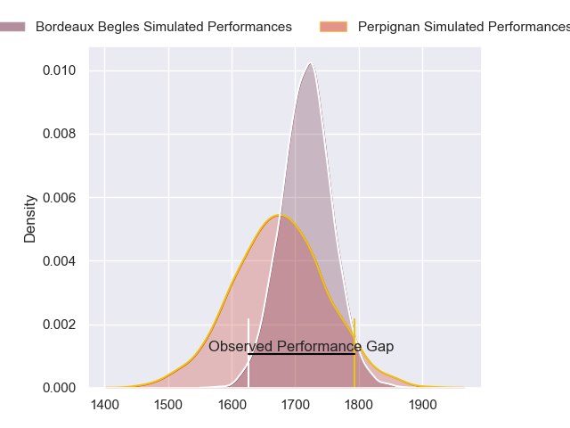
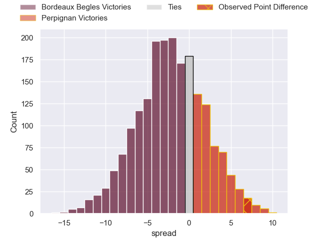
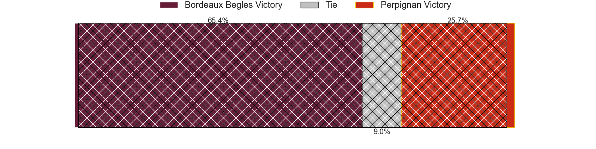
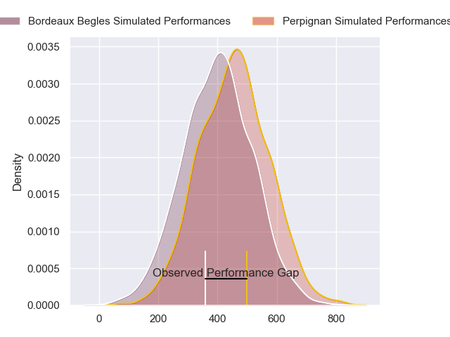
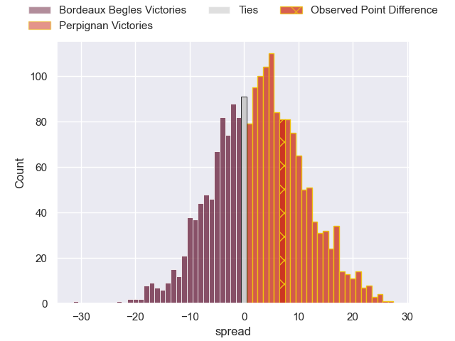
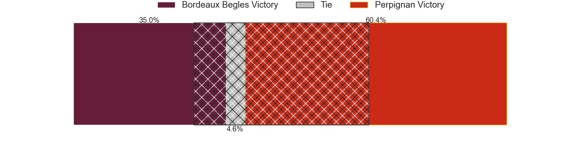

---  
layout: page  
title: Bordeaux Begles at Perpignan; 30-37  
date: 2024-06-01 18:00:00 -0500  
categories: "Top 14 Orange 2023" match review  
---
# Bordeaux Begles at Perpignan; 30-37

# Club Level Predictions

The first set of predictions treats a club as the smallest object, as the club develops its members, organizes a gameplan, and deploys its players as needed for each match. This club model has a prediction of 0.437, which translates to predicting Bordeaux Begles to win by 2.2.

Our Over/Under is 45.5 - and combined with the spread above, we have a predicted scoreline of 24 to 22

Each club has a rating and a rating deviation (similar to a Glicko rating), and expected performances can be generated. This allows for simulated matches and spreads like the ones below.
## Projected Performances - Club Model

## Projected Spreads - Club Model

## Projected Results - Club Model

# Player Level Predictions

Treating teams instead as an entity made up of the currently active players, I have ratings for each player in an altogether different system. These can be combined to form team ratings once teamsheets are announced, weighting starters a bit higher than the reserves. After the match is played, players can be weighted by their minutes on the field, allowing for an accurate measure of the team's composition. With these compiled team ratings, we can make predictions, measure inaccuracy, and update the individual player ratings.
## Prediction without Player Minutes: Perpignan by 3.6

Bordeaux Begles by 5.3 on a neutral pitch

## Projected Performances - Player Model

## Projected Spreads - Player Model

## Projected Results - Player Model

|   Away Minutes | Away Player               |   Away Percentile |   Number |   Home Percentile | Home Player             |   Home Minutes |
|---------------:|:--------------------------|------------------:|---------:|------------------:|:------------------------|---------------:|
|             27 | Ugo Boniface              |             92.31 |        1 |             60.81 | Sacha Lotrian           |             73 |
|             57 | Maxime Lamothe            |             68.81 |        2 |             89.71 | Ignacio Ruiz            |             67 |
|             50 | Carlu Sadie               |             40.16 |        3 |             74.25 | Pietro Ceccarelli       |             59 |
|             50 | Guido Petti               |             90.6  |        4 |             70.7  | Mathieu Tanguy          |             67 |
|             80 | Cyril Cazeaux             |             92.8  |        5 |             23.3  | Posolo Tuilagi          |             72 |
|             80 | Bastien Vergnes Taillefer |             81.5  |        6 |             76.2  | Lucas Bachelier         |             59 |
|             50 | Mahamadou Diaby           |             82.66 |        7 |             77.94 | Alan Brazo              |             80 |
|             50 | Tevita Tatafu             |             88.43 |        8 |             85.12 | Joaquin Oviedo          |             80 |
|             57 | Maxime Lucu               |             99.48 |        9 |             89.69 | Tom Ecochard            |             72 |
|             80 | Matthieu Jalibert         |             97.36 |       10 |             92.28 | Jake McIntyre           |             80 |
|             68 | Pablo Uberti              |              9.67 |       11 |             34.6  | Ali Crossdale           |             80 |
|             80 | Ben Tapuai                |             54.5  |       12 |             99.69 | Jeronimo de la Fuente   |             36 |
|             80 | Yoram Moefana             |             82.42 |       13 |             22.85 | Alivereti Duguivalu     |             80 |
|             80 | Damian Penaud             |             97.44 |       14 |             83.22 | Tavite Veredamu         |             67 |
|             80 | Louis Bielle-Biarrey      |             80.17 |       15 |             71.82 | Tommaso Allan           |             80 |
|             23 | Romain Latterrade         |             15.11 |       16 |             89.23 | Seilala Lam             |             13 |
|             53 | Toma'akino Taufa          |             40.24 |       17 |            nan    | Lorencio Boyer Gallardo |              7 |
|             30 | Thomas Jolmes             |             22.8  |       18 |             91.8  | Marvin Orie             |             21 |
|             30 | Antoine Miquel            |             72.52 |       19 |             93.6  | So'otala Fa'aso'o       |             21 |
|             30 | Pete Samu                 |             92.1  |       20 |             10.57 | Matteo Rodor            |              8 |
|             23 | Yann Lesgourgues          |              6.36 |       21 |             94.12 | Mathieu Acebes          |             44 |
|             13 | Madosh Tambwe             |             93.65 |       22 |             84.36 | Lucas Dubois            |             13 |
|             30 | Ben Tameifuna             |             98.06 |       23 |             74.57 | Nemo Roelofse           |             21 |

