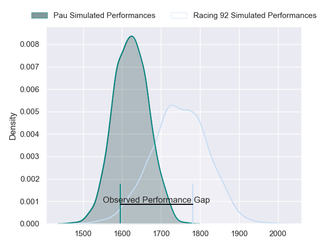
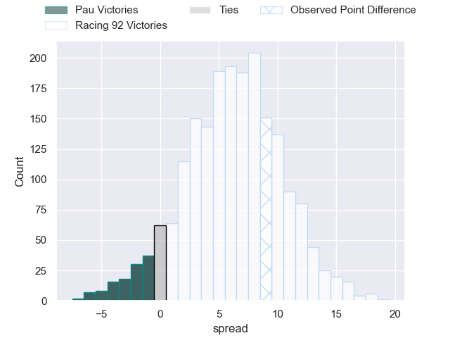
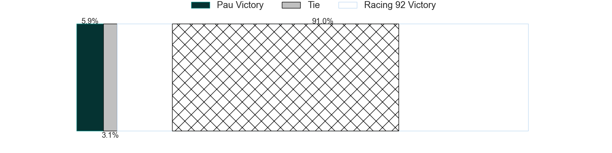
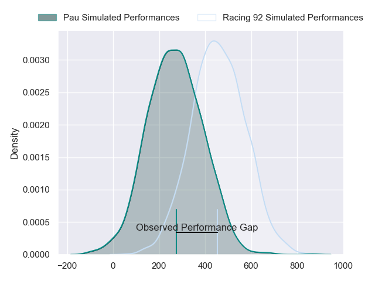
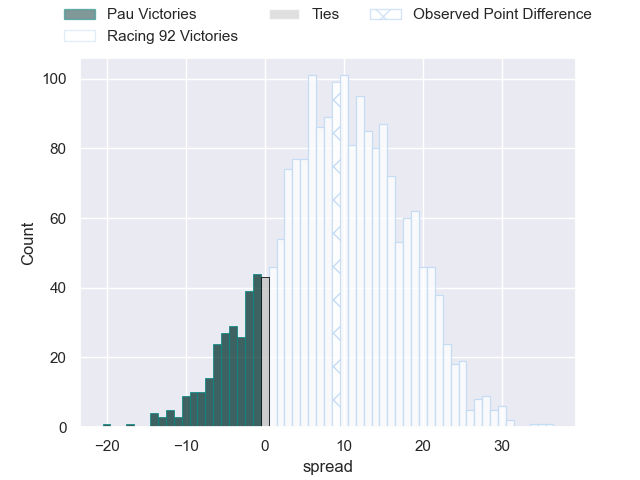
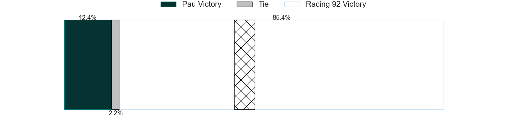

---  
layout: page  
title: Pau at Racing 92; 15-24  
date: 2024-06-01 18:00:00 -0500  
categories: "Top 14 Orange 2023" match review  
---
# Pau at Racing 92; 15-24

# Club Level Predictions

The first set of predictions treats a club as the smallest object, as the club develops its members, organizes a gameplan, and deploys its players as needed for each match. This club model has a prediction of 0.671, which translates to predicting Racing 92 to win by 6.2.

Our Over/Under is 54.5 - and combined with the spread above, we have a predicted scoreline of 24 to 30

Each club has a rating and a rating deviation (similar to a Glicko rating), and expected performances can be generated. This allows for simulated matches and spreads like the ones below.
## Projected Performances - Club Model

## Projected Spreads - Club Model

## Projected Results - Club Model

# Player Level Predictions

Treating teams instead as an entity made up of the currently active players, I have ratings for each player in an altogether different system. These can be combined to form team ratings once teamsheets are announced, weighting starters a bit higher than the reserves. After the match is played, players can be weighted by their minutes on the field, allowing for an accurate measure of the team's composition. With these compiled team ratings, we can make predictions, measure inaccuracy, and update the individual player ratings.
## Prediction without Player Minutes: Racing 92 by 10.3

Racing 92 by 3.4 on a neutral pitch

## Projected Performances - Player Model

## Projected Spreads - Player Model

## Projected Results - Player Model

|   Away Minutes | Away Player          |   Away Percentile |   Number |   Home Percentile | Home Player         |   Home Minutes |
|---------------:|:---------------------|------------------:|---------:|------------------:|:--------------------|---------------:|
|             53 | Simon-Pierre Chauvac |             55.55 |        1 |             15.95 | Hassane Kolingar    |             55 |
|             47 | Youri Delhommel      |             57.56 |        2 |             93.09 | Camille Chat        |             66 |
|             55 | Siate Tokolahi       |             85.75 |        3 |             76.03 | Trevor Nyakane      |             55 |
|             74 | Guillaume Ducat      |             24.7  |        4 |             91.7  | Cameron Woki        |             80 |
|             44 | Lekima Tagitagivalu  |             76    |        5 |             31.3  | Will Rowlands       |             53 |
|             55 | Sacha Zegueur        |             31.41 |        6 |             17.34 | Ibrahim Diallo      |             80 |
|             80 | Luke Whitelock       |             99.04 |        7 |             86.51 | Siya Kolisi         |             80 |
|             80 | Beka Gorgadze        |             76.65 |        8 |             74.79 | Jordan Joseph       |             63 |
|             53 | Thibault Daubagna    |             92.96 |        9 |             81.44 | Nolann Le Garrec    |             76 |
|             80 | Joe Simmonds         |             86.38 |       10 |             91.06 | Antoine Gibert      |             80 |
|             80 | Elliot Roudil        |             23.22 |       11 |             30.43 | Vinaya Habosi       |             80 |
|             47 | Nathan Decron        |             75.59 |       12 |             98.86 | Henry Chavancy      |             80 |
|             80 | Emilien Gailleton    |             71.87 |       13 |             97.21 | Gael Fickou         |             80 |
|             80 | Theo Attissogbe      |             24.08 |       14 |             95.55 | Josua Tuisova       |             72 |
|             80 | Axel Desperes        |             77.87 |       15 |             19    | Max Spring          |             74 |
|             33 | Lucas Rey            |             14.63 |       16 |             32.48 | Janick Tarrit       |             14 |
|             27 | Hugo Parrou          |            nan    |       17 |             51.98 | Guram Gogichashvili |             25 |
|             36 | Steven Cummins       |             14.4  |       18 |             77.8  | Boris Palu          |             27 |
|              6 | Thibaut Hamonou      |             36.9  |       19 |             57.51 | Maxime Baudonne     |             17 |
|             25 | Reece Hewat          |             79.77 |       20 |             18.9  | Clovis Le Bail      |              4 |
|             27 | Dan Robson           |             97.77 |       21 |             65.14 | Tristan Tedder      |              6 |
|             33 | Tumua Manu           |             95.97 |       22 |             95.92 | Christian Wade      |              8 |
|             25 | Nicolas Corato       |             12.39 |       23 |             76.68 | Cedate Gomes Sa     |             25 |

