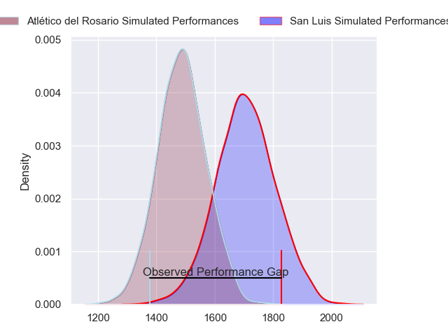
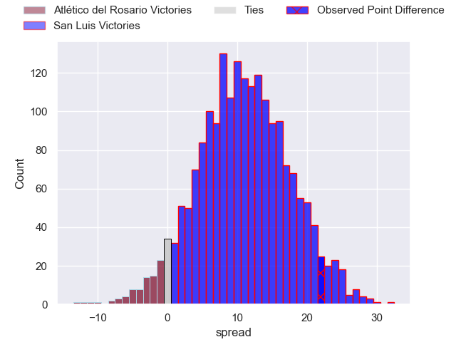
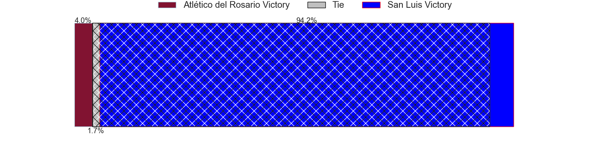
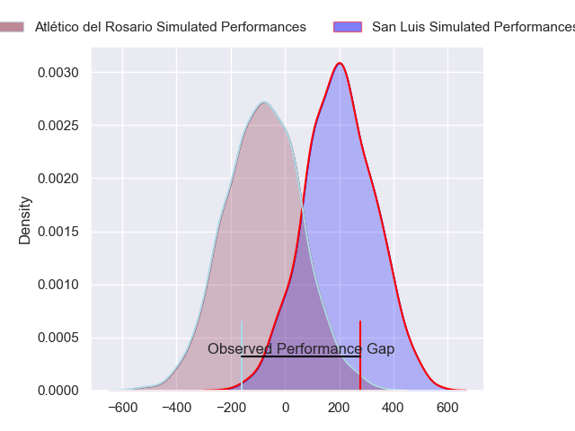
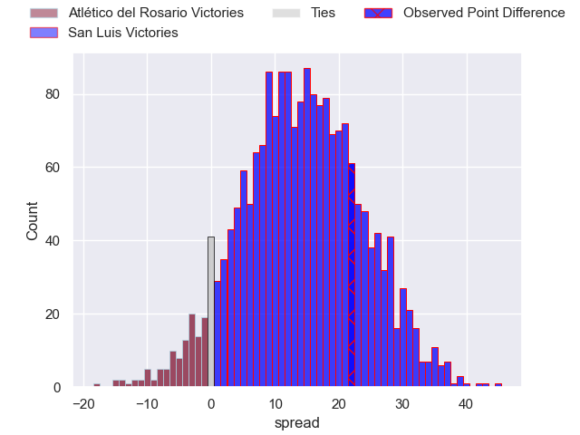
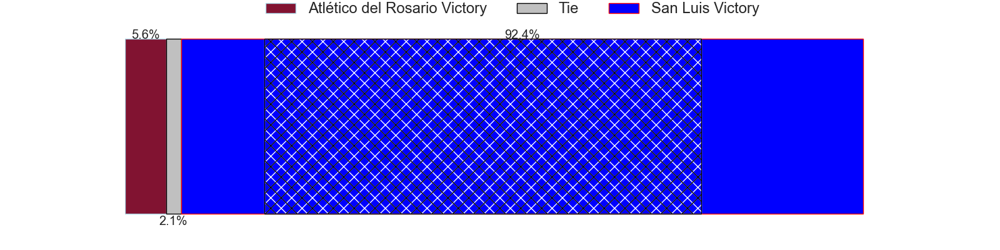

---  
layout: page  
title: Atletico del Rosario at San Luis; 14-36  
date: 2024-06-01 18:00:00 -0500  
categories: "URBA Top 12 2024" match review  
---
# Atletico del Rosario at San Luis; 14-36

# Club Level Predictions

The first set of predictions treats a club as the smallest object, as the club develops its members, organizes a gameplan, and deploys its players as needed for each match. This club model has a prediction of 0.77, which translates to predicting San Luis to win by 10.9.

Our Over/Under is 40.5 - and combined with the spread above, we have a predicted scoreline of 15 to 26

Each club has a rating and a rating deviation (similar to a Glicko rating), and expected performances can be generated. This allows for simulated matches and spreads like the ones below.
## Projected Performances - Club Model

## Projected Spreads - Club Model

## Projected Results - Club Model

# Player Level Predictions

Treating teams instead as an entity made up of the currently active players, I have ratings for each player in an altogether different system. These can be combined to form team ratings once teamsheets are announced, weighting starters a bit higher than the reserves. After the match is played, players can be weighted by their minutes on the field, allowing for an accurate measure of the team's composition. With these compiled team ratings, we can make predictions, measure inaccuracy, and update the individual player ratings.
## Prediction without Player Minutes: San Luis by 13.3

San Luis by 9.0 on a neutral pitch

## Projected Performances - Player Model

## Projected Spreads - Player Model

## Projected Results - Player Model

|   Away Minutes | Away Player       |   Away Percentile |   Number |   Home Percentile | Home Player           |   Home Minutes |
|---------------:|:------------------|------------------:|---------:|------------------:|:----------------------|---------------:|
|             80 | Agustin Fernandez |              6.32 |        1 |             51.34 | Santiago Bonavento    |             80 |
|             80 | Jeremias Aime     |              4.66 |        2 |             60.45 | Franco Cantalupo      |             80 |
|             80 | Bruno Montenegro  |             22.67 |        3 |             66.72 | Facundo Suarez        |             80 |
|             80 | Matias Kremer     |              8.1  |        4 |             57.3  | Ramiro Bruni          |             80 |
|             80 | Octavio Capella   |              7.9  |        5 |             58.5  | Santiago Canal        |             80 |
|             80 | Lucas Malanos     |              6.17 |        6 |             64.93 | Manuel Gnecco         |             80 |
|             80 | Federico Mayol    |             33.43 |        7 |             44.03 | Facundo Alvarez Amado |             80 |
|             80 | Jose Caseres      |             25.83 |        8 |             48.97 | Agustin Torello       |             80 |
|             80 | Martin Del Pazo   |             28.87 |        9 |             46.74 | Martin Aereboe        |             80 |
|             80 | Ramiro Musio      |             34.55 |       10 |             60.16 | Felipe Campodonico    |             80 |
|             80 | Facundo Gerosa    |             11.85 |       11 |             60.85 | Wilmer Ramirez        |             80 |
|             80 | Pedro de Aro      |              6.57 |       12 |             64.53 | Segundo Fresco        |             80 |
|             80 | Guido Vidalle     |              6.57 |       13 |             50.16 | Benjamin Marban       |             80 |
|             80 | Pedro Bisio       |              6.64 |       14 |             56.49 | Eduardo Ruesta        |             80 |
|             80 | Nicolas Casals    |             34.03 |       15 |             37.79 | Valentino Quattrocchi |             80 |
|              0 | Away Team 16      |            nan    |       16 |            nan    | Home Team 16          |              0 |
|              0 | Away Team 17      |            nan    |       17 |            nan    | Home Team 17          |              0 |
|              0 | Away Team 18      |            nan    |       18 |            nan    | Home Team 18          |              0 |
|              0 | Away Team 19      |            nan    |       19 |            nan    | Home Team 19          |              0 |
|              0 | Away Team 20      |            nan    |       20 |            nan    | Home Team 20          |              0 |
|              0 | Away Team 21      |            nan    |       21 |            nan    | Home Team 21          |              0 |
|              0 | Away Team 22      |            nan    |       22 |            nan    | Home Team 22          |              0 |
|              0 | Away Team 23      |            nan    |       23 |            nan    | Home Team 23          |              0 |

