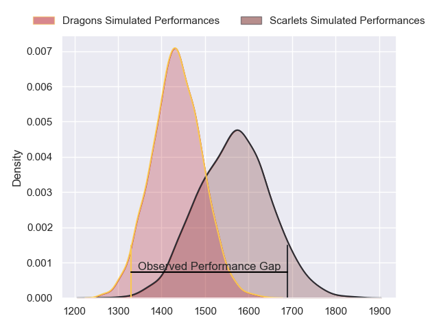
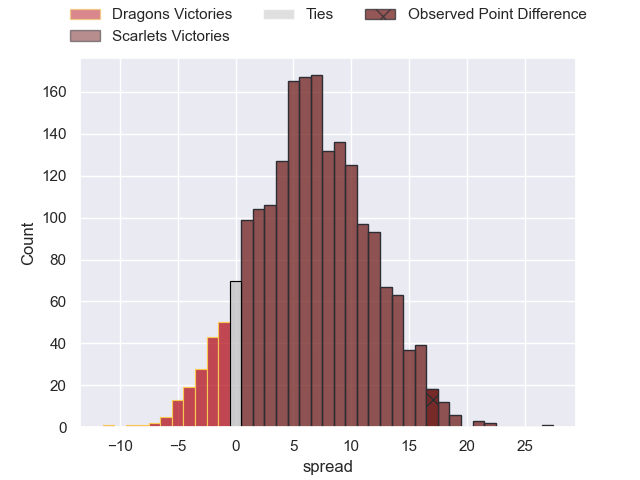
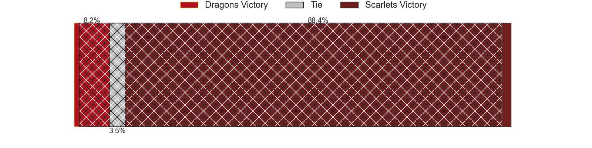
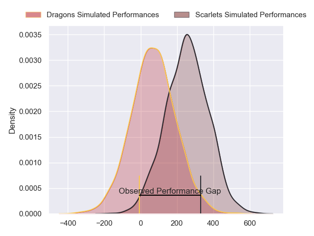
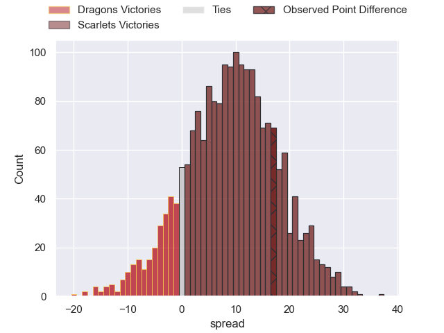

---  
layout: page  
title: Dragons at Scarlets; 15-32  
date: 2024-06-01 18:00:00 -0500  
categories: "United Rugby Championship 2023" match review  
---
# Dragons at Scarlets; 15-32

# Club Level Predictions

The first set of predictions treats a club as the smallest object, as the club develops its members, organizes a gameplan, and deploys its players as needed for each match. This club model has a prediction of 0.682, which translates to predicting Scarlets to win by 6.7.

Our Over/Under is 46.5 - and combined with the spread above, we have a predicted scoreline of 20 to 27

Each club has a rating and a rating deviation (similar to a Glicko rating), and expected performances can be generated. This allows for simulated matches and spreads like the ones below.
## Projected Performances - Club Model

## Projected Spreads - Club Model

## Projected Results - Club Model

# Player Level Predictions

Treating teams instead as an entity made up of the currently active players, I have ratings for each player in an altogether different system. These can be combined to form team ratings once teamsheets are announced, weighting starters a bit higher than the reserves. After the match is played, players can be weighted by their minutes on the field, allowing for an accurate measure of the team's composition. With these compiled team ratings, we can make predictions, measure inaccuracy, and update the individual player ratings.
## Prediction without Player Minutes: Scarlets by 9.0

Scarlets by 3.2 on a neutral pitch

## Projected Performances - Player Model

## Projected Spreads - Player Model

## Projected Results - Player Model

|   Away Minutes | Away Player        |   Away Percentile |   Number |   Home Percentile | Home Player      |   Home Minutes |
|---------------:|:-------------------|------------------:|---------:|------------------:|:-----------------|---------------:|
|             53 | Rhodri Jones       |              2.43 |        1 |             74.82 | Kemsley Mathias  |             55 |
|             53 | Brodie Coghlan     |             23.95 |        2 |             94.05 | Ryan Elias       |             70 |
|             53 | Chris Coleman      |             22.43 |        3 |             10.53 | Harri O'Connor   |             55 |
|             80 | Ben Carter         |             24.3  |        4 |             28.8  | Alex Craig       |             74 |
|             61 | Matthew Screech    |              0.6  |        5 |             73.2  | Sam Lousi        |             80 |
|             80 | Ryan Woodman       |             34.1  |        6 |             78.71 | Taine Plumtree   |             80 |
|             80 | Taine Basham       |             22.83 |        7 |             80.15 | Dan Davis        |             80 |
|             41 | Aaron Wainwright   |             87.81 |        8 |             54.13 | Carwyn Tuipulotu |             51 |
|             67 | Rhodri Williams    |             86.08 |        9 |             49.83 | Gareth Davies    |             51 |
|             80 | Will Reed          |             19.72 |       10 |             59.96 | Sam Costelow     |             75 |
|             55 | Christopher Hollis |             41.8  |       11 |             23.7  | Ryan Conbeer     |             80 |
|             31 | Aneurin Owen       |             58.22 |       12 |             41.47 | Eddie James      |             80 |
|             80 | Joe Westwood       |             28.44 |       13 |             75.49 | Johnny Williams  |             80 |
|             80 | Rio Dyer           |             27.87 |       14 |             88.06 | Tomi Lewis       |             66 |
|             80 | Ewan Rosser        |             26.1  |       15 |             12.73 | Ioan Nicholas    |             55 |
|             27 | James Benjamin     |             11.09 |       16 |              4.5  | Shaun Evans      |             10 |
|             27 | Rodrigo Martinez   |             61.86 |       17 |             59.68 | Wyn Jones        |             25 |
|             27 | Dimitri Arhip      |            nan    |       18 |             15.87 | Sam Wainwright   |             25 |
|             19 | George Nott        |             17.5  |       19 |              2.9  | Morgan Jones     |              6 |
|             39 | Dan Lydiate        |             46.63 |       20 |             52.41 | Jarrod Taylor    |             29 |
|             13 | Che Hope           |            nan    |       21 |             67.87 | Kieran Hardy     |             29 |
|             49 | Steffan Hughes     |             79.11 |       22 |              6.1  | Ioan Lloyd       |             30 |
|             25 | Sio Tomkinson      |             86.87 |       23 |            nan    | Macs Page        |             14 |

