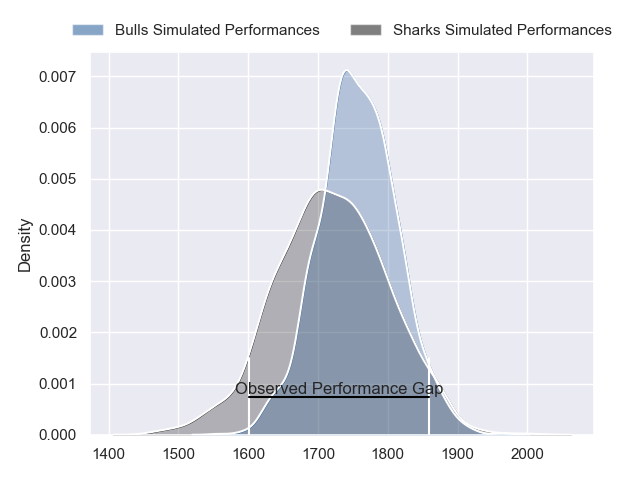
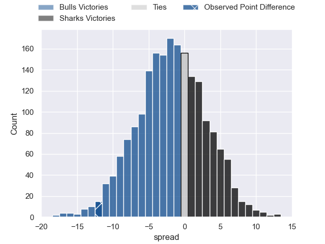
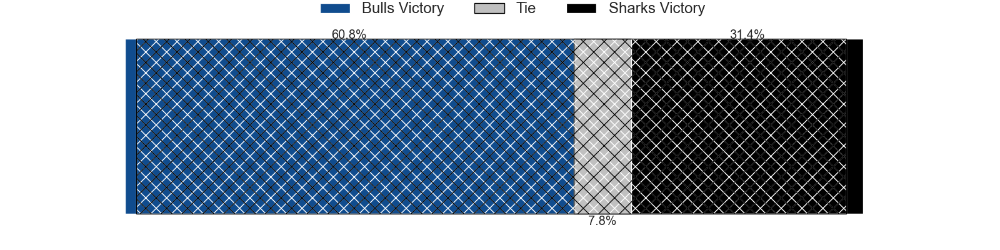
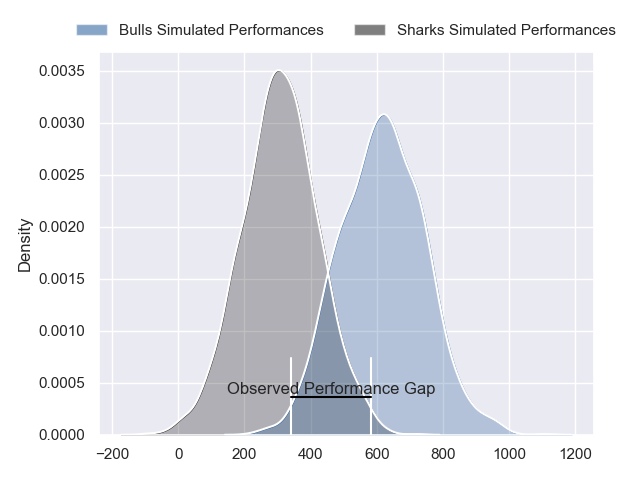
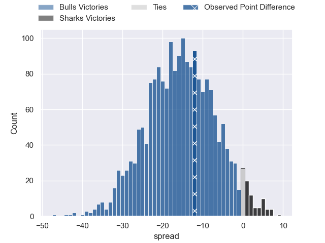

---  
layout: page  
title: Bulls at Sharks; 26-14  
date: 2024-06-01 18:00:00 -0500  
categories: "United Rugby Championship 2023" match review  
---
# Bulls at Sharks; 26-14

# Club Level Predictions

The first set of predictions treats a club as the smallest object, as the club develops its members, organizes a gameplan, and deploys its players as needed for each match. This club model has a prediction of 0.445, which translates to predicting Bulls to win by 1.9.

Our Over/Under is 61.5 - and combined with the spread above, we have a predicted scoreline of 32 to 30

Each club has a rating and a rating deviation (similar to a Glicko rating), and expected performances can be generated. This allows for simulated matches and spreads like the ones below.
## Projected Performances - Club Model

## Projected Spreads - Club Model

## Projected Results - Club Model

# Player Level Predictions

Treating teams instead as an entity made up of the currently active players, I have ratings for each player in an altogether different system. These can be combined to form team ratings once teamsheets are announced, weighting starters a bit higher than the reserves. After the match is played, players can be weighted by their minutes on the field, allowing for an accurate measure of the team's composition. With these compiled team ratings, we can make predictions, measure inaccuracy, and update the individual player ratings.
## Prediction without Player Minutes: Bulls by 14.3

Bulls by 18.7 on a neutral pitch

## Projected Performances - Player Model

## Projected Spreads - Player Model

## Projected Results - Player Model

|   Away Minutes | Away Player         |   Away Percentile |   Number |   Home Percentile | Home Player         |   Home Minutes |
|---------------:|:--------------------|------------------:|---------:|------------------:|:--------------------|---------------:|
|             46 | Gerhard Steenekamp  |             93.93 |        1 |             99.76 | Ox Nche             |             55 |
|             53 | Johan Grobbelaar    |             96.3  |        2 |             98.07 | Bongi Mbonambi      |             50 |
|             65 | Wilco Louw          |             99.43 |        3 |             67.29 | Vincent Koch        |             55 |
|             80 | Ruan Vermaak        |             13.8  |        4 |             16.1  | Corne Rahl          |             56 |
|             80 | Ruan Nortje         |             89.9  |        5 |             19    | Gerbrandt Grobler   |             55 |
|             43 | Marco van Staden    |             92.29 |        6 |             71.87 | James Venter        |             80 |
|             80 | Elrigh Louw         |             92.68 |        7 |             90.56 | Vincent Tshituka    |             80 |
|             69 | Cameron Hanekom     |             69.63 |        8 |             66.32 | Phepsi Buthelezi    |             80 |
|             79 | Embrose Papier      |             95.02 |        9 |              2.92 | Cameron Wright      |             59 |
|             76 | Johan Goosen        |             85.37 |       10 |             67.28 | Siya Masuku         |             80 |
|             51 | Kurt-Lee Arendse    |             98.77 |       11 |             17.63 | Eduan Keyter        |             80 |
|             80 | Harold Vorster      |             96.38 |       12 |             62.77 | Francois Venter     |             80 |
|             80 | David Kriel         |             95.04 |       13 |             59.15 | Ethan Hooker        |             59 |
|             80 | Canan Moodie        |             99.62 |       14 |             80.76 | Werner Kok          |             80 |
|             80 | Willie le Roux      |             97.7  |       15 |             91.65 | Aphelele Fassi      |             80 |
|             27 | Akker van der Merwe |             99.36 |       16 |             90.84 | Fez Mbatha          |             30 |
|             34 | Simphiwe Matanzima  |             79.27 |       17 |             47.29 | Ntuthuko Mchunu     |             25 |
|             15 | Francois Klopper    |            nan    |       18 |             77.73 | Khwezi Mona         |             25 |
|             11 | Reinhardt Ludwig    |             80.9  |       19 |             52.22 | Jeandre Labuschagne |             25 |
|             37 | Nizaam Carr         |             94.51 |       20 |             59.49 | Dylan Richardson    |             24 |
|              1 | Keagan Johannes     |            nan    |       21 |            nan    | Bradley Davids      |             21 |
|              4 | Chris William Smith |             30.08 |       22 |             42.17 | Boeta Chamberlain   |              0 |
|             29 | Sebastian de Klerk  |             95.07 |       23 |            nan    | Diego Appollis      |             21 |

