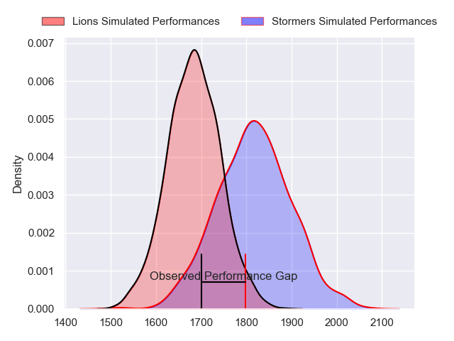
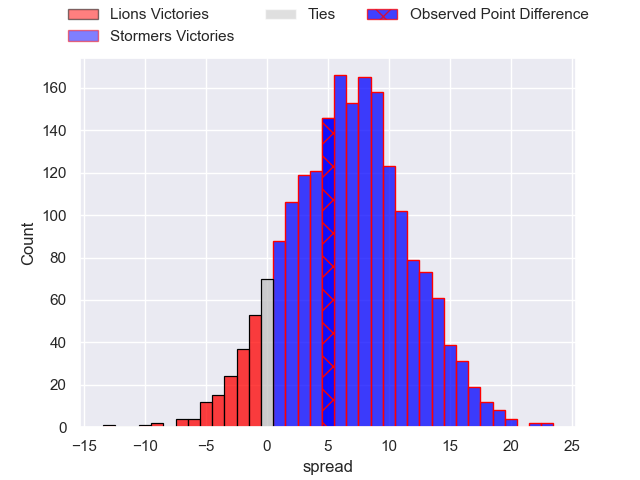
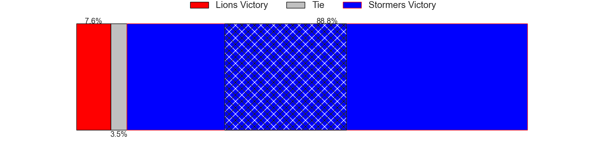
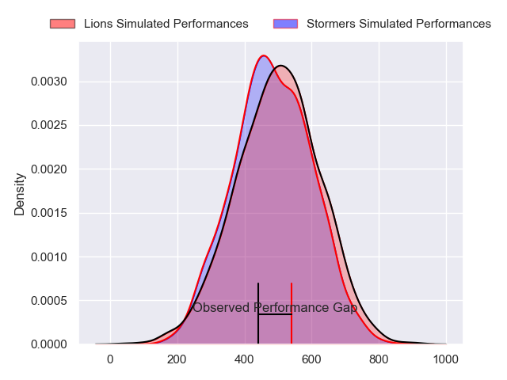
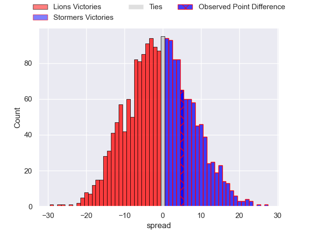
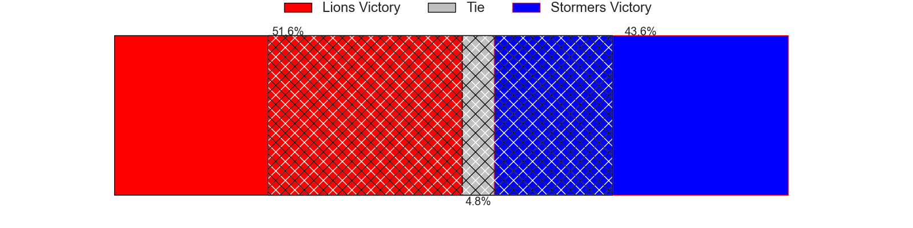

---  
layout: page  
title: Lions at Stormers; 24-29  
date: 2024-06-01 18:00:00 -0500  
categories: "United Rugby Championship 2023" match review  
---
# Lions at Stormers; 24-29

# Club Level Predictions

The first set of predictions treats a club as the smallest object, as the club develops its members, organizes a gameplan, and deploys its players as needed for each match. This club model has a prediction of 0.685, which translates to predicting Stormers to win by 6.9.

Our Over/Under is 58.5 - and combined with the spread above, we have a predicted scoreline of 26 to 33

Each club has a rating and a rating deviation (similar to a Glicko rating), and expected performances can be generated. This allows for simulated matches and spreads like the ones below.
## Projected Performances - Club Model

## Projected Spreads - Club Model

## Projected Results - Club Model

# Player Level Predictions

Treating teams instead as an entity made up of the currently active players, I have ratings for each player in an altogether different system. These can be combined to form team ratings once teamsheets are announced, weighting starters a bit higher than the reserves. After the match is played, players can be weighted by their minutes on the field, allowing for an accurate measure of the team's composition. With these compiled team ratings, we can make predictions, measure inaccuracy, and update the individual player ratings.
## Prediction without Player Minutes: Stormers by 1.7

Lions by 3.0 on a neutral pitch

## Projected Performances - Player Model

## Projected Spreads - Player Model

## Projected Results - Player Model

|   Away Minutes | Away Player          |   Away Percentile |   Number |   Home Percentile | Home Player          |   Home Minutes |
|---------------:|:---------------------|------------------:|---------:|------------------:|:---------------------|---------------:|
|             51 | Morgan Naude         |             57.17 |        1 |             72.63 | Sti Sithole          |             51 |
|             55 | PJ Botha             |             90.03 |        2 |             80.23 | Andre-Hugo Venter    |             51 |
|             55 | Asenathi Ntlabakanye |             82.91 |        3 |             86.96 | Neethling Fouche     |             51 |
|             71 | Willem Alberts       |             93.3  |        4 |             82.1  | Salmaan Moerat       |             59 |
|             63 | Ruan Delport         |             65.7  |        5 |             87.9  | Ruben van Heerden    |             80 |
|             80 | JC Pretorius         |             90.94 |        6 |             91.33 | Evan Roos            |             80 |
|             80 | Emmanuel Tshituka    |             73.22 |        7 |             73.6  | Ben-Jason Dixon      |             80 |
|             80 | Francke Horn         |             99.38 |        8 |             92.77 | Hacjivah Dayimani    |             59 |
|             80 | Morne van den Berg   |             92.61 |        9 |             93.81 | Herschel Jantjies    |             65 |
|             49 | Sanele Nohamba       |             95.73 |       10 |             85.98 | Manie Libbok         |             80 |
|             80 | Edwill van der Merwe |             95.26 |       11 |             96.3  | Angelo Davids        |             80 |
|             80 | Jordan Hendrikse     |             77.25 |       12 |             92.66 | Daniel du Plessis    |             68 |
|             80 | Erich Cronje         |             24.61 |       13 |             85.63 | Wandisile Simelane   |             51 |
|              5 | Rabz Maxwane         |             87.39 |       14 |             81.04 | Suleiman Hartzenberg |             80 |
|             80 | Quan Horn            |             94.36 |       15 |             77.66 | Sacha Mngomezulu     |             80 |
|             25 | Jaco Visagie         |             74.6  |       16 |             74.12 | Joseph Dweba         |             29 |
|             29 | Jean-Pierre Smith    |             83.24 |       17 |             99.92 | Brok Harris          |             29 |
|             25 | Ruan Dreyer          |             99.11 |       18 |             88.66 | Frans Malherbe       |             29 |
|              9 | Etienne Oosthuizen   |             83.9  |       19 |             81.4  | Adre Smith           |             21 |
|             17 | Reinhard Nothnagel   |             91.9  |       20 |             41.91 | Marcel Theunissen    |             21 |
|              0 | Izan Esterhuizen     |            nan    |       21 |             17.35 | Stefan Ungerer       |             15 |
|             75 | Marius Louw          |             95.55 |       22 |             71.04 | Jean-Luc du Plessis  |             29 |
|             31 | Gianni Lombard       |             81.71 |       23 |             91.85 | Ben Loader           |             12 |

