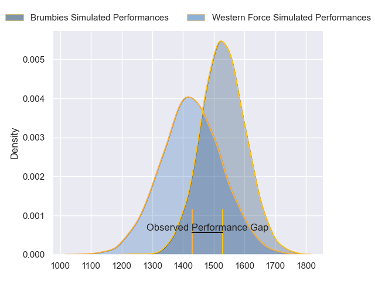
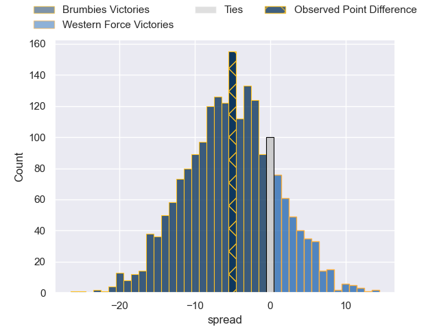
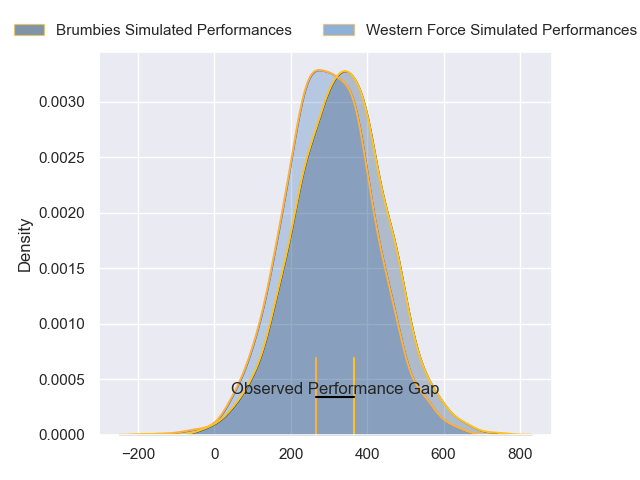
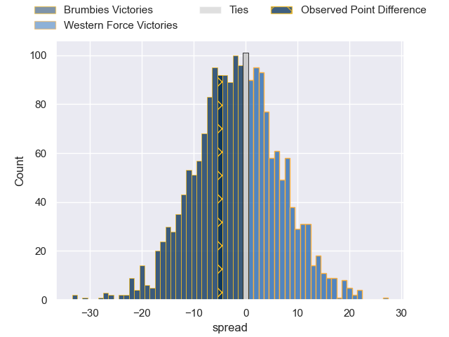

---  
layout: page  
title: Brumbies at Western Force; 24-19  
date: 2024-06-01 18:00:00 -0500  
categories: "Super Rugby Pacific 2024" match review  
---
# Brumbies at Western Force; 24-19

# Club Level Predictions

The first set of predictions treats a club as the smallest object, as the club develops its members, organizes a gameplan, and deploys its players as needed for each match. This club model has a prediction of 0.36, which translates to predicting Brumbies to win by 5.1.

Our Over/Under is 50.5 - and combined with the spread above, we have a predicted scoreline of 28 to 23

Each club has a rating and a rating deviation (similar to a Glicko rating), and expected performances can be generated. This allows for simulated matches and spreads like the ones below.
## Projected Performances - Club Model

## Projected Spreads - Club Model

## Projected Results - Club Model

# Player Level Predictions

Treating teams instead as an entity made up of the currently active players, I have ratings for each player in an altogether different system. These can be combined to form team ratings once teamsheets are announced, weighting starters a bit higher than the reserves. After the match is played, players can be weighted by their minutes on the field, allowing for an accurate measure of the team's composition. With these compiled team ratings, we can make predictions, measure inaccuracy, and update the individual player ratings.
## Prediction without Player Minutes: Brumbies by 1.2

Brumbies by 5.3 on a neutral pitch

## Projected Performances - Player Model

## Projected Spreads - Player Model

## Projected Results - Player Model

|   Away Minutes | Away Player      |   Away Percentile |   Number |   Home Percentile | Home Player           |   Home Minutes |
|---------------:|:-----------------|------------------:|---------:|------------------:|:----------------------|---------------:|
|              3 | Blake Schoupp    |             41.38 |        1 |             14.57 | Ryan Coxon            |             47 |
|             51 | Billy Pollard    |             82.15 |        2 |             64.95 | Tom Horton            |             65 |
|             51 | Allan Alaalatoa  |             97    |        3 |             10.36 | Santiago Medrano      |             56 |
|             83 | Darcy Swain      |             79.6  |        4 |             94.6  | Sam Carter            |             45 |
|             83 | Nick Frost       |             53.6  |        5 |             88.3  | Izack Rodda           |             66 |
|             57 | Tom Hooper       |             77.07 |        6 |             17.44 | Jeremy Williams       |             83 |
|             83 | Rory Scott       |             69.65 |        7 |             15.61 | Carlo Tizzano         |             68 |
|             51 | Rob Valetini     |             94.83 |        8 |             88.64 | Reed Prinsep          |             83 |
|             51 | Ryan Lonergan    |             90.21 |        9 |             99.31 | Nic White             |             73 |
|             51 | Noah Lolesio     |             87.4  |       10 |              4.88 | Max Burey             |             83 |
|             83 | Corey Toole      |             69.57 |       11 |             38.67 | Ronan Leahy           |             83 |
|             61 | Tamati Tua       |             66.39 |       12 |             84.69 | Hamish Stewart        |             45 |
|             83 | Len Ikitau       |             73.01 |       13 |              6    | Bayley Kuenzle        |             83 |
|             83 | Andy Muirhead    |             94.22 |       14 |             59.91 | George Poolman        |             83 |
|             83 | Tom Wright       |             82.88 |       15 |             96.03 | Kurtley Beale         |             83 |
|             32 | Connal McInerney |             85.53 |       16 |             95.34 | Ben Funnell           |             18 |
|             80 | Harry Vella      |             54.17 |       17 |             39.84 | Marley Pearce         |             36 |
|             32 | Sefo Kautai      |             30.2  |       18 |            nan    | Tiaan Tauakipulu      |             27 |
|             26 | Cadeyrn Neville  |             99    |       19 |             17.6  | Lopeti Faifua         |             17 |
|             32 | Luke Reimer      |             57.13 |       20 |              1.35 | Michael Wells         |             25 |
|             32 | Harrison Goddard |             23.37 |       21 |             76.78 | Will Harris           |             38 |
|             32 | Jack Debreczeni  |             75.61 |       22 |             33.68 | Issak Fines-Leleiwasa |             36 |
|             22 | Ollie Sapsford   |             90.71 |       23 |             22.03 | Sam Spink             |              2 |

