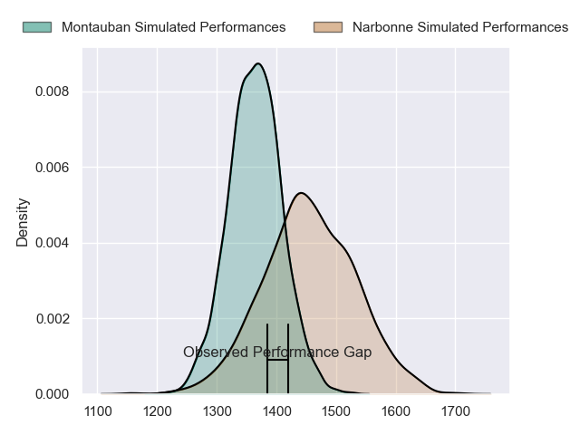
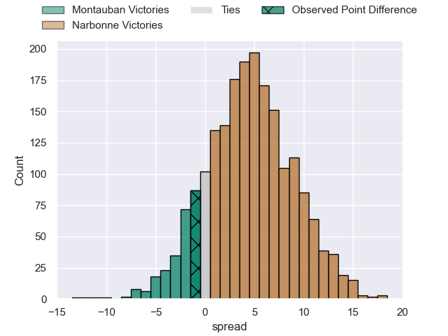
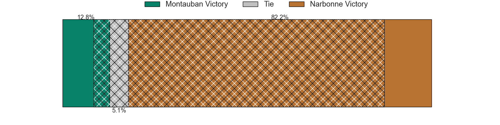
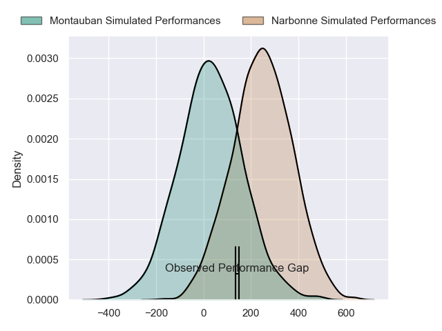
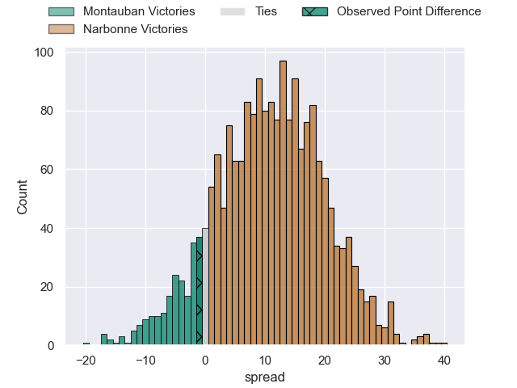
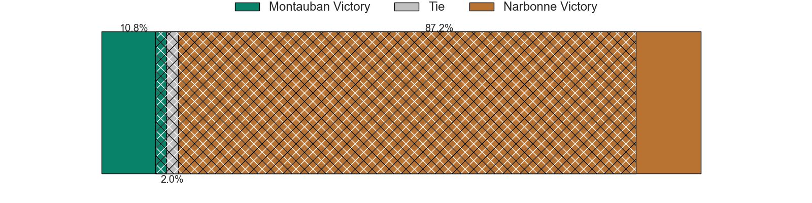

---  
layout: page  
title: Montauban at Narbonne; 20-19  
date: 2024-06-02 18:00:00 -0500  
categories: "Pro D2 2023" match review  
---
# Montauban at Narbonne; 20-19

# Club Level Predictions

The first set of predictions treats a club as the smallest object, as the club develops its members, organizes a gameplan, and deploys its players as needed for each match. This club model has a prediction of 0.629, which translates to predicting Narbonne to win by 4.6.

Our Over/Under is 40.5 - and combined with the spread above, we have a predicted scoreline of 18 to 22

Each club has a rating and a rating deviation (similar to a Glicko rating), and expected performances can be generated. This allows for simulated matches and spreads like the ones below.
## Projected Performances - Club Model

## Projected Spreads - Club Model

## Projected Results - Club Model

# Player Level Predictions

Treating teams instead as an entity made up of the currently active players, I have ratings for each player in an altogether different system. These can be combined to form team ratings once teamsheets are announced, weighting starters a bit higher than the reserves. After the match is played, players can be weighted by their minutes on the field, allowing for an accurate measure of the team's composition. With these compiled team ratings, we can make predictions, measure inaccuracy, and update the individual player ratings.
## Prediction without Player Minutes: Narbonne by 11.6

Narbonne by 3.7 on a neutral pitch

## Projected Performances - Player Model

## Projected Spreads - Player Model

## Projected Results - Player Model

|   Away Minutes | Away Player       |   Away Percentile |   Number |   Home Percentile | Home Player            |   Home Minutes |
|---------------:|:------------------|------------------:|---------:|------------------:|:-----------------------|---------------:|
|             80 | Tietie Tuimauga   |             73.28 |        1 |             80.32 | Théo Castinel          |             80 |
|             80 | Kevin Firmin      |              8.2  |        2 |              9.32 | Clément Esteriola      |             80 |
|             80 | Mirian Burduli    |              3.08 |        3 |              5.91 | Mohammed Loukia        |             80 |
|             80 | Tjuee Uanivi      |              6.4  |        4 |              5.2  | Marius Antonescu       |             80 |
|             80 | Dimitri Vaotoa    |             35.7  |        5 |              6.7  | Leva Fifita            |             80 |
|             80 | Kyllian Ringuet   |             48.17 |        6 |             75.63 | Baptiste Abescat-Leroy |             80 |
|             80 | Karl Wilkins      |             16.47 |        7 |              5.78 | Paul Belzons           |             80 |
|             80 | Tyrone Viiga      |             14.88 |        8 |              1.45 | Charles Malet          |             80 |
|             80 | Shaun Venter      |              5.5  |        9 |             71.13 | Pierrick Nova          |             80 |
|             80 | Jérôme Bosviel    |             84.55 |       10 |             31.3  | Tom Chauvet            |             80 |
|             80 | Stephane Ahmed    |             91.94 |       11 |              4.36 | Pierre-Hugo Ducom      |             80 |
|             80 | Dan Goggin        |             83.76 |       12 |             99.9  | Peter Betham           |             80 |
|             80 | Simon Renda       |             65.36 |       13 |             29.27 | Pierre Nueno           |             80 |
|             80 | Yvan Reilhac      |             48.91 |       14 |             36.87 | Clément Clavières      |             80 |
|             80 | Semesa Rokoduguni |             82.67 |       15 |             86.22 | Paul Auradou           |             80 |

