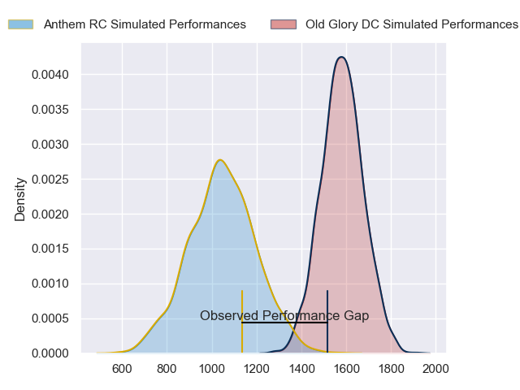
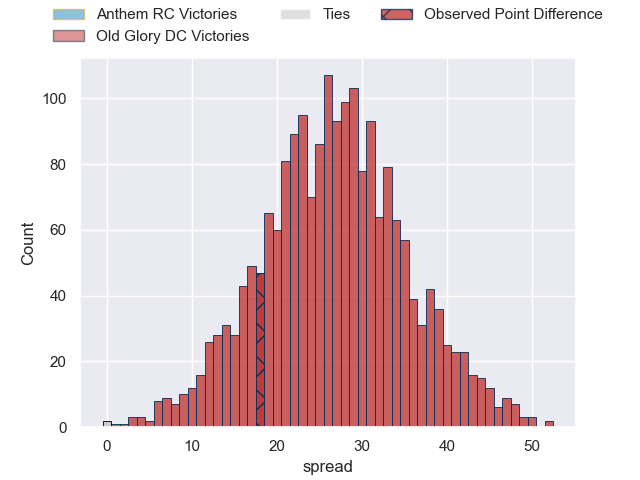
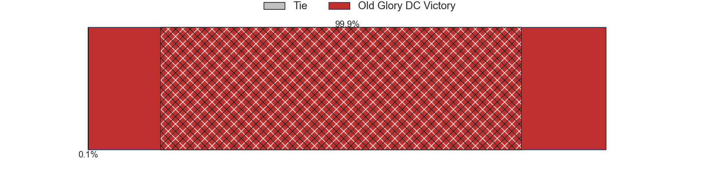
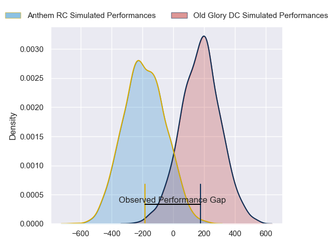
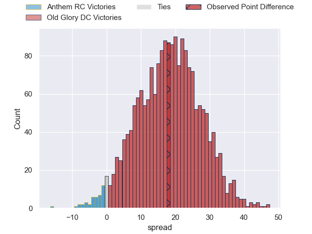
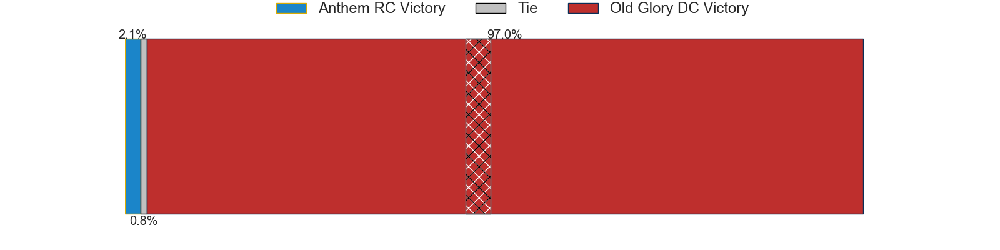

---  
layout: page  
title: Anthem RC at Old Glory DC; 29-47  
date: 2024-06-02 18:00:00 -0500  
categories: "Major League Rugby 2024" match review  
---
# Anthem RC at Old Glory DC; 29-47

# Club Level Predictions

The first set of predictions treats a club as the smallest object, as the club develops its members, organizes a gameplan, and deploys its players as needed for each match. This club model has a prediction of 0.941, which translates to predicting Old Glory DC to win by 26.6.

Our Over/Under is 66.5 - and combined with the spread above, we have a predicted scoreline of 20 to 47

Each club has a rating and a rating deviation (similar to a Glicko rating), and expected performances can be generated. This allows for simulated matches and spreads like the ones below.
## Projected Performances - Club Model

## Projected Spreads - Club Model

## Projected Results - Club Model

# Player Level Predictions

Treating teams instead as an entity made up of the currently active players, I have ratings for each player in an altogether different system. These can be combined to form team ratings once teamsheets are announced, weighting starters a bit higher than the reserves. After the match is played, players can be weighted by their minutes on the field, allowing for an accurate measure of the team's composition. With these compiled team ratings, we can make predictions, measure inaccuracy, and update the individual player ratings.
## Prediction without Player Minutes: Old Glory DC by 18.7

Old Glory DC by 16.1 on a neutral pitch

## Projected Performances - Player Model

## Projected Spreads - Player Model

## Projected Results - Player Model

|   Away Minutes | Away Player           |   Away Percentile |   Number |   Home Percentile | Home Player              |   Home Minutes |
|---------------:|:----------------------|------------------:|---------:|------------------:|:-------------------------|---------------:|
|             80 | Jake Turnbull         |             72.15 |        1 |             19.03 | Jack Iscaro              |             80 |
|             80 | Connor Robinson       |             13.67 |        2 |             61.25 | Martin Vaca              |             80 |
|             80 | Joe Apikotoa          |             31.98 |        3 |             85.83 | Steven Longwell          |             80 |
|             80 | James Rivers          |              5.4  |        4 |             92.2  | Rob Harley               |             80 |
|             80 | Lucas Gramlick        |             19.2  |        5 |             66.9  | Bill Whiteside           |             80 |
|             80 | Joseph Basser         |              5.97 |        6 |             31.5  | Jamason Fa'anana Schultz |             80 |
|             80 | Albert O'Shannessey   |              1.54 |        7 |             20.91 | Cory Gilliland-Daniel    |             80 |
|             80 | Shneil Singh          |             20.87 |        8 |             96.07 | Lautaro Ezequiel Bavaro  |             80 |
|             80 | Sean Yacoubian        |             34.36 |        9 |             62.89 | Connor Buckley           |             80 |
|             80 | Oscar Koller          |              1.42 |       10 |              0.81 | Jason Robertson          |             80 |
|             80 | Te Rangatira Waitokia |              0.76 |       11 |             87.96 | Axel Muller              |             80 |
|             80 | Junior Gafa           |              7.34 |       12 |              2.9  | Tommaso Boni             |             80 |
|             80 | Sebastian Zaridze     |             12    |       13 |             32.37 | William Talataina-Mu     |             80 |
|             80 | Cael Hodgson          |              2.18 |       14 |             49.95 | Ishmail Shabazz          |             80 |
|             80 | Cliven Loubser        |             14.41 |       15 |             29.23 | Perry Humphreys          |             80 |

