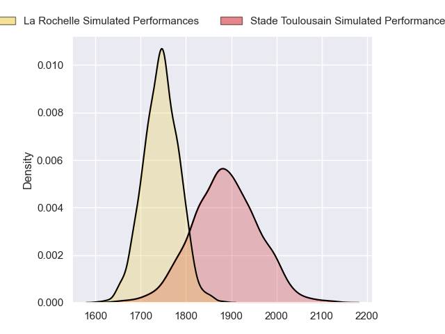
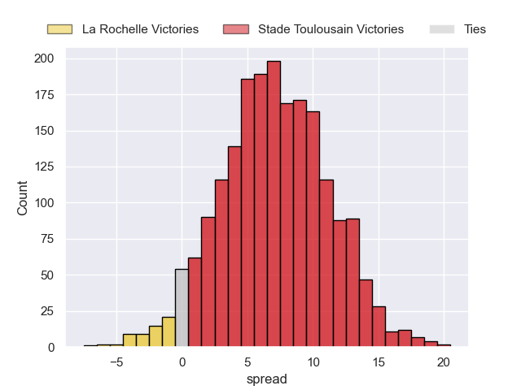
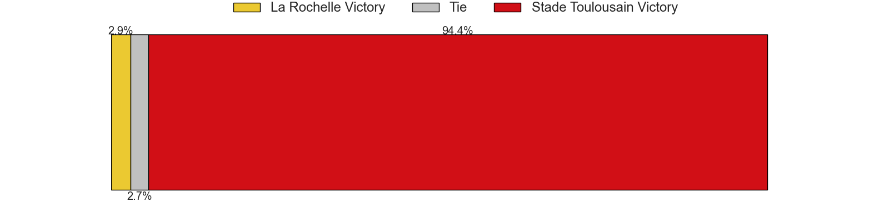
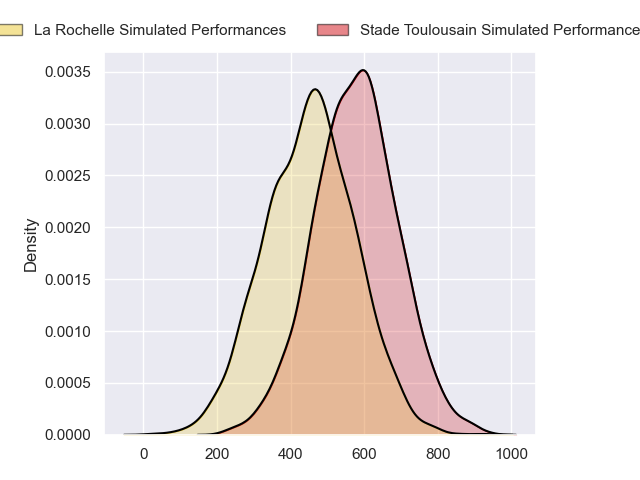
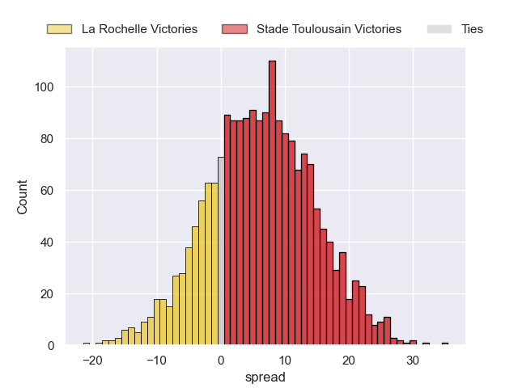
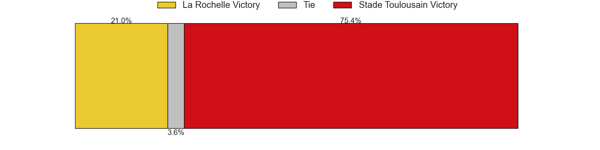

---  
layout: page  
title: La Rochelle at Stade Toulousain; 31-31  
date: 2024-06-02 18:00:00 -0500  
categories: "Top 14 Orange 2023" match review  
---
# La Rochelle at Stade Toulousain; 31-31

# Club Level Predictions

The first set of predictions treats a club as the smallest object, as the club develops its members, organizes a gameplan, and deploys its players as needed for each match. This club model has a prediction of 0.69, which translates to predicting Stade Toulousain to win by 7.0.

Our Over/Under is 45.5 - and combined with the spread above, we have a predicted scoreline of 19 to 26

Each club has a rating and a rating deviation (similar to a Glicko rating), and expected performances can be generated. This allows for simulated matches and spreads like the ones below.
## Projected Performances - Club Model

## Projected Spreads - Club Model

## Projected Results - Club Model

# Player Level Predictions

Treating teams instead as an entity made up of the currently active players, I have ratings for each player in an altogether different system. These can be combined to form team ratings once teamsheets are announced, weighting starters a bit higher than the reserves. After the match is played, players can be weighted by their minutes on the field, allowing for an accurate measure of the team's composition. With these compiled team ratings, we can make predictions, measure inaccuracy, and update the individual player ratings.
## Prediction without Player Minutes: Stade Toulousain by 7.4

La Rochelle by 0.1 on a neutral pitch

## Projected Performances - Player Model

## Projected Spreads - Player Model

## Projected Results - Player Model

|   Away Minutes | Away Player           |   Away Percentile |   Number |   Home Percentile | Home Player          |   Home Minutes |
|---------------:|:----------------------|------------------:|---------:|------------------:|:---------------------|---------------:|
|             61 | Reda Wardi            |             95.87 |        1 |             63.4  | Rodrigue Neti        |             55 |
|             52 | Quentin Lespiaucq     |             73.95 |        2 |             81.03 | Guillaume Cramont    |             71 |
|             52 | Uini Atonio           |             99.51 |        3 |             93.68 | David Ainu'u         |             55 |
|             63 | Judicael Cancoriet    |             25.8  |        4 |             72.8  | Clement Verge        |             75 |
|             80 | Will Skelton          |             98.3  |        5 |             74.5  | Piula Fa'asalele     |             57 |
|              9 | Matthias Haddad       |             44.12 |        6 |             98.27 | Francois Cros        |             80 |
|             80 | Oscar Jegou           |             25.82 |        7 |             75.05 | Mathis Castro        |             61 |
|             80 | Gregory Alldritt      |             97.52 |        8 |             53.31 | Theo Ntamack         |             61 |
|             73 | Thomas Berjon         |             81.96 |        9 |             42.78 | Paul Graou           |             69 |
|             80 | Antoine Hastoy        |             57.93 |       10 |             95.93 | Thomas Ramos         |             80 |
|             80 | Dillyn Leyds          |             98.86 |       11 |             77.63 | Lucas Tauzin         |             80 |
|             69 | Jules Favre           |             80.35 |       12 |             89.66 | Pierre-Louis Barassi |             52 |
|             63 | Ulupano Seuteni       |             63.19 |       13 |             77.66 | Dimitri Delibes      |             80 |
|             80 | Jack Nowell           |             97.16 |       14 |             77.44 | Setareki Bituniyata  |             80 |
|             52 | Brice Dulin           |             99.58 |       15 |             94.57 | Ange Capuozzo        |             80 |
|             28 | Tolu Latu             |             90.68 |       16 |             95.18 | Peato Mauvaka        |              9 |
|             19 | Louis Penverne        |             26.64 |       17 |             96.44 | Cyril Baille         |             25 |
|             17 | Remi Picquette        |             64.8  |       18 |             82.75 | Joel Merkler         |             28 |
|             71 | Yoan Tanga            |             73.14 |       19 |             95.87 | Alexandre Roumat     |             19 |
|              7 | Teddy Iribaren        |             86.94 |       20 |             96.34 | Jack Willis          |             19 |
|             28 | Ihaia West            |             35.57 |       21 |             12.2  | Baptiste Germain     |             11 |
|             28 | Jonathan Danty        |             91.83 |       22 |             96.9  | Sofiane Guitoune     |             28 |
|             28 | Georges-Henri Colombe |              3.56 |       23 |             96.68 | Dorian Aldegheri     |             25 |

