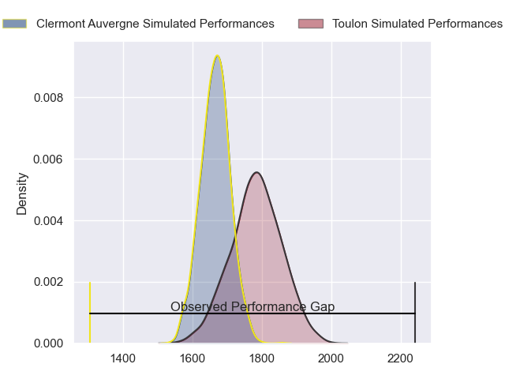
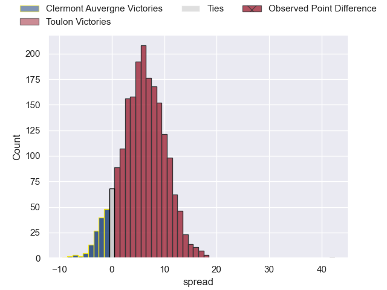
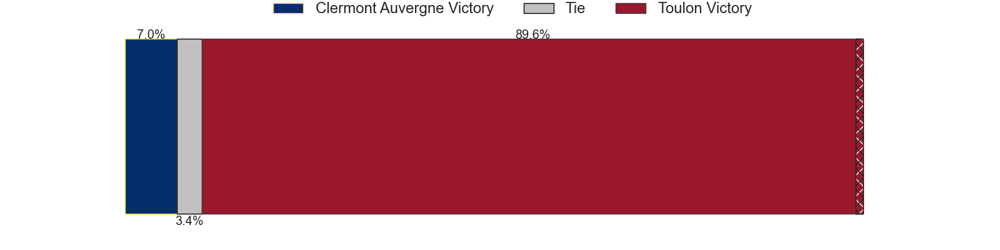
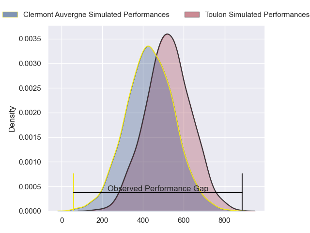
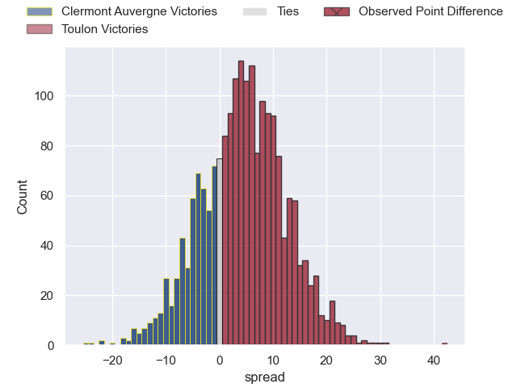
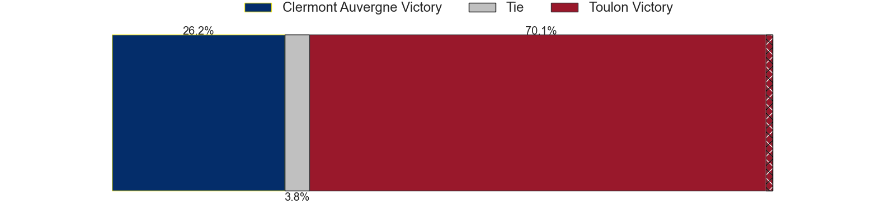

---  
layout: page  
title: Clermont Auvergne at Toulon; 10-52  
date: 2024-06-02 18:00:00 -0500  
categories: "Top 14 Orange 2023" match review  
---
# Clermont Auvergne at Toulon; 10-52

# Club Level Predictions

The first set of predictions treats a club as the smallest object, as the club develops its members, organizes a gameplan, and deploys its players as needed for each match. This club model has a prediction of 0.659, which translates to predicting Toulon to win by 5.8.

Our Over/Under is 50.5 - and combined with the spread above, we have a predicted scoreline of 22 to 28

Each club has a rating and a rating deviation (similar to a Glicko rating), and expected performances can be generated. This allows for simulated matches and spreads like the ones below.
## Projected Performances - Club Model

## Projected Spreads - Club Model

## Projected Results - Club Model

# Player Level Predictions

Treating teams instead as an entity made up of the currently active players, I have ratings for each player in an altogether different system. These can be combined to form team ratings once teamsheets are announced, weighting starters a bit higher than the reserves. After the match is played, players can be weighted by their minutes on the field, allowing for an accurate measure of the team's composition. With these compiled team ratings, we can make predictions, measure inaccuracy, and update the individual player ratings.
## Prediction without Player Minutes: Toulon by 6.9

Clermont Auvergne by 0.1 on a neutral pitch

## Projected Performances - Player Model

## Projected Spreads - Player Model

## Projected Results - Player Model

|   Away Minutes | Away Player          |   Away Percentile |   Number |   Home Percentile | Home Player       |   Home Minutes |
|---------------:|:---------------------|------------------:|---------:|------------------:|:------------------|---------------:|
|             53 | Giorgi Beria         |             69.07 |        1 |             94.57 | Dany Priso        |             50 |
|             17 | Etienne Fourcade     |             76.21 |        2 |             72.83 | Teddy Baubigny    |             56 |
|             53 | Rabah Slimani        |             89.31 |        3 |             83.81 | Beka Gigashvili   |             56 |
|             53 | Thibaud Lanen        |             88.1  |        4 |             92.1  | David Ribbans     |             63 |
|             80 | Rob Simmons          |             94.5  |        5 |             93    | Brian Alainu'uese |             74 |
|             80 | Peceli Yato          |             51.83 |        6 |             91.52 | Cornell du Preez  |             57 |
|             53 | Marcos Kremer        |             89.4  |        7 |             59.83 | Jules Coulon      |             60 |
|             80 | Fritz Lee            |             92.15 |        8 |             98.76 | Charles Ollivon   |             77 |
|             53 | Sebastien Bezy       |             86.6  |        9 |             97.25 | Baptiste Serin    |             64 |
|             53 | Benjamin Urdapilleta |             85.16 |       10 |             88.41 | Paolo Garbisi     |             80 |
|             80 | Alivereti Raka       |              9.95 |       11 |             94.41 | Gabin Villiere    |             80 |
|             80 | George Moala         |             93.8  |       12 |             27.71 | Maelan Rabut      |             80 |
|             53 | Julien Heriteau      |             74.35 |       13 |             74.46 | Seta Tuicuvu      |             57 |
|             80 | Joris Jurand         |             86.54 |       14 |             92.42 | Jiuta Wainiqolo   |             80 |
|             80 | Bautista Delguy      |             89.56 |       15 |             91.23 | Melvyn Jaminet    |             80 |
|             63 | Folau Fainga'a       |             93.73 |       16 |             92.93 | Jack Singleton    |             24 |
|             27 | Etienne Falgoux      |             86.48 |       17 |             11.5  | Bruce Devaux      |             30 |
|             27 | Anthime Hemery       |             69.46 |       18 |             34.4  | Matthias Halagahu |             23 |
|             27 | Alexandre Fischer    |             75.14 |       19 |             84.39 | Selevasio Tolofua |             23 |
|             27 | Baptiste Jauneau     |             73.02 |       20 |             87.6  | Facundo Isa       |             23 |
|             27 | Anthony Belleau      |             96.14 |       21 |             86.43 | Ben White         |             16 |
|             27 | Leon Darricarrere    |             82.63 |       22 |             98.37 | Dan Biggar        |             23 |
|             27 | Cristian Ojovan      |             74.74 |       23 |             21.86 | Kieran Brookes    |             24 |

