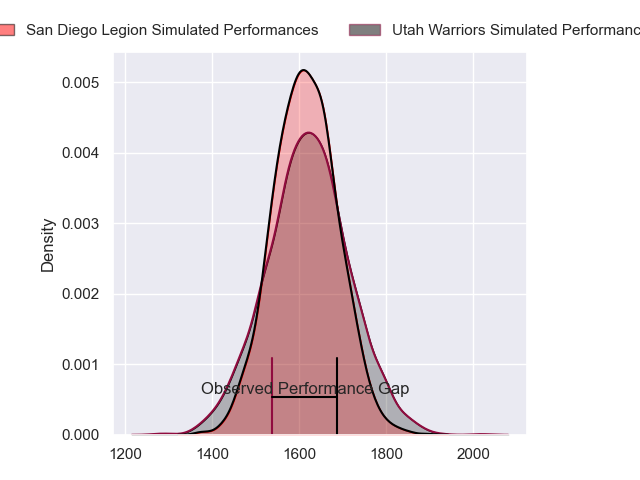
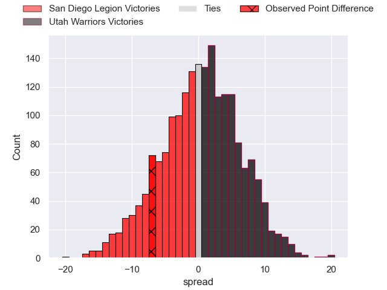
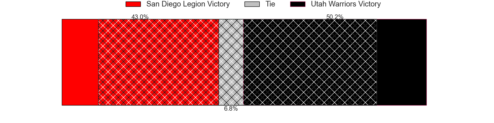
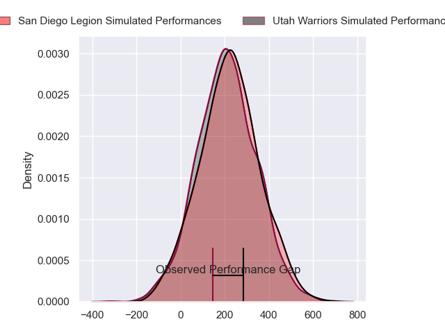
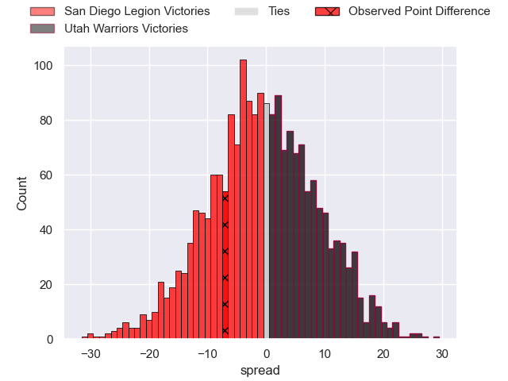

---  
layout: page  
title: San Diego Legion at Utah Warriors; 27-20  
date: 2024-06-02 18:00:00 -0500  
categories: "Major League Rugby 2024" match review  
---
# San Diego Legion at Utah Warriors; 27-20

# Club Level Predictions

The first set of predictions treats a club as the smallest object, as the club develops its members, organizes a gameplan, and deploys its players as needed for each match. This club model has a prediction of 0.506, which translates to predicting Utah Warriors to win by 0.2.

Our Over/Under is 61.5 - and combined with the spread above, we have a predicted scoreline of 31 to 31

Each club has a rating and a rating deviation (similar to a Glicko rating), and expected performances can be generated. This allows for simulated matches and spreads like the ones below.
## Projected Performances - Club Model

## Projected Spreads - Club Model

## Projected Results - Club Model

# Player Level Predictions

Treating teams instead as an entity made up of the currently active players, I have ratings for each player in an altogether different system. These can be combined to form team ratings once teamsheets are announced, weighting starters a bit higher than the reserves. After the match is played, players can be weighted by their minutes on the field, allowing for an accurate measure of the team's composition. With these compiled team ratings, we can make predictions, measure inaccuracy, and update the individual player ratings.
## Prediction without Player Minutes: San Diego Legion by 0.5

San Diego Legion by 3.2 on a neutral pitch

## Projected Performances - Player Model

## Projected Spreads - Player Model

## Projected Results - Player Model

|   Away Minutes | Away Player           |   Away Percentile |   Number |   Home Percentile | Home Player      |   Home Minutes |
|---------------:|:----------------------|------------------:|---------:|------------------:|:-----------------|---------------:|
|             80 | Djustice Sears-Duru   |              1.86 |        1 |             62.67 | Fatongia Paea    |             80 |
|             80 | Chris Mickelson       |             57.07 |        2 |             36.01 | Phillip Bradford |             80 |
|             80 | Luke Green            |             80.81 |        3 |             63.81 | Paul Mullen      |             80 |
|             80 | Jay Tuivaiti          |             56.3  |        4 |             47.4  | Saia Uhila       |             80 |
|             80 | Greg Peterson         |             15.8  |        5 |             38.3  | Matthew Jensen   |             80 |
|             80 | Christian Poidevin    |             76.4  |        6 |             64.55 | Frank Lochore    |             80 |
|             80 | Blair Cowan           |             84.49 |        7 |             33.62 | John DuPree      |             80 |
|             80 | Tevita David Tameilau |             60.54 |        8 |             50.21 | Thomas Tu'avao   |             80 |
|             80 | Connor Tupai          |             33.85 |        9 |             83.16 | Zion Going       |             80 |
|             80 | Matt Giteau           |             99.59 |       10 |             41.87 | Joel Hodgson     |             80 |
|             80 | Ryan James            |             19.91 |       11 |             21.04 | Isaia Kruse      |             80 |
|             80 | Ma'a Nonu             |             81.49 |       12 |             13.65 | Paul Lasike      |             80 |
|             80 | Tiaan Loots           |             76.94 |       13 |             37.75 | Alesana Pohla    |             80 |
|             80 | Tomas Aoake           |             59.43 |       14 |             15.92 | Michael Manson   |             80 |
|             80 | Marcel Brache         |             88.73 |       15 |             88.52 | Caleb Makene     |             80 |

