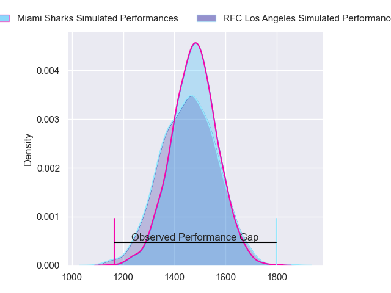
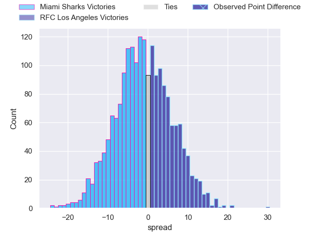
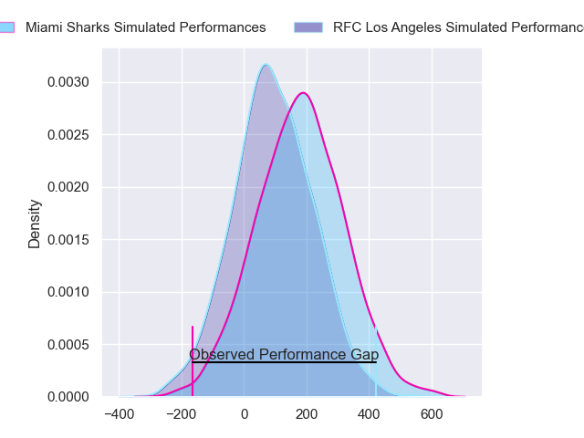
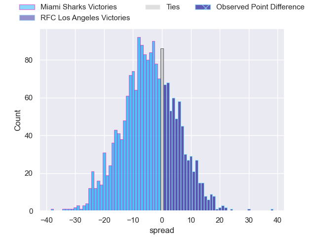
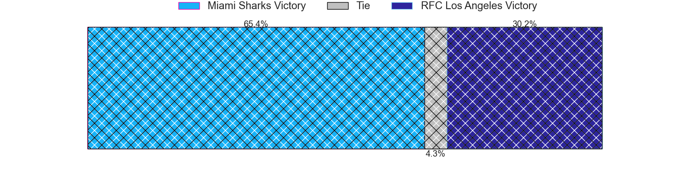

---  
layout: page  
title: Miami Sharks at RFC Los Angeles; 15-45  
date: 2024-06-03 18:00:00 -0500  
categories: "Major League Rugby 2024" match review  
---
# Miami Sharks at RFC Los Angeles; 15-45

# Club Level Predictions

The first set of predictions treats a club as the smallest object, as the club develops its members, organizes a gameplan, and deploys its players as needed for each match. This club model has a prediction of 0.474, which translates to predicting Miami Sharks to win by 0.9.

Our Over/Under is 48.5 - and combined with the spread above, we have a predicted scoreline of 25 to 24

Each club has a rating and a rating deviation (similar to a Glicko rating), and expected performances can be generated. This allows for simulated matches and spreads like the ones below.
## Projected Performances - Club Model

## Projected Spreads - Club Model

## Projected Results - Club Model

# Player Level Predictions

Treating teams instead as an entity made up of the currently active players, I have ratings for each player in an altogether different system. These can be combined to form team ratings once teamsheets are announced, weighting starters a bit higher than the reserves. After the match is played, players can be weighted by their minutes on the field, allowing for an accurate measure of the team's composition. With these compiled team ratings, we can make predictions, measure inaccuracy, and update the individual player ratings.
## Prediction without Player Minutes: Miami Sharks by 5.1

Miami Sharks by 7.3 on a neutral pitch

## Projected Performances - Player Model

## Projected Spreads - Player Model

## Projected Results - Player Model

|   Away Minutes | Away Player             |   Away Percentile |   Number |   Home Percentile | Home Player     |   Home Minutes |
|---------------:|:------------------------|------------------:|---------:|------------------:|:----------------|---------------:|
|             80 | Rob Evans               |             91.47 |        1 |             61.66 | Dane Zander     |             80 |
|             80 | Kirby Myhill            |             12.04 |        2 |             65.97 | Ben Strang      |             80 |
|             80 | Tau Koloamatangi        |             70.19 |        3 |              5.44 | Alex Maughan    |             80 |
|             80 | Rick Rose               |             29.22 |        4 |              9.34 | Jason Damm      |             80 |
|             80 | Stan van den Hoven      |              0.89 |        5 |             93.14 | Reegan O'Gorman |             80 |
|             80 | Tomas Casares           |             13.73 |        6 |             66.15 | Michael Amiras  |             80 |
|             80 | Roelof Smit             |             10.44 |        7 |              1.84 | Matt Heaton     |             80 |
|             80 | Benjam�n Bonasso        |             81.67 |        8 |             96.04 | Semi Kunatani   |             80 |
|             80 | Tomas Cubelli           |             13.36 |        9 |             73.63 | Niall Saunders  |             80 |
|             80 | Felipe Etcheverry       |             63.8  |       10 |             54.45 | Tas Smith       |             80 |
|             80 | Marcos Young            |             52.49 |       11 |             17.15 | Jack Shaw       |             80 |
|             80 | Nick Grigg              |              7.71 |       12 |             13.7  | Jason Emery     |             80 |
|             80 | Tomas Inciarte Rachetti |             85.83 |       13 |             61.67 | Will Leonard    |             80 |
|             80 | Michael Hand            |             36.78 |       14 |             86.3  | Andrew Coe      |             80 |
|             80 | Matias Freyre           |             60.25 |       15 |             69.36 | James Stokes    |             80 |

