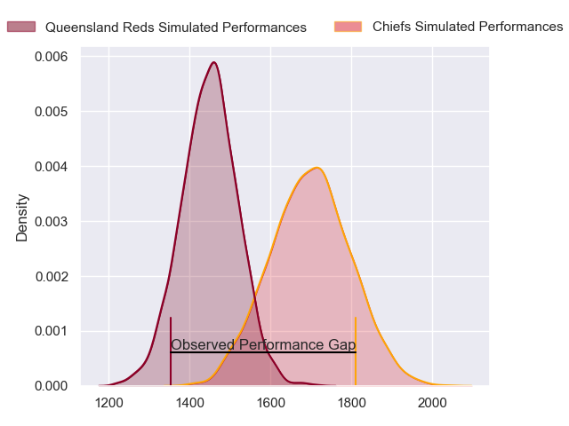
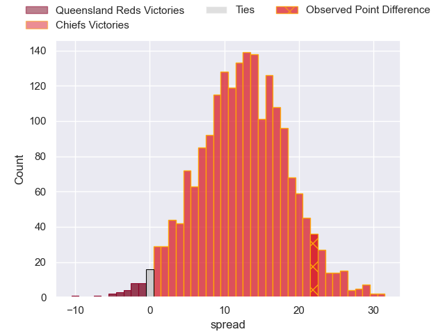
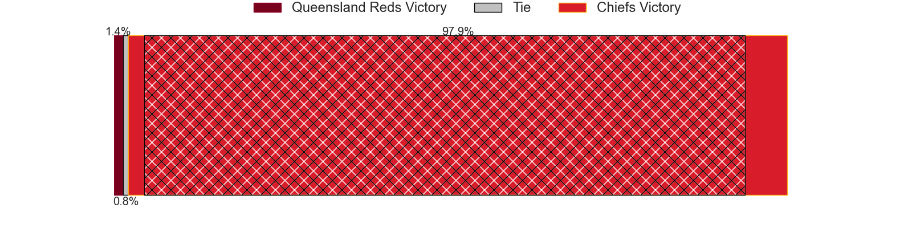
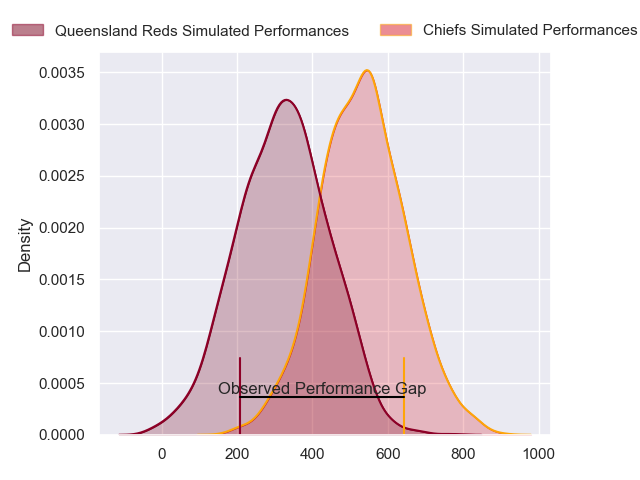
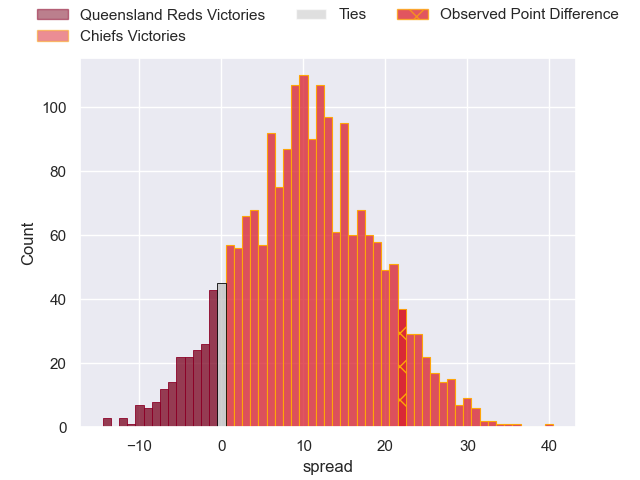
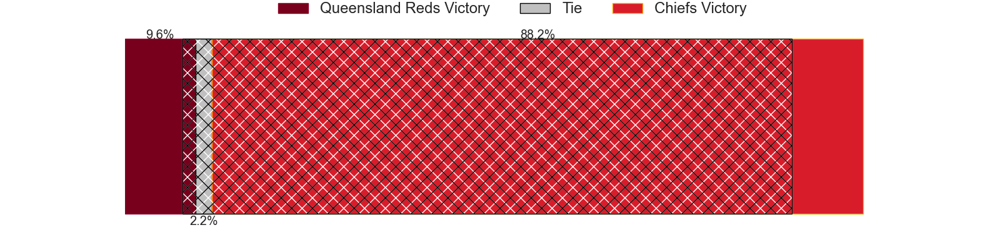

---  
layout: page  
title: Queensland Reds at Chiefs; 21-43  
date: 2024-06-07 18:00:00 -0500  
categories: "Super Rugby Pacific 2024" match review  
---
# Queensland Reds at Chiefs; 21-43

# Club Level Predictions

The first set of predictions treats a club as the smallest object, as the club develops its members, organizes a gameplan, and deploys its players as needed for each match. This club model has a prediction of 0.802, which translates to predicting Chiefs to win by 12.4.

Our Over/Under is 56.5 - and combined with the spread above, we have a predicted scoreline of 22 to 35

Each club has a rating and a rating deviation (similar to a Glicko rating), and expected performances can be generated. This allows for simulated matches and spreads like the ones below.
## Projected Performances - Club Model

## Projected Spreads - Club Model

## Projected Results - Club Model

# Player Level Predictions

Treating teams instead as an entity made up of the currently active players, I have ratings for each player in an altogether different system. These can be combined to form team ratings once teamsheets are announced, weighting starters a bit higher than the reserves. After the match is played, players can be weighted by their minutes on the field, allowing for an accurate measure of the team's composition. With these compiled team ratings, we can make predictions, measure inaccuracy, and update the individual player ratings.
## Prediction without Player Minutes: Chiefs by 12.1

Chiefs by 7.4 on a neutral pitch

## Projected Performances - Player Model

## Projected Spreads - Player Model

## Projected Results - Player Model

|   Away Minutes | Away Player        |   Away Percentile |   Number |   Home Percentile | Home Player         |   Home Minutes |
|---------------:|:-------------------|------------------:|---------:|------------------:|:--------------------|---------------:|
|             56 | Alex Hodgman       |             63.85 |        1 |             98.86 | Aidan Ross          |             49 |
|             56 | Matt Faessler      |             82.18 |        2 |             95.51 | Samisoni Taukei'aho |             53 |
|             59 | Jeff Toomaga-Allen |             94.56 |        3 |             85.87 | George Dyer         |             49 |
|             64 | Seru Uru           |             71.67 |        4 |             41.55 | Jimmy Tupou         |             56 |
|             80 | Ryan Smith         |             43.34 |        5 |             93.34 | Tupou Vaa'i         |             80 |
|             80 | Liam Wright        |             97.39 |        6 |             95.65 | Samipeni Finau      |             80 |
|             80 | Fraser McReight    |             94.78 |        7 |             94.39 | Luke Jacobson       |             80 |
|             70 | John Bryant        |             49.17 |        8 |             55.62 | Wallace Sititi      |             66 |
|             70 | Tate McDermott     |             80.31 |        9 |             75.51 | Cortez Ratima       |             71 |
|             53 | Tom Lynagh         |             83.64 |       10 |             98.36 | Damian McKenzie     |             80 |
|             80 | Mac Grealy         |             89.27 |       11 |             75.96 | Etene Nanai-Seturo  |             79 |
|             80 | Hunter Paisami     |             79.17 |       12 |             78.23 | Rameka Poihipi      |             80 |
|             80 | Josh Flook         |             51.04 |       13 |             95    | Anton Lienert-Brown |             80 |
|             80 | Tim Ryan           |             61.97 |       14 |             93.01 | Emoni Narawa        |             53 |
|             41 | Jock Campbell      |             71.22 |       15 |             84.06 | Shaun Stevenson     |             40 |
|             24 | Josh Nasser        |            nan    |       16 |             84.27 | Bradley Slater      |             27 |
|             24 | Sef Fa'agase       |             78.39 |       17 |             27.54 | Jared Proffit       |             31 |
|             21 | Zane Nonggorr      |             79.94 |       18 |             42.89 | Reuben O'Neill      |             31 |
|             16 | Connor Vest        |             38.97 |       19 |             95.92 | Naitoa Ah Kuoi      |             24 |
|             10 | Joe Brial          |             42.5  |       20 |             56    | Simon Parker        |             14 |
|             10 | Kalani Thomas      |             67.81 |       21 |             55.48 | Xavier Roe          |             10 |
|             27 | Lawson Creighton   |             14.93 |       22 |             93.23 | Quinn Tupaea        |             27 |
|             39 | Taj Annan          |            nan    |       23 |             81.15 | Daniel Rona         |             40 |

