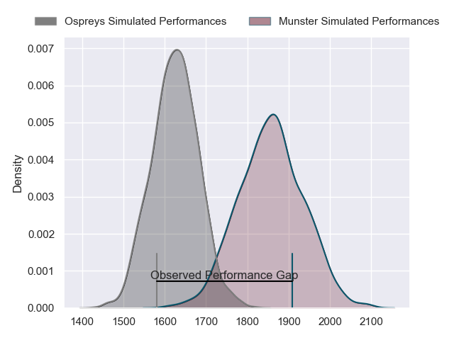
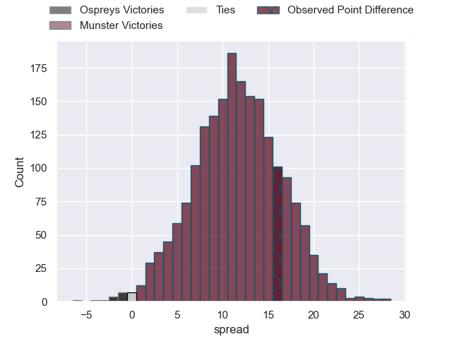
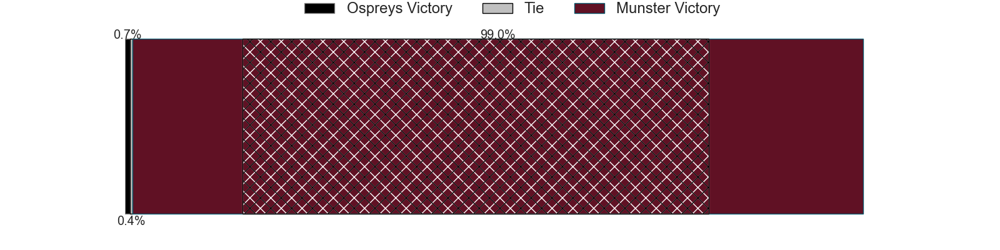
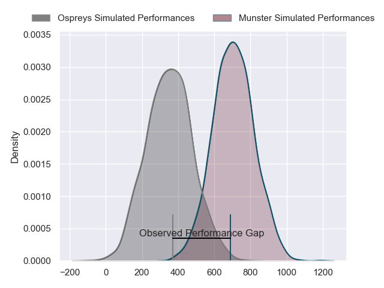
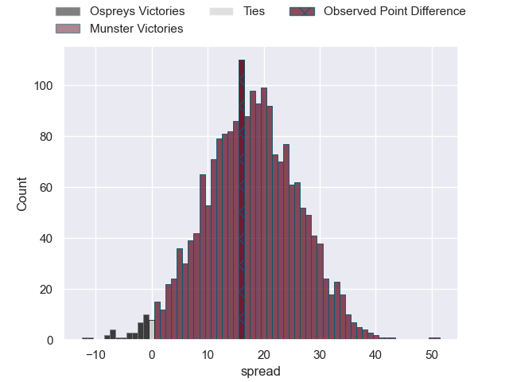
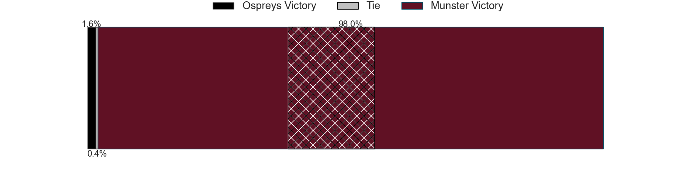

---  
layout: page  
title: Ospreys at Munster; 7-23  
date: 2024-06-07 18:00:00 -0500  
categories: "United Rugby Championship 2023" match review  
---
# Ospreys at Munster; 7-23

# Club Level Predictions

The first set of predictions treats a club as the smallest object, as the club develops its members, organizes a gameplan, and deploys its players as needed for each match. This club model has a prediction of 0.789, which translates to predicting Munster to win by 11.6.

Our Over/Under is 49.5 - and combined with the spread above, we have a predicted scoreline of 19 to 30

Each club has a rating and a rating deviation (similar to a Glicko rating), and expected performances can be generated. This allows for simulated matches and spreads like the ones below.
## Projected Performances - Club Model

## Projected Spreads - Club Model

## Projected Results - Club Model

# Player Level Predictions

Treating teams instead as an entity made up of the currently active players, I have ratings for each player in an altogether different system. These can be combined to form team ratings once teamsheets are announced, weighting starters a bit higher than the reserves. After the match is played, players can be weighted by their minutes on the field, allowing for an accurate measure of the team's composition. With these compiled team ratings, we can make predictions, measure inaccuracy, and update the individual player ratings.
## Prediction without Player Minutes: Munster by 22.6

Munster by 16.3 on a neutral pitch

## Projected Performances - Player Model

## Projected Spreads - Player Model

## Projected Results - Player Model

|   Away Minutes | Away Player            |   Away Percentile |   Number |   Home Percentile | Home Player     |   Home Minutes |
|---------------:|:-----------------------|------------------:|---------:|------------------:|:----------------|---------------:|
|             55 | Nicky Smith            |             80.75 |        1 |             96.75 | Jeremy Loughman |             62 |
|             62 | Dewi Lake              |             63.72 |        2 |             95.18 | Niall Scannell  |             47 |
|             55 | Tom Botha              |             83.75 |        3 |             98.78 | Stephen Archer  |             47 |
|             80 | James Ratti            |             84.49 |        4 |             99.3  | RG Snyman       |             80 |
|             71 | Huw Owen-Sutton        |             67.79 |        5 |             99.11 | Tadhg Beirne    |             80 |
|             80 | Jac Morgan             |             95.16 |        6 |             98.45 | Peter O'Mahony  |             47 |
|             80 | Justin Tipuric         |             98.36 |        7 |             65.28 | John Hodnett    |             62 |
|             74 | Morgan Morris          |             17.29 |        8 |             86.25 | Gavin Coombes   |             80 |
|             69 | Reuben Morgan-Williams |             83.22 |        9 |             85.1  | Craig Casey     |             59 |
|             80 | Owen Williams          |             93.05 |       10 |             61.76 | Jack Crowley    |             80 |
|             79 | Keelan Giles           |             19.44 |       11 |             97.61 | Shane Daly      |             80 |
|             80 | Keiran Williams        |             90.1  |       12 |             19.9  | Sean O'Brien    |             80 |
|             80 | Owen Watkin            |             99.27 |       13 |             93.65 | Antoine Frisch  |             69 |
|             80 | Luke Morgan            |             32.66 |       14 |             95.21 | Calvin Nash     |             80 |
|             71 | Max Nagy               |             84.27 |       15 |             95.45 | Simon Zebo      |             54 |
|             18 | Sam Parry              |             74.32 |       16 |            nan    | Diarmuid Barron |             33 |
|             25 | Gareth Thomas          |             63.61 |       17 |             94.15 | John Ryan       |             18 |
|             25 | Rhys Henry             |             87.57 |       18 |             93.1  | Oli Jager       |             33 |
|              9 | Victor Sekekete        |             72.56 |       19 |             85.62 | Jack O'Donoghue |             33 |
|              6 | Morgan Morse           |             70.02 |       20 |             85.49 | Alex Kendellen  |             18 |
|             11 | Luke Davies            |             64.9  |       21 |             98.8  | Conor Murray    |             21 |
|              1 | Luke Scully            |            nan    |       22 |             27.4  | Tony Butler     |             11 |
|              9 | Harri Houston          |            nan    |       23 |             89.86 | Mike Haley      |             26 |

