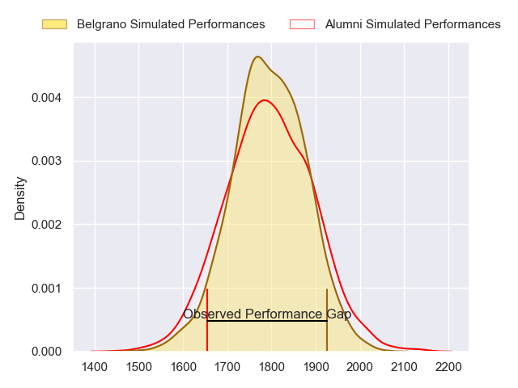
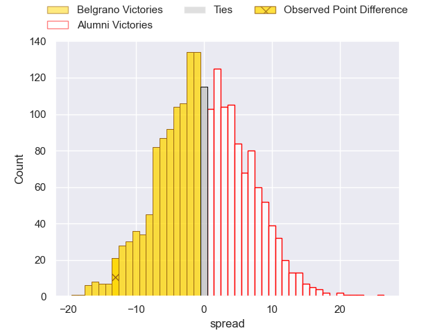
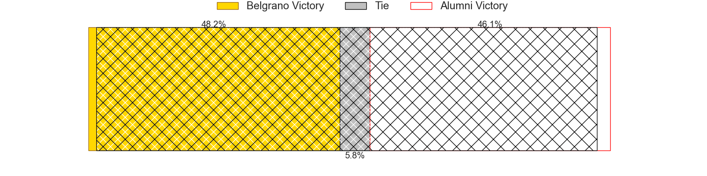
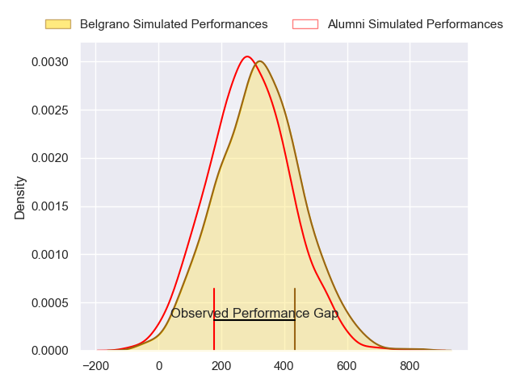
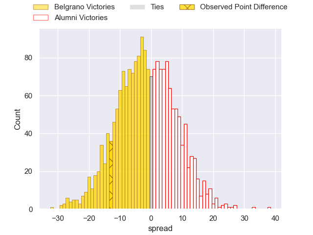
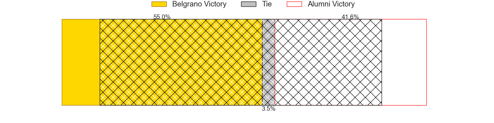

---  
layout: page  
title: Belgrano at Alumni; 22-9  
date: 2024-06-08 18:00:00 -0500  
categories: "URBA Top 12 2024" match review  
---
# Belgrano at Alumni; 22-9

# Club Level Predictions

The first set of predictions treats a club as the smallest object, as the club develops its members, organizes a gameplan, and deploys its players as needed for each match. This club model has a prediction of 0.501, which translates to predicting Alumni to win by 0.0.

Our Over/Under is 49.5 - and combined with the spread above, we have a predicted scoreline of 25 to 25

Each club has a rating and a rating deviation (similar to a Glicko rating), and expected performances can be generated. This allows for simulated matches and spreads like the ones below.
## Projected Performances - Club Model

## Projected Spreads - Club Model

## Projected Results - Club Model

# Player Level Predictions

Treating teams instead as an entity made up of the currently active players, I have ratings for each player in an altogether different system. These can be combined to form team ratings once teamsheets are announced, weighting starters a bit higher than the reserves. After the match is played, players can be weighted by their minutes on the field, allowing for an accurate measure of the team's composition. With these compiled team ratings, we can make predictions, measure inaccuracy, and update the individual player ratings.
## Prediction without Player Minutes: Belgrano by 0.1

Belgrano by 4.3 on a neutral pitch

## Projected Performances - Player Model

## Projected Spreads - Player Model

## Projected Results - Player Model

|   Away Minutes | Away Player         |   Away Percentile |   Number |   Home Percentile | Home Player                |   Home Minutes |
|---------------:|:--------------------|------------------:|---------:|------------------:|:---------------------------|---------------:|
|             80 | Francisco Ferronato |             90.17 |        1 |             51.1  | Federico Lucca             |             80 |
|             80 | Francisco Lusarreta |             90.85 |        2 |             53.45 | Tomas Bivort               |             80 |
|             80 | Justo Duranona      |             61.9  |        3 |             22.75 | Ezequiel Oliva             |             80 |
|             80 | Luciano Tecca       |             90.06 |        4 |             27.34 | Federico Canovas           |             80 |
|             80 | Ramon Duggan        |             72.27 |        5 |             45.13 | Nicolas Promanzio          |             80 |
|             80 | Augusto Vaccarino   |             80.85 |        6 |             49.61 | Ignacio Cubilla            |             80 |
|             80 | Julian Rebusone     |             66.34 |        7 |             51.16 | Manuel Mora                |             80 |
|             80 | Franco Vega         |             84.17 |        8 |             17.5  | Juan Cruz Alvarinas        |             80 |
|             80 | Ignacio Marino      |             79.28 |        9 |             51.2  | Tomas Passerotti           |             80 |
|             80 | Juan Aparicio       |             73.42 |       10 |             21.88 | Santiago Gonzalez Iglesias |             80 |
|             80 | Ignacio Diaz        |             86.78 |       11 |             17.72 | Cruz Gonzalez              |             80 |
|             80 | Ramon Arana         |             86.35 |       12 |             45.42 | Franco Battezzati          |             80 |
|             80 | Tomas Etchepare     |             83.44 |       13 |             47.19 | Alejo Chavez               |             80 |
|             80 | Tobias Bernabe      |             81.8  |       14 |             29.21 | Franco Sabato              |             80 |
|             80 | Juan Lando          |             82.61 |       15 |             34.37 | Tomas Corneille            |             80 |
|              0 | Jose Saporitti      |            nan    |       16 |            nan    | Maximo Lamelas             |              0 |
|              0 | Eliseo Marchetti    |            nan    |       17 |            nan    | Maximo Castillo            |              0 |
|              0 | Juan Penoucos       |            nan    |       18 |             71.65 | Bautista Vidal             |              0 |
|              0 | Valentin Chiodi     |            nan    |       19 |             54.27 | Santiago Alduncin          |              0 |
|              0 | Francisco Gradin    |             30.95 |       20 |             67.6  | Juan Anderson              |              0 |
|              0 | Juan Brescia        |            nan    |       21 |             74.85 | Joaquin Luzzi              |              0 |
|              0 | Theo Blaksley       |             63.87 |       22 |            nan    | Santiago Ambroa            |              0 |
|              0 | Pedro Arana         |            nan    |       23 |             73.95 | Luca Sabato                |              0 |

