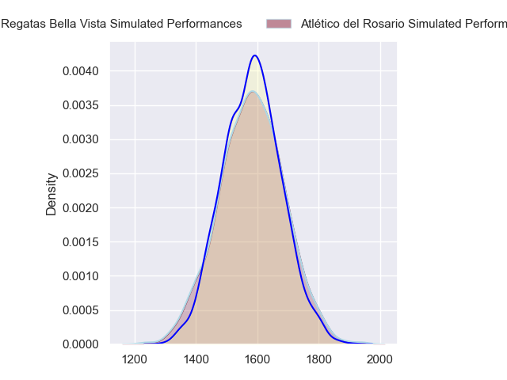
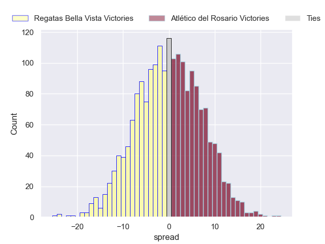
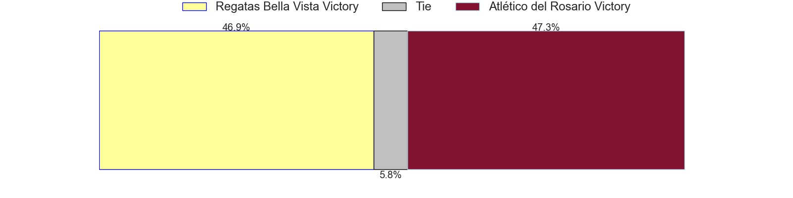
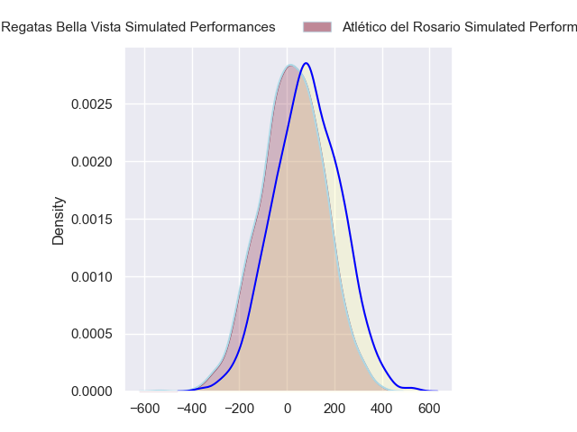
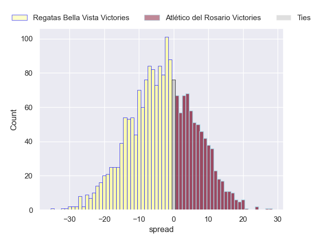
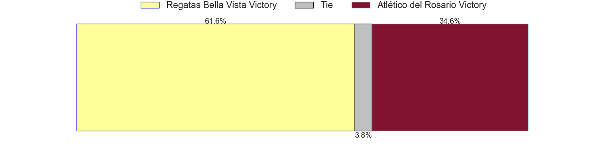

---  
layout: page  
title: Regatas Bella Vista at Atletico del Rosario; 27-27  
date: 2024-06-08 18:00:00 -0500  
categories: "URBA Top 12 2024" match review  
---
# Regatas Bella Vista at Atletico del Rosario; 27-27

# Club Level Predictions

The first set of predictions treats a club as the smallest object, as the club develops its members, organizes a gameplan, and deploys its players as needed for each match. This club model has a prediction of 0.499, which translates to predicting Regatas Bella Vista to win by 0.0.

Our Over/Under is 41.5 - and combined with the spread above, we have a predicted scoreline of 21 to 21

Each club has a rating and a rating deviation (similar to a Glicko rating), and expected performances can be generated. This allows for simulated matches and spreads like the ones below.
## Projected Performances - Club Model

## Projected Spreads - Club Model

## Projected Results - Club Model

# Player Level Predictions

Treating teams instead as an entity made up of the currently active players, I have ratings for each player in an altogether different system. These can be combined to form team ratings once teamsheets are announced, weighting starters a bit higher than the reserves. After the match is played, players can be weighted by their minutes on the field, allowing for an accurate measure of the team's composition. With these compiled team ratings, we can make predictions, measure inaccuracy, and update the individual player ratings.
## Prediction without Player Minutes: Regatas Bella Vista by 3.1

Regatas Bella Vista by 6.8 on a neutral pitch

## Projected Performances - Player Model

## Projected Spreads - Player Model

## Projected Results - Player Model

|   Away Minutes | Away Player          |   Away Percentile |   Number |   Home Percentile | Home Player                 |   Home Minutes |
|---------------:|:---------------------|------------------:|---------:|------------------:|:----------------------------|---------------:|
|             80 | Tomas Barbaccia      |             38.67 |        1 |              7.31 | Agustin Fernandez           |             80 |
|             80 | Pedro Colinas        |             46.87 |        2 |             50.72 | Matias Malanos              |             80 |
|             80 | Juan Gobet           |             53.45 |        3 |             27.86 | Bruno Montenegro            |             80 |
|             80 | Tomas Sanguinetti    |             46.52 |        4 |              9.05 | Matias Kremer               |             80 |
|             80 | Valentin Sanguinetti |             52.49 |        5 |              8.75 | Octavio Capella             |             80 |
|             80 | Marcos Ferro         |             62.96 |        6 |             40.62 | Federico Mayol              |             80 |
|             80 | Lucas Gobet          |             29.98 |        7 |             28.53 | Jose Caseres                |             80 |
|             80 | Felipe Camerlinckx   |             37.71 |        8 |              8.33 | Lucas Malanos               |             80 |
|             80 | Marcos Joseph        |             39.04 |        9 |             50.51 | Felipe Nogues               |             80 |
|             80 | Mateo Camerlinckx    |             36.81 |       10 |             39.26 | Ramiro Musio                |             80 |
|             80 | Francisco Pisani     |             35.73 |       11 |             13.79 | Facundo Gerosa              |             80 |
|             80 | Rafael Santana       |             45.83 |       12 |              7.34 | Guido Vidalle               |             80 |
|             80 | Alejo Barrera        |             34.48 |       13 |              7.34 | Pedro de Aro                |             80 |
|             80 | Enrique Camerlinckx  |             37.84 |       14 |             16.67 | Maximiliano Nicoli Fiscella |             80 |
|             80 | Cruz Camerlinckx     |             34.16 |       15 |              6.21 | Pedro Bisio                 |             80 |
|              0 | Marcos Camerlinckx   |            nan    |       16 |            nan    | Ignacio Sapino              |              0 |
|              0 | Diego Aguero         |            nan    |       17 |            nan    | Mateo Andorni               |              0 |
|              0 | Esteban Sciandro     |             40.85 |       18 |            nan    | Ramiro Rubio                |              0 |
|              0 | Francisco Ploder     |             48.71 |       19 |            nan    | Blas Jabornisky             |              0 |
|              0 | Pedro Vega           |             24.56 |       20 |            nan    | Jose Ignacio Ferrer         |              0 |
|              0 | Esteban Siandro      |            nan    |       21 |             28.42 | Martin Del Pazo             |              0 |
|              0 | Ramiro Moadeb        |             19.58 |       22 |            nan    | Federico Martin             |              0 |
|              0 | Justo Camerlinckx    |             37.01 |       23 |              7.55 | Lisandro Dipierri           |              0 |

