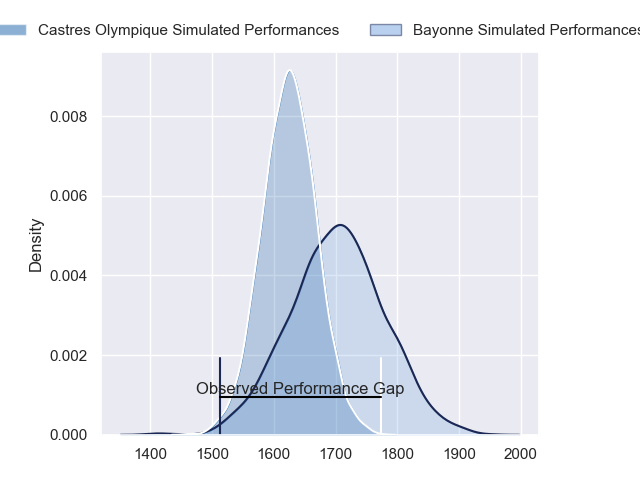
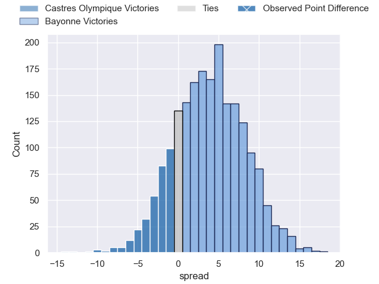
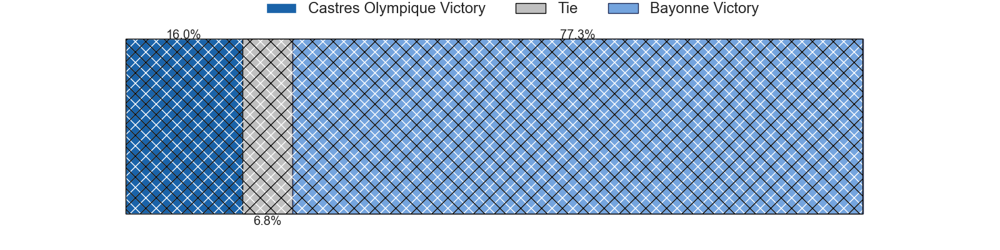
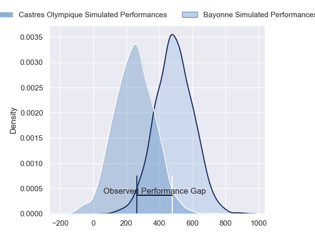
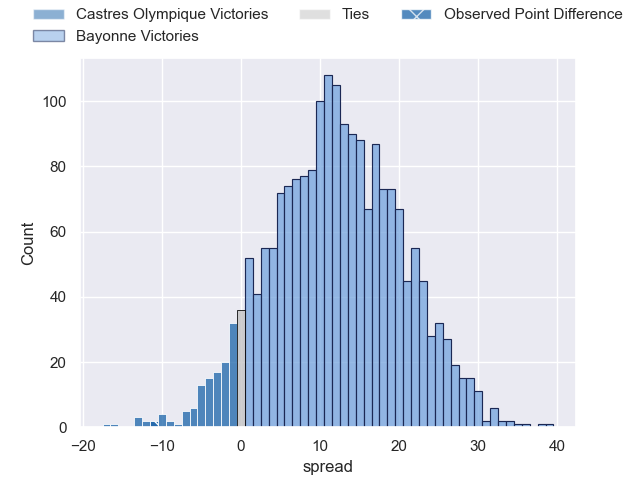
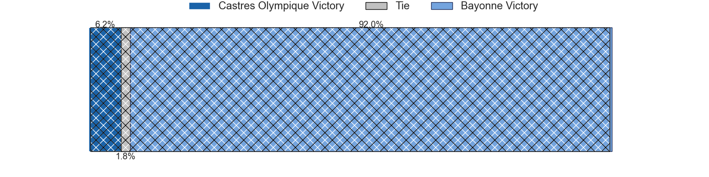

---  
layout: page  
title: Castres Olympique at Bayonne; 28-17  
date: 2024-06-08 18:00:00 -0500  
categories: "Top 14 Orange 2023" match review  
---
# Castres Olympique at Bayonne; 28-17

# Club Level Predictions

The first set of predictions treats a club as the smallest object, as the club develops its members, organizes a gameplan, and deploys its players as needed for each match. This club model has a prediction of 0.61, which translates to predicting Bayonne to win by 3.9.

Our Over/Under is 49.5 - and combined with the spread above, we have a predicted scoreline of 23 to 27

Each club has a rating and a rating deviation (similar to a Glicko rating), and expected performances can be generated. This allows for simulated matches and spreads like the ones below.
## Projected Performances - Club Model

## Projected Spreads - Club Model

## Projected Results - Club Model

# Player Level Predictions

Treating teams instead as an entity made up of the currently active players, I have ratings for each player in an altogether different system. These can be combined to form team ratings once teamsheets are announced, weighting starters a bit higher than the reserves. After the match is played, players can be weighted by their minutes on the field, allowing for an accurate measure of the team's composition. With these compiled team ratings, we can make predictions, measure inaccuracy, and update the individual player ratings.
## Prediction without Player Minutes: Bayonne by 14.4

Bayonne by 6.1 on a neutral pitch

## Projected Performances - Player Model

## Projected Spreads - Player Model

## Projected Results - Player Model

|   Away Minutes | Away Player                |   Away Percentile |   Number |   Home Percentile | Home Player           |   Home Minutes |
|---------------:|:---------------------------|------------------:|---------:|------------------:|:----------------------|---------------:|
|             41 | Lois Guerois-Galisson      |             62.79 |        1 |             26.24 | Matis Perchaud        |             66 |
|             41 | Gaetan Barlot              |             86.36 |        2 |             93.74 | Facundo Bosch         |             37 |
|             41 | Levan Chilachava           |             85.46 |        3 |             62.71 | Luke Tagi             |             47 |
|             80 | Leone Nakarawa             |             96.42 |        4 |             75.84 | Thomas Ceyte          |             69 |
|             68 | Tom Staniforth             |             74.16 |        5 |             29.62 | Lucas Paulos          |             58 |
|             80 | Nick Champion de Crespigny |             65.67 |        6 |             37.43 | Pierre Huguet         |             56 |
|             70 | Baptiste Delaporte         |             86.17 |        7 |             64.02 | Arthur Iturria        |             80 |
|             51 | Abraham Papali'i           |             53.54 |        8 |             61.46 | Uzair Cassiem         |             80 |
|             63 | Jeremy Fernandez           |             35.96 |        9 |             91.95 | Maxime Machenaud      |             56 |
|             79 | Pierre Popelin             |             69.94 |       10 |             91.82 | Camille Lopez         |             66 |
|             69 | Filipo Nakosi              |             88.41 |       11 |             86.4  | Remy Baget            |             80 |
|             80 | Adrea Cocagi               |             92.29 |       12 |             88.02 | Yan Lestrade          |             80 |
|             80 | Vilimoni Botitu            |             60.21 |       13 |             59.79 | Sireli Maqala         |             80 |
|             80 | Geoffrey Palis             |             98.37 |       14 |             20.79 | Arnaud Erbinartegaray |             80 |
|             80 | Julien Dumora              |             86.54 |       15 |              7.87 | Tom Spring            |             52 |
|             39 | Loris Zarantonello         |             32.74 |       16 |             87.32 | Thomas Acquier        |             43 |
|             39 | Antoine Tichit             |             88.3  |       17 |             69.05 | Quentin Bethune       |             14 |
|             12 | Florent Vanverberghe       |             64.41 |       18 |              7.65 | Manuel Leindekar      |             33 |
|             39 | Yann Peysson               |             73.75 |       19 |             98.54 | Rodrigo Bruni         |             24 |
|             17 | Santiago Arata             |             62.67 |       20 |             57.88 | Gela Aprasidze        |             24 |
|              1 | Louis Le Brun              |             76.89 |       21 |             53.17 | Thomas Dolhagaray     |             14 |
|             11 | Nathanael Hulleu           |             79.69 |       22 |             10.56 | Cheikh Tiberghien     |             28 |
|             39 | Henry Thomas               |             34.93 |       23 |             25.67 | Tevita Tatafu         |             33 |

