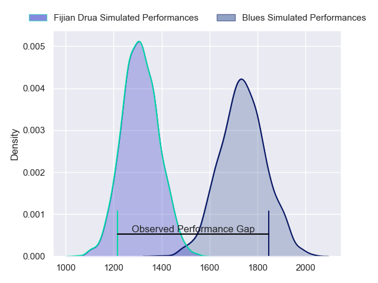
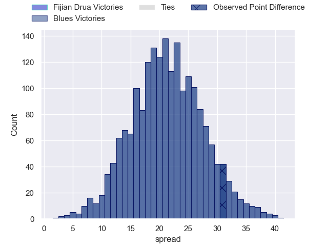
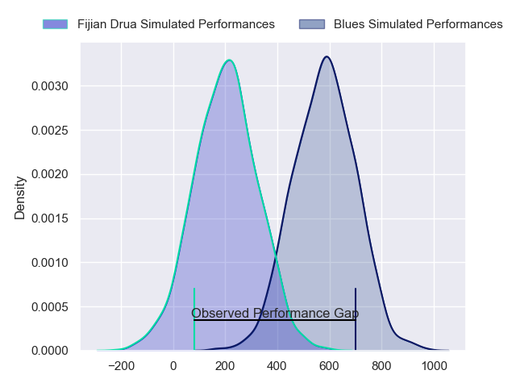
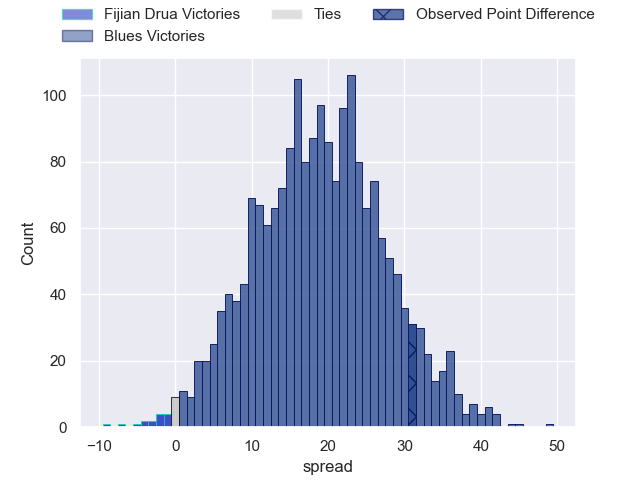
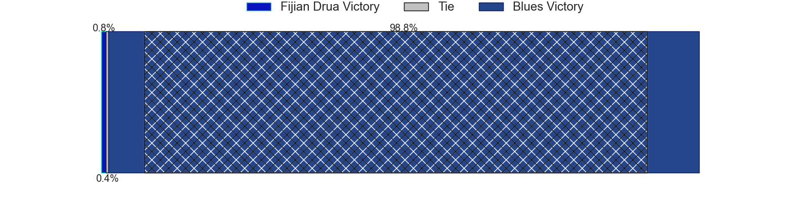

---  
layout: page  
title: Fijian Drua at Blues; 5-36  
date: 2024-06-08 18:00:00 -0500  
categories: "Super Rugby Pacific 2024" match review  
---
# Fijian Drua at Blues; 5-36

# Club Level Predictions

The first set of predictions treats a club as the smallest object, as the club develops its members, organizes a gameplan, and deploys its players as needed for each match. This club model has a prediction of 0.916, which translates to predicting Blues to win by 21.4.

Our Over/Under is 65.5 - and combined with the spread above, we have a predicted scoreline of 22 to 43

Each club has a rating and a rating deviation (similar to a Glicko rating), and expected performances can be generated. This allows for simulated matches and spreads like the ones below.
## Projected Performances - Club Model

## Projected Spreads - Club Model

## Projected Results - Club Model

# Player Level Predictions

Treating teams instead as an entity made up of the currently active players, I have ratings for each player in an altogether different system. These can be combined to form team ratings once teamsheets are announced, weighting starters a bit higher than the reserves. After the match is played, players can be weighted by their minutes on the field, allowing for an accurate measure of the team's composition. With these compiled team ratings, we can make predictions, measure inaccuracy, and update the individual player ratings.
## Prediction without Player Minutes: Blues by 22.8

Blues by 18.3 on a neutral pitch

## Projected Performances - Player Model

## Projected Spreads - Player Model

## Projected Results - Player Model

|   Away Minutes | Away Player             |   Away Percentile |   Number |   Home Percentile | Home Player       |   Home Minutes |
|---------------:|:------------------------|------------------:|---------:|------------------:|:------------------|---------------:|
|             62 | Livai Natave            |             51.99 |        1 |             99.35 | Ofa Tu'ungafasi   |             62 |
|             70 | Tevita Ikanivere        |             90.21 |        2 |             89.89 | Ricky Riccitelli  |             62 |
|             58 | Mesake Doge             |             40.94 |        3 |             82.78 | Marcel Renata     |             53 |
|             80 | Mesake Vocevoce         |             75.25 |        4 |             96.02 | Patrick Tuipulotu |             20 |
|             50 | Ratu Rotuisolia         |             51.79 |        5 |             83    | Josh Beehre       |             80 |
|             69 | Etonia Waqa             |             81.82 |        6 |             98.65 | Akira Ioane       |             67 |
|             70 | Kitione Salawa          |             10.06 |        7 |             99.52 | Dalton Papalii    |             80 |
|             53 | Meli Derenalagi         |             42.08 |        8 |             95.21 | Hoskins Sotutu    |             80 |
|             80 | Frank Lomani            |             78.25 |        9 |             72.95 | Finlay Christie   |             55 |
|             58 | Isaiah Armstrong-Ravula |             32.72 |       10 |             93.25 | Harry Plummer     |             70 |
|             62 | Waqa Nalaga             |             60.82 |       11 |             72.32 | Caleb Clarke      |             80 |
|             80 | Kemu Valetini           |             45    |       12 |             81.56 | AJ Lam            |             76 |
|             80 | Iosefo Masi             |             82.29 |       13 |             88.75 | Rieko Ioane       |             80 |
|             80 | Selestino Ravutaumada   |             83.72 |       14 |             81.42 | Mark Tele'a       |             80 |
|             80 | Ilaisa Droasese         |             67.49 |       15 |             98.34 | Stephen Perofeta  |             80 |
|             10 | Zuriel Togiatama        |             38.04 |       16 |             91.97 | Kurt Eklund       |             18 |
|             18 | Emosi Tuqiri            |            nan    |       17 |             48.74 | Josh Fusitu'a     |             18 |
|             22 | Samu Tawake             |            nan    |       18 |             96.83 | Angus Ta'avao     |             27 |
|             30 | Isoa Nasilasila         |             66.3  |       19 |            nan    | James Thompson    |             60 |
|             21 | Motikiai Murray         |            nan    |       20 |             66.44 | Adrian Choat      |             13 |
|             27 | Elia Canakaivata        |             65    |       21 |             23.97 | Taufa Funaki      |             25 |
|             18 | Peni Matawalu           |             58.56 |       22 |             78.02 | Corey Evans       |              4 |
|             22 | Caleb Muntz             |             67.89 |       23 |             77.43 | Cole Forbes       |             10 |

