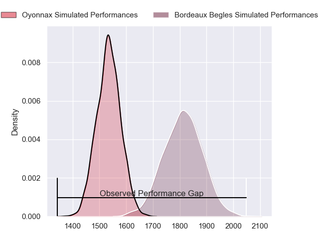
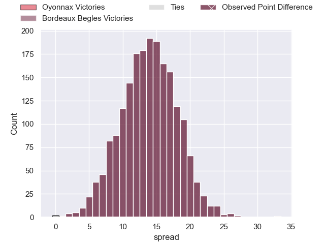
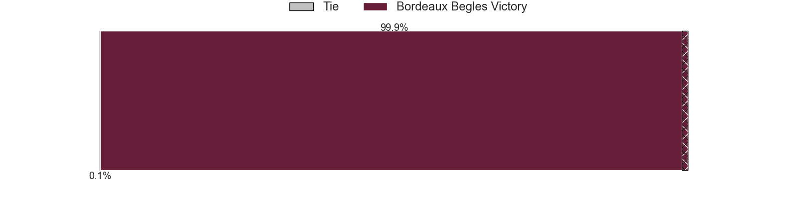
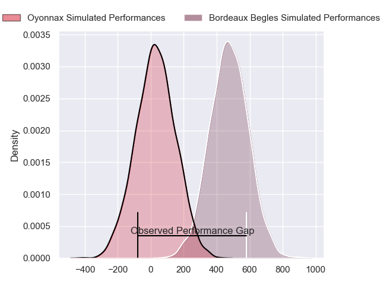
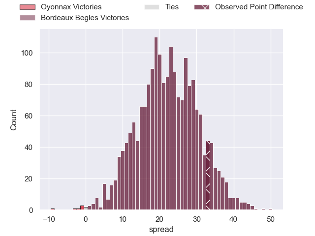
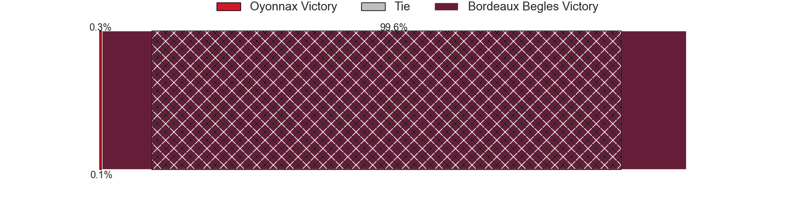

---  
layout: page  
title: Oyonnax at Bordeaux Begles; 7-40  
date: 2024-06-08 18:00:00 -0500  
categories: "Top 14 Orange 2023" match review  
---
# Oyonnax at Bordeaux Begles; 7-40

# Club Level Predictions

The first set of predictions treats a club as the smallest object, as the club develops its members, organizes a gameplan, and deploys its players as needed for each match. This club model has a prediction of 0.827, which translates to predicting Bordeaux Begles to win by 13.7.

Our Over/Under is 69.5 - and combined with the spread above, we have a predicted scoreline of 28 to 42

Each club has a rating and a rating deviation (similar to a Glicko rating), and expected performances can be generated. This allows for simulated matches and spreads like the ones below.
## Projected Performances - Club Model

## Projected Spreads - Club Model

## Projected Results - Club Model

# Player Level Predictions

Treating teams instead as an entity made up of the currently active players, I have ratings for each player in an altogether different system. These can be combined to form team ratings once teamsheets are announced, weighting starters a bit higher than the reserves. After the match is played, players can be weighted by their minutes on the field, allowing for an accurate measure of the team's composition. With these compiled team ratings, we can make predictions, measure inaccuracy, and update the individual player ratings.
## Prediction without Player Minutes: Bordeaux Begles by 26.3

Bordeaux Begles by 18.9 on a neutral pitch

## Projected Performances - Player Model

## Projected Spreads - Player Model

## Projected Results - Player Model

|   Away Minutes | Away Player         |   Away Percentile |   Number |   Home Percentile | Home Player               |   Home Minutes |
|---------------:|:--------------------|------------------:|---------:|------------------:|:--------------------------|---------------:|
|             59 | Adrien Bordenave    |              3.57 |        1 |             75.47 | Jefferson Poirot          |             65 |
|             53 | Teddy Durand        |             10.91 |        2 |             92.78 | Clement Maynadier         |             61 |
|             50 | Ali Oz              |             42    |        3 |             89.36 | Lekso Kaulashvili         |             60 |
|             59 | Phoenix Battye      |             96.62 |        4 |             79.52 | Kane Douglas              |             56 |
|             44 | Ewan Johnson        |             66.1  |        5 |             98.91 | Adam Coleman              |             49 |
|             80 | Kevin Lebreton      |             54.26 |        6 |             81.62 | Bastien Vergnes Taillefer |             49 |
|             74 | Kevin Kornath       |             16.63 |        7 |             73.21 | Antoine Miquel            |             80 |
|             41 | Loic Godener        |              4.58 |        8 |             90.42 | Pete Samu                 |             80 |
|             56 | Vasil Lobzhanidze   |             16.44 |        9 |              5.82 | Yann Lesgourgues          |             64 |
|             78 | Justin Bouraux      |             10.43 |       10 |             97.34 | Matthieu Jalibert         |             74 |
|             80 | Enzo Reybier        |             50.77 |       11 |             93.68 | Madosh Tambwe             |             80 |
|             80 | Lucas Mensa         |             69.48 |       12 |             56.67 | Ben Tapuai                |             80 |
|             80 | Theo Millet         |             79.58 |       13 |              9.9  | Pablo Uberti              |             80 |
|             80 | Gavin Stark         |             10.73 |       14 |             97.41 | Damian Penaud             |             49 |
|             58 | Daniel Ikpefan      |             70.19 |       15 |             30.85 | Mateo Garcia              |             80 |
|             27 | Manu Leiataua       |              1.44 |       16 |             68.38 | Maxime Lamothe            |             19 |
|             21 | Antoine Abraham     |             60.6  |       17 |             40.62 | Toma'akino Taufa          |             31 |
|             36 | Hugo Fabregue       |             72.66 |       18 |            nan    | Jandre Marais             |             31 |
|             39 | Loic Credoz         |             45.36 |       19 |             87.23 | Pierre Bochaton           |             31 |
|             24 | Ilan El Khattabi    |            nan    |       20 |             99.49 | Maxime Lucu               |             22 |
|             24 | Alexis Pisani       |            nan    |       21 |             22.56 | Thomas Jolmes             |             24 |
|             27 | David Odiase        |            nan    |       22 |             25.86 | Mael Moustin              |             31 |
|             30 | Irakli Mirtskhulava |             85.05 |       23 |             97.97 | Ben Tameifuna             |              4 |

