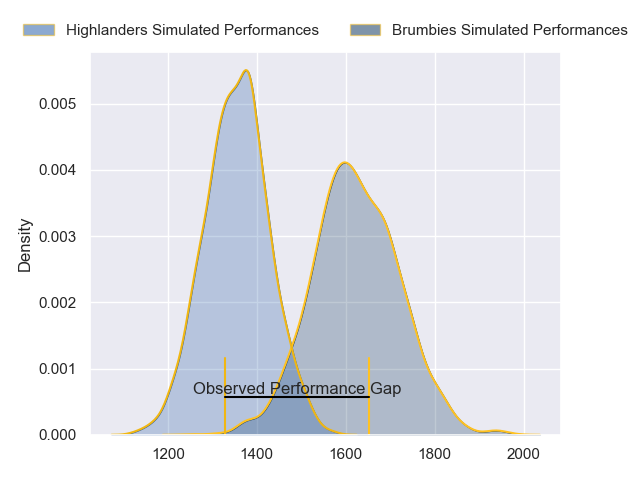
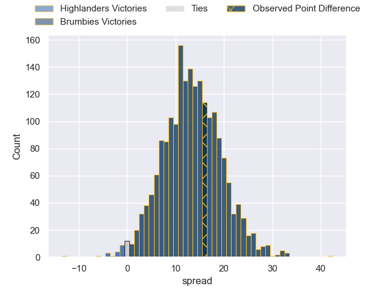
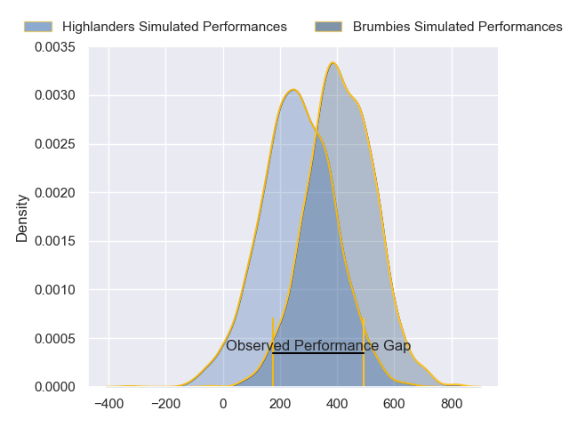
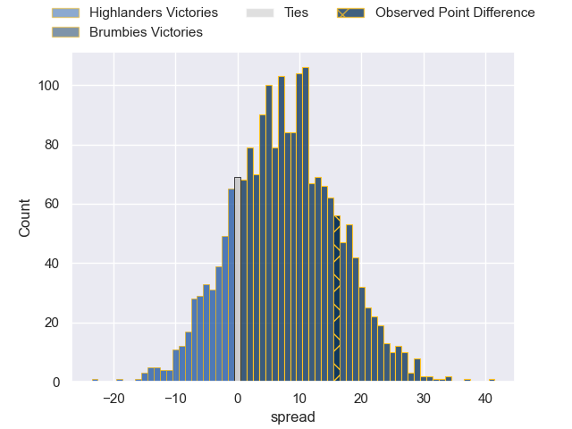

---  
layout: page  
title: Highlanders at Brumbies; 16-32  
date: 2024-06-08 18:00:00 -0500  
categories: "Super Rugby Pacific 2024" match review  
---
# Highlanders at Brumbies; 16-32

# Club Level Predictions

The first set of predictions treats a club as the smallest object, as the club develops its members, organizes a gameplan, and deploys its players as needed for each match. This club model has a prediction of 0.815, which translates to predicting Brumbies to win by 13.2.

Our Over/Under is 57.5 - and combined with the spread above, we have a predicted scoreline of 22 to 35

Each club has a rating and a rating deviation (similar to a Glicko rating), and expected performances can be generated. This allows for simulated matches and spreads like the ones below.
## Projected Performances - Club Model

## Projected Spreads - Club Model

## Projected Results - Club Model

# Player Level Predictions

Treating teams instead as an entity made up of the currently active players, I have ratings for each player in an altogether different system. These can be combined to form team ratings once teamsheets are announced, weighting starters a bit higher than the reserves. After the match is played, players can be weighted by their minutes on the field, allowing for an accurate measure of the team's composition. With these compiled team ratings, we can make predictions, measure inaccuracy, and update the individual player ratings.
## Prediction without Player Minutes: Brumbies by 10.0

Brumbies by 5.2 on a neutral pitch

## Projected Performances - Player Model

## Projected Spreads - Player Model

## Projected Results - Player Model

|   Away Minutes | Away Player                   |   Away Percentile |   Number |   Home Percentile | Home Player      |   Home Minutes |
|---------------:|:------------------------------|------------------:|---------:|------------------:|:-----------------|---------------:|
|             61 | Ethan de Groot                |             72.71 |        1 |             66.77 | Harry Vella      |             46 |
|             57 | Henry Bell                    |             41.25 |        2 |             83.95 | Billy Pollard    |             65 |
|             61 | Jermaine Ainsley              |             80.67 |        3 |             97.4  | Allan Alaalatoa  |             67 |
|             80 | Mitchell Dunshea              |             91.65 |        4 |             82.9  | Darcy Swain      |             80 |
|             80 | Fabian Holland                |             83.3  |        5 |             82.5  | Tom Hooper       |             80 |
|             61 | Oliver Haig                   |             73.31 |        6 |             98.07 | Rob Valetini     |             80 |
|             80 | Sean Withy                    |             20.02 |        7 |             87.04 | Jahrome Brown    |             56 |
|             69 | Billy Harmon                  |             78.96 |        8 |             59.58 | Charlie Cale     |             55 |
|             73 | Folau Fakatava                |             74.83 |        9 |             90.92 | Ryan Lonergan    |             56 |
|             80 | Cameron Millar                |             68.1  |       10 |             88.75 | Noah Lolesio     |             71 |
|             65 | Jona Nareki                   |             86.02 |       11 |             73.18 | Corey Toole      |             80 |
|             80 | Sam Gilbert                   |             26.04 |       12 |             70.52 | Tamati Tua       |             73 |
|             80 | Tanielu Tele'a                |             41.04 |       13 |             75.94 | Len Ikitau       |             80 |
|             80 | Timoci Tavatavanawai          |             33.62 |       14 |             94.83 | Andy Muirhead    |             80 |
|             80 | Jacob Ratumaitavuki-Kneepkens |             97.52 |       15 |             85.09 | Tom Wright       |             80 |
|             23 | Jack Taylor                   |             50.08 |       16 |            nan    | Liam Bowron      |             15 |
|             19 | Dan Lienert-Brown             |             16.73 |       17 |             74.33 | Rhys Van Nek     |             34 |
|             19 | Saula Ma'u                    |             15.03 |       18 |             30.54 | Sefo Kautai      |             13 |
|             19 | Max Hicks                     |             23.6  |       19 |             53.78 | Nick Frost       |             25 |
|             11 | Nikora Broughton              |             28.12 |       20 |             56.77 | Luke Reimer      |             24 |
|              7 | James Arscott                 |              6.68 |       21 |             22.43 | Harrison Goddard |             24 |
|             34 | Matt Whaanga                  |             11.77 |       22 |             75.87 | Jack Debreczeni  |              9 |
|             15 | Finn Hurley                   |             35.61 |       23 |             90.61 | Ollie Sapsford   |              7 |

