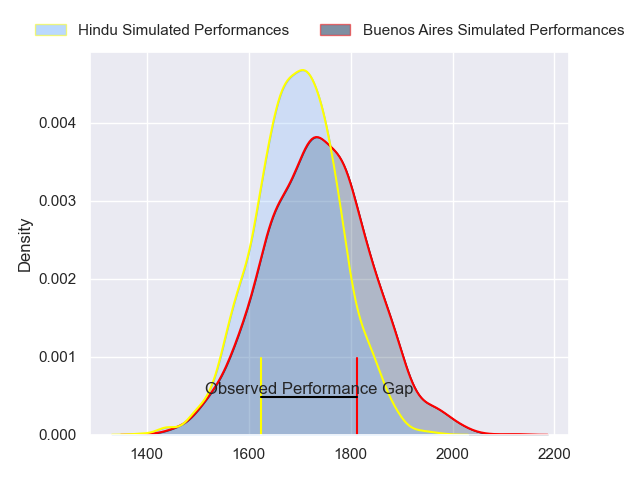
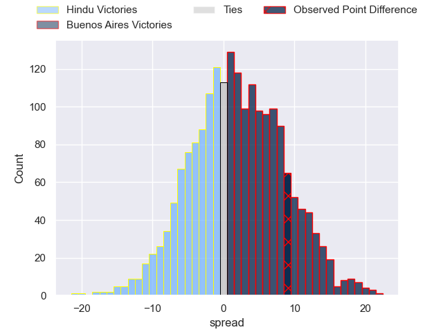
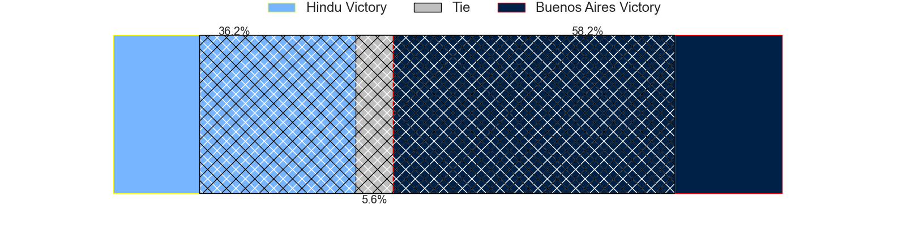
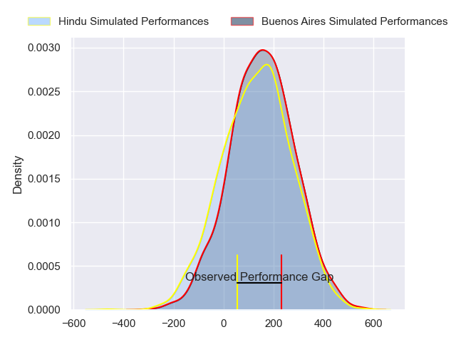
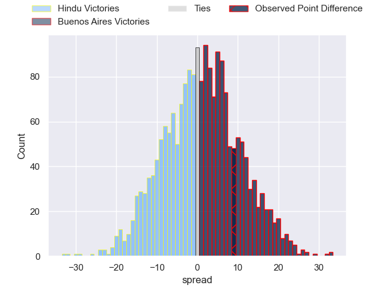

---  
layout: page  
title: Hindu at Buenos Aires; 17-26  
date: 2024-06-08 18:00:00 -0500  
categories: "URBA Top 12 2024" match review  
---
# Hindu at Buenos Aires; 17-26

# Club Level Predictions

The first set of predictions treats a club as the smallest object, as the club develops its members, organizes a gameplan, and deploys its players as needed for each match. This club model has a prediction of 0.552, which translates to predicting Buenos Aires to win by 1.9.

Our Over/Under is 45.5 - and combined with the spread above, we have a predicted scoreline of 22 to 24

Each club has a rating and a rating deviation (similar to a Glicko rating), and expected performances can be generated. This allows for simulated matches and spreads like the ones below.
## Projected Performances - Club Model

## Projected Spreads - Club Model

## Projected Results - Club Model

# Player Level Predictions

Treating teams instead as an entity made up of the currently active players, I have ratings for each player in an altogether different system. These can be combined to form team ratings once teamsheets are announced, weighting starters a bit higher than the reserves. After the match is played, players can be weighted by their minutes on the field, allowing for an accurate measure of the team's composition. With these compiled team ratings, we can make predictions, measure inaccuracy, and update the individual player ratings.
## Prediction without Player Minutes: Buenos Aires by 1.7

Hindu by 1.1 on a neutral pitch

## Projected Performances - Player Model

## Projected Spreads - Player Model

## Projected Results - Player Model

|   Away Minutes | Away Player                |   Away Percentile |   Number |   Home Percentile | Home Player            |   Home Minutes |
|---------------:|:---------------------------|------------------:|---------:|------------------:|:-----------------------|---------------:|
|             80 | Franco Diviesti            |              8.37 |        1 |             78.23 | Pablo Gaston Vaca      |             80 |
|             80 | Agustin Capurro            |              7.54 |        2 |             71.11 | Tomas Rosasco          |             80 |
|             80 | Nicolas Leiva              |              6.5  |        3 |             62.14 | Tomas Gallo            |             80 |
|             80 | Carlos Repetto             |             22.66 |        4 |             67.69 | Francisco Jose Sluga   |             80 |
|             80 | Elias Banach               |             15.81 |        5 |             65.01 | Bautista Duranona      |             80 |
|             80 | Tomas Scallan              |             19.15 |        6 |             53.97 | Valentin Arauz         |             80 |
|             80 | Agustin Arburua            |              6.29 |        7 |             63.44 | Matias Espina          |             80 |
|             80 | Nicolas Amaya              |             20.21 |        8 |             48.12 | Tomas Alvarez Bayon    |             80 |
|             80 | Lucas Fernandez Miranda    |             17.29 |        9 |             62.84 | Juan Monasterio        |             80 |
|             80 | Santiago Fernandez         |             93.87 |       10 |             48.88 | Tomas Bunge            |             80 |
|             80 | Lisandro Rodriguez         |              9.96 |       11 |             63.6  | Ramiro Costa           |             80 |
|             80 | Bautista Farise            |              8.54 |       12 |             60.68 | Agustin Lamensa Sanudo |             80 |
|             80 | Belisario Agulla           |             78.65 |       13 |             60.68 | Tobias Diaz Borda      |             80 |
|             80 | Tomas Amher                |              9.2  |       14 |             66.38 | Alfonso Latorre        |             80 |
|             80 | Joaquin Diaz Bonilla       |             64.8  |       15 |             61.08 | Julian Quetglas Bojar  |             80 |
|              0 | Benjamin Silveyra          |            nan    |       16 |            nan    | Valentino Minoyetti    |              0 |
|              0 | Juan Ignacio Martinez Sosa |             32.49 |       17 |             31.68 | Tomas Herrador         |              0 |
|              0 | Mariano Leiva              |            nan    |       18 |             56.95 | Blas Armando Coria     |              0 |
|              0 | Juan Ignacio Comolli       |             12.52 |       19 |            nan    | Marcos Deges           |              0 |
|              0 | Santino Amayav             |             10.15 |       20 |            nan    | Simon Mimessi          |              0 |
|              0 | Lucas Pulido               |             17.98 |       21 |             50.68 | Mateo Freire           |              0 |
|              0 | Alfredo Mayol              |            nan    |       22 |            nan    | Francisco Lamensa      |              0 |
|              0 | Gaspar Jeckeln             |            nan    |       23 |             47.22 | Benjamin Handley       |              0 |

